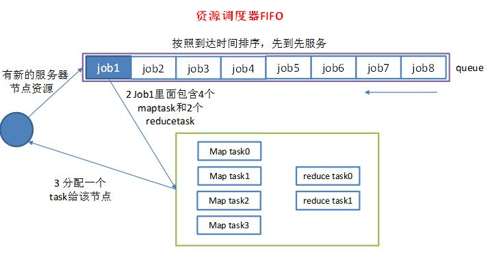
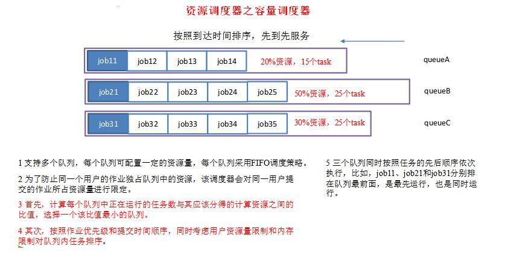
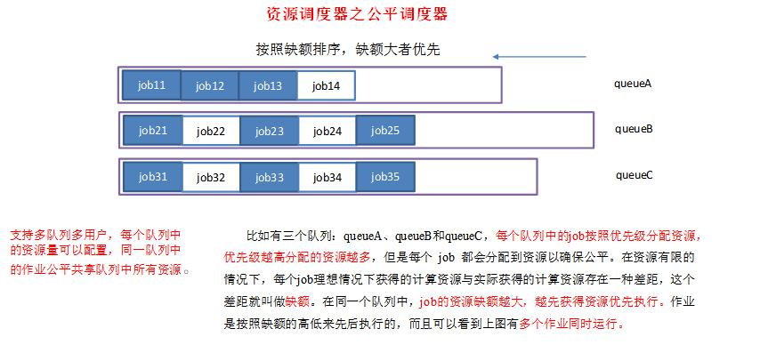

### **HDFS写流程**

1）client 客户端发送上传请求，通过 RPC 与 namenode 建立通信，namenode 检查该用户是否有上传权限，以及上传的文件是否在 hdfs 对应的目录下重名，如果这两者有任意一个不满足，则直接报错，如果两者都满足，则返回给客户端一个可以上传的信息

2）client 根据文件的大小进行切分，默认 128M一块，切分完成之后给namenode 发送请求第一个 block 块上传到哪些服务器上

3）namenode 收到请求之后，根据网络拓扑和机架感知以及副本机制进行文件分配，返回可用的 DataNode 的地址

4）客户端收到地址之后与服务器地址列表中的一个节点如 A 进行通信，本质上就是 RPC 调用，建立 pipeline，A 收到请求后会继续调用 B，B 在调用 C，将整个 pipeline 建立完成，逐级返回 client

5）client 开始向 A 上发送第一个 block（先从磁盘读取数据然后放到本地内存缓存），以 packet（数据包，64kb）为单位，A 收到一个 packet 就会发送给 B，然后 B 发送给 C，A 每传完一个 packet 就会放入一个应答队列等待应答

6）数据被分割成一个个的 packet 数据包在 pipeline 上依次传输，在pipeline 反向传输中，逐个发送 ack（命令正确应答），最终由 pipeline 中第一个 DataNode 节点 A 将 pipelineack 发送给 Client

7）当一个 block 传输完成之后, Client 再次请求 NameNode 上传第二个block ，namenode 重新选择三台 DataNode 给 client

### HDFS读流程

1）client 向 namenode 发送 RPC 请求。请求文件 block 的位置

2）namenode 收到请求之后会检查用户权限以及是否有这个文件，如果都符合，则会视情况返回部分或全部的 block 列表，对于每个 block，NameNode都会返回含有该 block 副本的 DataNode 地址； 这些返回的 DN 地址，会按照集群拓扑结构得出 DataNode 与客户端的距离，然后进行排序，排序两个规则：网络拓扑结构中距离 Client 近的排靠前；心跳机制中超时汇报的 DN 状态为 STALE，这样的排靠后

3）Client 选取排序靠前的 DataNode 来读取 block，如果客户端本身就是DataNode,那么将从本地直接获取数据(短路读取特性)

4）底层上本质是建立 Socket Stream（FSDataInputStream），重复的调用父类 DataInputStream 的 read 方法，直到这个块上的数据读取完毕

5）当读完列表的 block 后，若文件读取还没有结束，客户端会继续向NameNode 获取下一批的 block 列表6）读取完一个 block 都会进行 checksum 验证，如果读取 DataNode 时出现错误，客户端会通知 NameNode，然后再从下一个拥有该 block 副本的DataNode 继续读

7）read 方法是并行的读取 block 信息，不是一块一块的读取；NameNode只是返回 Client 请求包含块的 DataNode 地址，并不是返回请求块的数据

8） 最终读取来所有的 block 会合并成一个完整的最终文件

### Scondary namenode工作机制

**1）第一阶段：NameNode启动**
 （1）第一次启动NameNode格式化后，创建fsimage和edits文件。如果不是第一次启动，直接加载编辑日志和镜像文件到内存。
 （2）客户端对元数据进行增删改的请求。
 （3）NameNode记录操作日志，更新滚动日志。
 （4）NameNode在内存中对数据进行增删改查。
 **2）第二阶段：Secondary NameNode工作**
 （1）Secondary NameNode询问NameNode是否需要checkpoint。直接带回NameNode是否检查结果。
 （2）Secondary NameNode请求执行checkpoint。
 （3）NameNode滚动正在写的edits日志。
 （4）将滚动前的编辑日志和镜像文件拷贝到Secondary NameNode。
 （5）Secondary NameNode加载编辑日志和镜像文件到内存，并合并。
 （6）生成新的镜像文件fsimage.chkpoint。
 （7）拷贝fsimage.chkpoint到NameNode。
 （8）NameNode将fsimage.chkpoint重新命名成fsimage。

**NameNode与SecondaryNameNode 的区别与联系？** 1）区别
 （1）NameNode负责管理整个文件系统的元数据，以及每一个路径（文件）所对应的数据块信息。
 （2）SecondaryNameNode主要用于定期合并命名空间镜像和命名空间镜像的编辑日志。
 2）联系：
 （1）SecondaryNameNode中保存了一份和namenode一致的镜像文件（fsimage）和编辑日志（edits）。
 （2）在主namenode发生故障时（假设没有及时备份数据），可以从SecondaryNameNode恢复数据。

### **HDFS的联盟（Federation）和HA的区别**

（1）、联盟是有两个NameNode，并且都是active状态；HA也有两个，不过其中有一个是standby一个是active状态。

（2）、HA需要借助ZK来实现，而Federation不需要，Federation能让缓存更多的元信息。

（3）、HA的好处是：①负载均衡。②失败迁移。

### **HDFS的架构**

我们可以看到在这个架构中有一个NameNode和几个DataNode还有一个SecondaryNameNode，下面我们分别来阐述一下它们各自的作用。

**NameNode：**

（1）、加载fsimag和edits文件到内存中。

ps：fsimag文件是HDFS元信息文件，edits文件是记录操作日志文件。fsimage文件和edits文件在一起，记录了数据块的位置和冗余信息。
（2）、客户端向NameNode发起增删改查的请求。

（3）、NameNode记录操作到内存中，更新滚动日志。

（4）、NameNode在内存中对数据进行增删改查。

**DataNode：**

（1）、保存数据块，默认是128M，Hadoop1.0默认是64M。

（2）、存储在磁盘上，包括两个文件，一个数据本身，一个是元数据包括数据块长度，块数据校验和以及时间戳。

（3）、DataNode启动后向NameNode注册，通过后，周期性（64分钟）的向NameNode上报所有的信息。

（4）、心跳是三秒一次，心跳返回结果包括NameNode给该DataNode的命令。如果十分钟都没有收到该DataNode的心跳，则该节点不可用

**SecondaryNameNode**

> 目的使帮助NameNode合并编辑日志，减少NameNode 启动时间

（1）、向NameNode询问是否需要checkPoint。

  ps：检查点触发的条件是：①时间快到了，60分钟。②日志文件edits中数据满了，64M。

（2）、请求执行checkPoint。

（3）、拷贝edits文件和fsimag文件到SecondaryNameNode中。

（4）、将拷贝过来的edits文件和fsimag文件进行合并。

（5）、生成新的fsimage命名为fsimage.chkpoint。

（6）、将fsimage.chkpoint拷贝到NameNode中去。

（7）、重新命名生成fsimage

**Client**

  （1）文件切分。文件上传HDFS的时候，Client将文件切分成一个一个的Block，然后进行存储；

  （2）与NameNode交互，获取文件的位置信息；

  （3）与DataNode交互，读取或者写入数据；

  （4）Client提供一些命令来管理HDFS，比如启动或者关闭HDFS；

  （5）Client可以通过一些命令来访问HDFS；

### **hadoop的块大小**

Hadoop1.x都是64M，hadoop2.x开始都是128M。

### **NameNode与SecondaryNameNode 的区别与联系**

1）区别

  （1）NameNode负责管理整个文件系统的元数据，以及每一个路径（文件）所对应的数据块信息。

  （2）SecondaryNameNode主要用于定期合并命名空间镜像和命名空间镜像的编辑日志。

2）联系：

  （1）SecondaryNameNode中保存了一份和namenode一致的镜像文件（fsimage）和编辑日志（edits）。

  （2）在主namenode发生故障时（假设没有及时备份数据），可以从SecondaryNameNode恢复数据。

### **HAnamenode 是如何工作的**

**ZKFailoverController主要职责**

  1）健康监测：周期性的向它监控的NN发送健康探测命令，从而来确定某个NameNode是否处于健康状态，如果机器宕机，心跳失败，那么zkfc就会标记它处于一个不健康的状态。

  2）会话管理：如果NN是健康的，zkfc就会在zookeeper中保持一个打开的会话，如果NameNode同时还是Active状态的，那么zkfc还会在Zookeeper中占有一个类型为短暂类型的znode，当这个NN挂掉时，这个znode将会被删除，然后备用的NN，将会得到这把锁，升级为主NN，同时标记状态为Active。

  3）当宕机的NN新启动时，它会再次注册zookeper，发现已经有znode锁了，便会自动变为Standby状态，如此往复循环，保证高可靠，需要注意，目前仅仅支持最多配置2个NN。

  4）master选举：如上所述，通过在zookeeper中维持一个短暂类型的znode，来实现抢占式的锁机制，从而判断那个NameNode为Active状态

### **谈谈Hadoop序列化和反序列化**

1）序列化和反序列化

  （1）序列化就是把内存中的对象，转换成字节序列（或其他数据传输协议）以便于存储（持久化）和网络传输。

  （2）反序列化就是将收到字节序列（或其他数据传输协议）或者是硬盘的持久化数据，转换成内存中的对象。

  （3）Java的序列化是一个重量级序列化框架（Serializable），一个对象被序列化后，会附带很多额外的信息（各种校验信息，header，继承体系等），不便于在网络中高效传输。所以，hadoop自己开发了一套序列化机制（Writable），精简、高效。

2）自定义bean对象要想序列化传输步骤及注意事项：

  （1）必须实现Writable接口

  （2）反序列化时，需要反射调用空参构造函数，所以必须有空参构造

  （3）重写序列化方法

  （4）重写反序列化方法

  （5）注意反序列化的顺序和序列化的顺序完全一致

  （6）要想把结果显示在文件中，需要重写toString()，且用"\t"分开，方便后续用

  （7）如果需要将自定义的bean放在key中传输，则还需要实现comparable接口，因为mapreduce框中的shuffle过程一定会对key进行排序

### **HDFS小文件优化方法**

（1）、Hadoop Archive：将小文件放入HDFS块中的文件归档工具，减少NameNode内存的使用。

（2）、采用SequenceFile格式。

（3）、CombineFileInputFormat：将多个文件合并成一个单独的split。

（4）、JVM重用：一个map运行一个JVM，一个map运行完毕，jvm会继续运行其他map。

###  **InputSplit文件如何切分**

FileInputFormat源码解析(input.getSplits(job))

（1）找到你数据存储的目录。

（2）开始遍历处理（规划切片）目录下的每一个文件。

（3）遍历第一个文件ss.txt。

  a）获取文件大小fs.sizeOf(ss.txt);。

  b）计算切片大小computeSliteSize(Math.max(minSize,Math.min(maxSize,blocksize)))=blocksize=128M。

  c）默认情况下，切片大小=blocksize。

  d）开始切，形成第1个切片：ss.txt—0:128M 第2个切片ss.txt—128:256M 第3个切片ss.txt—256M:300M（每次切片时，都要判断切完剩下的部分是否大于块的1.1倍，不大于1.1倍就划分一块切片）。

  e）将切片信息写到一个切片规划文件中。

  f）整个切片的核心过程在getSplit()方法中完成。

  g）数据切片只是在逻辑上对输入数据进行分片，并不会再磁盘上将其切分成分片进行存储。InputSplit只记录了分片的元数据信息，比如起始位置、长度以及所在的节点列表等。

  h）注意：block是HDFS上物理上存储的存储的数据，切片是对数据逻辑上的划分。

（4）提交切片规划文件到yarn上，yarn上的MrAppMaster就可以根据切片规划文件计算开启maptask个数。

### **如何判定一个job的map和reduce的数量**

1）map数量

  `splitSize=max{minSize,min{maxSize,blockSize}}`

  map数量由处理的数据分成的block数量决定default_num = total_size / split_size;

2）reduce数量

  reduce的数量job.setNumReduceTasks(x);x 为reduce的数量。不设置的话默认为 1。

### **Maptask**和ReduceTask的个数由什么决定

>  MapTask的个数由什么决定

（1）、一个job的map阶段MapTask个数，由客户端提交的job的切片个数决定。

（2）、每一个切片分配一个MapTask。

（3）、切片大小默认=blocksize。

（4）、切片时针对每一个文件单独切片，不考虑数据集整体。

> ReduceTask个数由什么决定

一个job的reduceTask数量是通过job.setNumReduceTasks(x)来设置的;x 为reduce的数量。不设置的话默认为 1

### **MapTask和ReduceTask工作机制**

**MapTask工作机制**

**Read阶段-->Map阶段-->Collect阶段-->Spill溢写阶段-->Combiner阶段****。**

（1）Read阶段：Map Task通过用户编写的RecordReader，从输入InputSplit中解析出一个个key/value。

（2）Map阶段：该节点主要是将解析出的key/value交给用户编写map()函数处理，并产生一系列新的key/value。

（3）Collect收集阶段：在用户编写map()函数中，当数据处理完成后，一般会调用OutputCollector.collect()输出结果。在该函数内部，它会将生成的key/value分区（调用Partitioner），并写入一个环形内存缓冲区中。

（4）Spill阶段：即“溢写”，当环形缓冲区满后，MapReduce会将数据写到本地磁盘上，生成一个临时文件。需要注意的是，将数据写入本地磁盘之前，先要对数据进行一次本地排序，并在必要时对数据进行合并、压缩等操作。

（5）Combine阶段：当所有数据处理完成后，MapTask对所有临时文件进行一次合并，以确保最终只会生成一个数据文件。

**ReduceTask工作机制**

**Copy阶段-->Merge阶段-->Sort阶段-->Reduce阶段**

（1）Copy阶段：ReduceTask从各个MapTask上远程拷贝一片数据，并针对某一片数据，如果其大小超过一定阈值，则写到磁盘上，否则直接放到内存中。

（2）Merge阶段：在远程拷贝数据的同时，ReduceTask启动了两个后台线程对内存和磁盘上的文件进行合并，以防止内存使用过多或磁盘上文件过多。

（3）Sort阶段：按照MapReduce语义，用户编写reduce()函数输入数据是按key进行聚集的一组数据。为了将key相同的数据聚在一起，Hadoop采用了基于排序的策略。 由于各个MapTask已经实现对自己的处理结果进行了局部排序，因此，ReduceTask只需对所有数据进行一次归并排序即可。

（4）Reduce阶段：reduce()函数将计算结果写到HDFS上

### **描述mapReduce有几种排序及排序发生的阶段**

1）排序的分类：

  （1）部分排序：

    MapReduce根据输入记录的键对数据集排序。保证输出的每个文件内部排序。

  （2）全排序：

    如何用Hadoop产生一个全局排序的文件？最简单的方法是使用一个分区。但该方法在处理大型文件时效率极低，因为一台机器必须处理所有输出文件，从而完全丧失了MapReduce所提供的并行架构。

    替代方案：首先创建一系列排好序的文件；其次，串联这些文件；最后，生成一个全局排序的文件。主要思路是使用一个分区来描述输出的全局排序。例如：可以为待分析文件创建3个分区，在第一分区中，记录的单词首字母a-g，第二分区记录单词首字母h-n, 第三分区记录单词首字母o-z。

  （3）辅助排序：（GroupingComparator分组）

    Mapreduce框架在记录到达reducer之前按键对记录排序，但键所对应的值并没有被排序。甚至在不同的执行轮次中，这些值的排序也不固定，因为它们来自不同的map任务且这些map任务在不同轮次中完成时间各不相同。一般来说，大多数MapReduce程序会避免让reduce函数依赖于值的排序。但是，有时也需要通过特定的方法对键进行排序和分组等以实现对值的排序。

  （4）二次排序：

    在自定义排序过程中，如果compareTo中的判断条件为两个即为二次排序

2）自定义排序WritableComparable

  bean对象实现WritableComparable接口重写compareTo方法，就可以实现排序

```java
    @Override

    public int compareTo(FlowBean o) {

      // 倒序排列，从大到小

      return this.sumFlow > o.getSumFlow() ? -1 : 1;

    }
```

3）排序发生的阶段：

  （1）一个是在map side发生在spill后partition前。

  （2）一个是在reduce side发生在copy后 reduce前

### **描述mapReduce中combiner的作用是什么**

1）Combiner的意义就是对每一个maptask的输出进行局部汇总，以减小网络传输量。

2）Combiner能够应用的前提是不能影响最终的业务逻辑，而且，Combiner的输出kv应该跟reducer的输入kv类型要对应起来。

3）Combiner和reducer的区别在于运行的位置。

  Combiner是在每一个maptask所在的节点运行；

  Reducer是接收全局所有Mapper的输出结果。

### **Yarn的资源调度器**

**（1）默认的调度器FIFO**

  Hadoop中默认的调度器，它先按照作业的优先级高低，再按照到达时间的先后选择被执行的作业。


**（2）计算能力调度器Capacity Scheduler**

  支持多个队列，每个队列可配置一定的资源量，每个队列采用FIFO调度策略，为了防止同一个用户的作业独占队列中的资源，该调度器会对同一用户提交的作业所占资源量进行限定。调度时，首先按以下策略选择一个合适队列：计算每个队列中正在运行的任务数与其应该分得的计算资源之间的比值，选择一个该比值最小的队列；然后按以下策略选择该队列中一个作业：按照作业优先级和提交时间顺序选择，同时考虑用户资源量限制和内存限制。Hadoop2.7.2默认的资源调度器是Capacity Scheduler.


**（3）公平调度器Fair Scheduler**

  同计算能力调度器类似，支持多队列多用户，每个队列中的资源量可以配置，同一队列中的作业公平共享队列中所有资源。


具体设置详见：yarn-default.xml文件 

```javascript
<property>
    <description>The class to use as the resource scheduler.</description>
    <name>yarn.resourcemanager.scheduler.class</name>
    <value>org.apache.hadoop.yarn.server.resourcemanager.scheduler.capacity.CapacityScheduler</value>
</property>
```

**总结**：

FIFO Scheduler：按照顺序执行，不适合共享集群。

Capacity Sheduler：专门的队列来运行小任务，为小任务专门预设了一定的资源，导致大任务的执行时间回落后使用FIFO调度器的时间。

Fair Scheduler：公平调度，每个来的任务都会获得的相等的资源

### **Hadoop的缓存机制（Distributedcache）**

 分布式缓存一个最重要的应用就是在进行join操作的时候，如果一个表很大，另一个表很小，我们就可以将这个小表进行广播处理，即每个计算节点上都存一份，然后进行map端的连接操作，经过我的实验验证，这种情况下处理效率大大高于一般的reduce端join，广播处理就运用到了分布式缓存的技术。

  DistributedCache将拷贝缓存的文件到Slave节点在任何Job在节点上执行之前，文件在每个Job中只会被拷贝一次，缓存的归档文件会被在Slave节点中解压缩。将本地文件复制到HDFS中去，接着Client会通过addCacheFile() 和addCacheArchive()方法告诉DistributedCache在HDFS中的位置。当文件存放到文地时，JobClient同样获得DistributedCache来创建符号链接，其形式为文件的URI加fragment标识。当用户需要获得缓存中所有有效文件的列表时，JobConf 的方法 getLocalCacheFiles() 和getLocalArchives()都返回一个指向本地文件路径对象数组。

### **如何使用mapReduce实现两个表的join**

  1）reduce side join : 在map阶段，map函数同时读取两个文件File1和File2，为了区分两种来源的key/value数据对，对每条数据打一个标签（tag）,比如：tag=0 表示来自文件File1，tag=2 表示来自文件File2。

  2）map side join : Map side join 是针对以下场景进行的优化：两个待连接表中，有一个表非常大，而另一个表非常小，以至于小表可以直接存放到内存中。这样，我们可以将小表复制多份，让每个map task 内存中存在一份（比如存放到hash table 中），然后只扫描大表：对于大表中的每一条记录key/value，在hash table 中查找是否有相同的key 的记录，如果有，则连接后输出即可。

###  **Yarn的基本组成**

yarn的基本组成：resourceManager、nodeManger、applicationMaster、container

1、resourceManager：主要负责资源的调度和应用程序的管理。

①调度器：调度器是将系统中的资源分配给各个正在运行的应用程序。

②应用程序管理：负责管理所有applicationMaster。

2、nodeManager：定时告诉resourceManger，node节点的资源使用情况；任务的启动和终止。

3、applicationMaster：向resourceManger请求资源，监听任务的执行进度。

4、container：资源的抽象（cpu，内存的信息），当applicationMaster向recourceManger请求资源的时候，就是以container抽象资源的形式返回，限制资源的使用情况

### **MapReduce的调优**

**1、资源相关参数：**

1）、mapreduce.map.memory.mb 一个Map Task可使用的资源上限（单位:MB），默认为1024。如果Map Task实际使用的资源量超过该值，则会被强制杀死。

2）、mapreduce.reduce.memory.mb 一个Reduce Task可使用的资源上限（单位:MB），默认为1024。如果Reduce Task实际使用的资源量超过该值，则会被强制杀死。

3）、mapreduce.map.java.opts Map Task的JVM参数，你可以在此配置默认的java heap size等参数, e.g."-Xmx1024m -verbose:gc -Xloggc:/tmp/@taskid@.gc" （@taskid@会被Hadoop框架自动换为相应的taskid）, 默认值: ""
4）、mapreduce.reduce.java.opts Reduce Task的JVM参数，你可以在此配置默认的java heap size等参数, e.g."-Xmx1024m -verbose:gc -Xloggc:/tmp/@taskid@.gc", 默认值: ""
5）、mapreduce.map.cpu.vcores 每个Map task可使用的最多cpu core数目, 默认值: 1
6）、mapreduce.reduce.cpu.vcores 每个Reduce task可使用的最多cpu core数目, 默认值: 1

7）、yarn.scheduler.maximum-allocation-mb 8192 给应用程序container分配的最大内存

8）、yarn.scheduler.minimum-allocation-mb 1024 给应用程序container分配的最小内存

**2、容错相关参数：**

1）、mapreduce.map.maxattempts 每个Map Task最大重试次数，一旦重试参数超过该值，则认为Map Task运行失败，默认值：4。

2）、mapreduce.reduce.maxattempts 每个Reduce Task最大重试次数，一旦重试参数超过该值，则认为Map Task运行失败，默认值：4。

3）、mapreduce.map.failures.maxpercent 当失败的Map Task失败比例超过该值为，整个作业则失败，默认值为0. 如果你的应用程序允许丢弃部分输入数据，则该该值设为一个大于0的值，比如5，表示如果有低于5%的Map Task失败（如果一个Map Task重试次数超过mapreduce.map.maxattempts，则认为这个Map Task失败，其对应的输入数据将不会产生任何结果），整个作业扔认为成功。

4）、mapreduce.reduce.failures.maxpercent 当失败的Reduce Task失败比例超过该值为，整个作业则失败，默认值为0。

5）、mapreduce.task.timeout Task超时时间，经常需要设置的一个参数，该参数表达的意思为：如果一个task在一定时间内没有任何进入，即不会读取新的数据，也没有输出数据，则认为该task处于block状态，可能是卡住了，也许永远会卡主，为了防止因为用户程序永远block住不退出，则强制设置了一个该超时时间（单位毫秒），默认是300000。如果你的程序对每条输入数据的处理时间过长（比如会访问数据库，通过网络拉取数据等），建议将该参数调大，该参数过小常出现的错误提示是“AttemptID:attempt_14267829456721_123456_m_000224_0 Timed out after 300 secsContainer killed by the ApplicationMaster.”。

### **HDFS文件的上传**

（1）、客户端发出文件上传的请求。

（2）、客户端创建出DistrbutedSystem。

（3）、DistributedSystem和NameNode建立RPC通信，得到一个NameNode的代理对象。

（4）、请求创建文件的元信息。

（5）、NameNode创建出文件的元信息。元信息包括文件名，文件的大小，路径，数据块数量，数据块分布在DataNode的信息。

（6）、NameNode缓存元信息。

（7）、如果满了就采用LRU置换算法，生成fsimage文件。

（8）、返回给客户端文件的元信息。

（9）、创建输出流。

（10）、上传第一个数据块到DataNode上面去。

（11）、DataNode之间根据冗余信息，进行复制。

（12）、FSDataOutputStream循环上传数据。

### **HDFS文件的下载**

（1）、客户端发出文件下载的请求。

（2）、客户端创建出DistrbutedSystem。

（3）、DistributedSystem和NameNode建立RPC通信，得到一个NameNode的代理对象。

（4）、得到文件的元信息。

（5）、NameNode在内存中查找文件的元信息。

（6）、在fsimage中查找。

（7）、返回给客户端文件的元信息。

（8）、创建一个输入流。

（9）、下载第一个数据块，多线程下载数据块。

### **HDFS的数据压缩算法？及每种算法的应用场景**

#### **1、gzip压缩**

**优点：**压缩率比较高，而且压缩/解压速度也比较快；hadoop本身支持，在应用中处理gzip格式的文件就和直接处理文本一样；大部分linux系统都自带gzip命令，使用方便。

**缺点：**不支持split。

**应用场景：**当每个文件压缩之后在130M以内的（1个块大小内），都可以考虑用gzip压缩格式。例如说一天或 者一个小时的日志压缩成一个gzip文件，运行mapreduce程序的时候通过多个gzip文件达到并发。hive程序， streaming程序，和java写的mapreduce程序完全和文本处理一样，压缩之后原来的程序不需要做任何修改。

#### **2、Bzip2压缩**

**优点：**支持split；具有很高的压缩率，比gzip压缩率都高；hadoop本身支持，但不支持native；在linux系统下自带bzip2命令，使用方便。

**缺点：**压缩/解压速度慢；不支持native。

**应用场景：**适合对速度要求不高，但需要较高的压缩率的时候，可以作为mapreduce作业的输出格式；或者 输出之后的数据比较大，处理之后的数据需要压缩存档减少磁盘空间并且以后数据用得比较少的情况；或者对单个 很大的文本文件想压缩减少存储空间，同时又需要支持split，而且兼容之前的应用程序（即应用程序不需要修改） 的情况。

#### **3、Lzo压缩**

**优点：**压缩/解压速度也比较快，合理的压缩率；支持split，是hadoop中最流行的压缩格式；可以在linux系统下安装lzop命令，使用方便。

**缺点：**压缩率比gzip要低一些；hadoop本身不支持，需要安装；在应用中对lzo格式的文件需要做一些特殊处理（为了支持split需要建索引，还需要指定inputformat为lzo格式）。

**应用场景：**一个很大的文本文件，压缩之后还大于200M以上的可以考虑，而且单个文件越大，lzo优点越越明显。

#### **4、Snappy压缩**

**优点：**高速压缩速度和合理的压缩率。

**缺点：**不支持split；压缩率比gzip要低；hadoop本身不支持，需要安装；

**应用场景：**当Mapreduce作业的Map输出的数据比较大的时候，作为Map到Reduce的中间数据的压缩格式； 或者作为一个Mapreduce作业的输出和另外一个Mapreduce作业的输入


