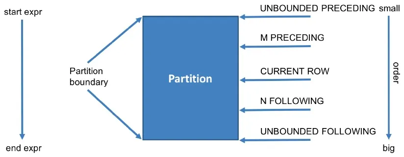

## 排名函数
### ROW_NUMBER()
给定一个分区内的行一个唯一的整数排名，按照记录的排序顺序。示例：
```hiveql
SELECT
  column1,
  column2,
  ROW_NUMBER() OVER (PARTITION BY partition_column ORDER BY order_column) AS rank
FROM
  table_name;

```

### RANK()
为分区内的行分配一个排名，如果有相等的值，则将它们分配相同的排名，有相同排名，但会跳过占用的排名。示例：
```hiveql
SELECT
  column1,
  column2,
  RANK() OVER (PARTITION BY partition_column ORDER BY order_column) AS rank
FROM
  table_name;

```
### DENSE_RANK()
DENSE意思为稠密的，即序号是连续的。为分区内的行分配一个排名，如果有相等的值，则将它们分配相同的排名，但不跳过后续的排名。示例：
```hiveql
SELECT
  column1,
  column2,
  DENSE_RANK() OVER (PARTITION BY partition_column ORDER BY order_column) AS rank
FROM
  table_name;

```
## 窗口函数
可参考https://www.baispace.cn/article/hive-knowledge-window-function.html
### 定义
```hiveql
Function (arg1,..., argn) OVER ([PARTITION BY <...>] [ORDER BY <....>]
[])
```
Function (arg1,..., argn) 可以是下面的函数：

- Aggregate Functions: 聚合函数,比如：sum(...)、 max(...)、min(...)、avg(...)等.
- Sort Functions: 数据排序函数, 比如 ：rank(...)、row_number(...)等.
- Analytics Functions: 统计和比较函数, 比如：lead(...)、lag(...)、 first_value(...)等.
### 窗口边界
| preceding | 往前 |
| --- | --- |
| following | 往后 |
| current row | 当前行 |
| unbounded | 起点 |
| unbounded preceding | 从前面的起点 |
| unbounded following | 到后面的终点 |

1. 如果不指定 PARTITION BY，则不对数据进行分区，换句话说，所有数据看作同一个分区；
2. 如果不指定 ORDER BY，则不对各分区做排序，通常用于那些顺序无关的窗口函数，例如 SUM()
3. 如果不指定窗口子句，则默认采用以下的窗口定义：<br />a、**若不指定 ORDER BY，默认使用分区内所有行 ROWS BETWEEN UNBOUNDED PRECEDING AND UNBOUNDED FOLLOWING**.<br />b、若指定了 ORDER BY，默认使用分区内第一行到当前值 ROWS BETWEEN UNBOUNDED PRECEDING AND CURRENT ROW.

**计算过程**

- 按窗口定义，将所有输入数据分区、再排序（如果需要的话）
- 对每一行数据，计算它的窗口范围
- 将窗口内的行集合输入窗口函数，计算结果填入当前行
  <a name="Wc3cT"></a>

### 窗口聚合函数
| AVG() | 参数类型为DECIMAL的返回类型为DECIMAL，其他为DOUBLE | AVG 窗口函数返回输入表达式值的平均值，忽略 NULL 值。 |
| --- | --- | --- |
| COUNT() | BIGINT | COUNT 窗口函数计算输入行数。 COUNT(*) 计算目标表中的所有行，包括Null值；COUNT(expression) 计算特定列或表达式中具有非 NULL 值的行数。 |
| MAX() | 与传参类型一致 | MAX窗口函数返回表达式在所有输入值中的最大值，忽略 NULL 值。 |
| MIN() | 与传参类型一致 | MIN窗口函数返回表达式在所有输入值中的最小值，忽略 NULL 值。 |
| SUM() | 针对传参类型为DECIMAL的，返回类型一致；除此之外的浮点型为DOUBLE；传参类型为整数类型的，返回类型为BIGINT | SUM窗口函数返回所有输入值的表达式 |

<a name="HR7Y5"></a>
### 窗口排名函数
| ROW_NUMBER() | BIGINT | 根据具体的分组和排序，为每行数据生成一个起始值等于1的唯一序列数 |
| --- | --- | --- |
| RANK() | BIGINT | 对组中的数据进行排名，如果名次相同，则排名也相同，但是下一个名次的排名序号会出现不连续。 |
| DENSE_RANK() dense是稠密的意思，可以引申记忆 | BIGINT | dense_rank函数的功能与rank函数类似，dense_rank函数在生成序号时是连续的，而rank函数生成的序号有可能不连续。当出现名次相同时，则排名序号也相同。而下一个排名的序号与上一个排名序号是连续的。 |
| PERCENT_RANK() | DOUBLE | 计算给定行的百分比排名。可以用来计算超过了百分之多少的人;排名计算公式为：(当前行的rank值-1)/(分组内的总行数-1) |
| CUME_DIST() | DOUBLE | 计算某个窗口或分区中某个值的累积分布。假定升序排序，则使用以下公式确定累积分布：小于等于当前值x的行数 / 窗口或partition分区内的总行数。其中，x 等于 order by 子句中指定的列的当前行中的值 |
| NTILE() | INT | ntile 函数用于将分组数据按照顺序切分成n组，并返回当前切片值。如果切片不均匀，默认增加第一个切片的分布。它把有序的数据集合「平均分配」到指定的数量（n）个桶中, 将桶号分配给每一行。如果不能平均分配，则优先分配较小编号的桶，并且各个桶中能放的行数最多相差 1。 |

<a name="baUgE"></a>
### 值窗口函数
| LAG() | 与lead相反，用于统计窗口内往上第n行值。第一个参数为列名，第二个参数为往上第n行（可选，默认为1），第三个参数为默认值（当往上第n行为NULL时候，取默认值，如不指定，则为NULL. |
| --- | --- |
| LEAD() | 用于统计窗口内往下第n行值。第一个参数为列名，第二个参数为往下第n行（可选，默认为1），第三个参数为默认值（当往下第n行为NULL时候，取默认值，如不指定，则为NULL. |
| FIRST_VALUE | 取分组内排序后，截止到当前行，第一个值 |
| LAST_VALUE | 取分组内排序后，截止到当前行，最后一个值 |

注意: last_value默认的窗口是 RANGE BETWEEN UNBOUNDED PRECEDING AND CURRENT ROW
<a name="wRkDd"></a>

## 表生成函数
<a name="t1QlT"></a>
### Explode
```plsql
EXPLODE(array|map|struct)
```
**explode(col)：将hive一列中复杂的array或者map结构拆分成多行。**

- explode(ARRAY):数组的每个元素生成一行
- explode(MAP) map中每个key-value对，生成一行，key为一列，value为一列
  <a name="LpHyJ"></a>
### posexplode
**posexplode()**函数类似于**explode()**，但额外返回元素的位置。
```plsql
SELECT
  id,
  pos,
  exploded_value
FROM
  example_array_table
LATERAL VIEW POSEXPLODE(values) exploded_table AS pos, exploded_value;

```
<a name="XmjUM"></a>
### json_tuple
**json_tuple()** 函数用于解析JSON格式的字符串，并将其中的字段提取为列。
```plsql
SELECT
  id,
  name,
  age
FROM
  example_json_table
LATERAL VIEW JSON_TUPLE(json_data, 'name', 'age') exploded_table AS name, age;

```
<a name="FDYyF"></a>
## LATERAL VIEW侧视图
```plsql
LATERAL VIEW udtf(expression) tableAlias AS columnAlias
```
解释：用于和split, explode等UDTF一起使用，它能够将一列数据拆成多行数据，在此基础上可以对拆分后的数据进行聚合.
## 排序
### Order By
全局排序。在 Hive 中，ORDER BY 保证数据的全局有序，为此将所有的数据发送到一个 Reducer 中。因为只有一个 Reducer，所以当输入规模较大时，需要较长的计算时间。Hive 中的 ORDER BY 语法与 SQL 中 ORDER BY 的语法相似，按照某一项或者几项排序输出，可以指定是升序或者是降序排序。

**limit限制**

在严格模式下，即 hive.mapred.mode = strict，ORDER BY 子句后面必须跟一个 LIMIT 子句。如果将 hive.mapred.mode 设置为 nonstrict，可以不用 LIMIT 子句。原因是为了实现所有数据的全局有序，只能使用一个 reducer 来对最终输出进行排序。如果输出中的行数太大，单个 Reducer 可能需要很长时间才能完成。如果在严格模式不指定 LIMIT 子句，会报错。SemanticException 1:106 Order by-s without limit are disabled for safety reasons

### Sort By
分区内排序。不是全局排序，其在数据进入reducer前完成排序，也就是说它会在数据进入reduce之前为每个reducer都产生一个排序后的文件。因此，如果用sort by进行排序，并且设置mapreduce.job.reduces>1，则sort by只保证每个reducer的输出有序，不保证全局有序。
Hive 支持 SORT BY，它对每个 reducer 的数据进行排序。
order by和sort by的区别在于,**前者保证输出中的总顺序，而后者仅保证 reducer 内行的排序。如果有多个 reducer,sort by可能会给出部分有序的最终结果**

### distribute by
数据分发。distribute by是控制在map端如何拆分数据给reduce端的。类似于MapReduce中分区partationer对数据进行分区。hive会根据distribute by后面列，将数据分发给对应的reducer，默认是采用hash算法+取余数的方式。在Mapreduce程序中，进行HashPartition的key是读取输入文件的每行的一个起始位置(单位是字节)，“值”是本行的文本内容。
sort by为每个reduce产生一个排序文件，在有些情况下，你需要控制某写特定的行应该到哪个reducer，这通常是为了进行后续的聚集操作。distribute by刚好可以做这件事。因此，distribute by经常和sort by配合使用。
### cluster by
cluster by除了具有distribute by的功能外还兼具sort by的功能。但是排序只能是升序排序，不能指定排序规则为ASC或者DESC。
当分区字段和排序字段相同cluster by可以简化distribute by+sort by 的SQL 写法，也就是说当distribute by和sort by 字段相同时，可以使用cluster by 代替distribute by和sort by