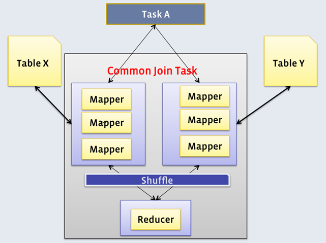
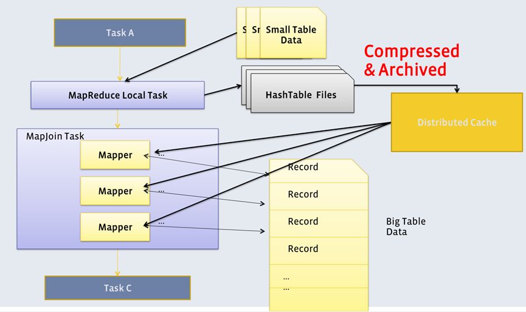
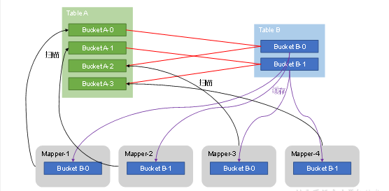
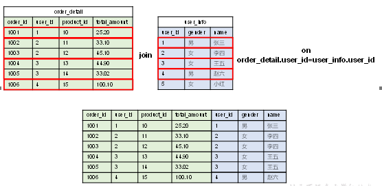
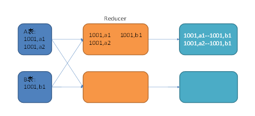
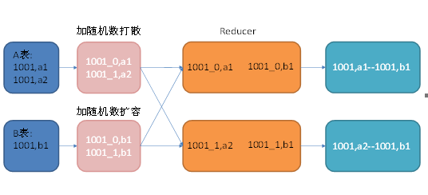
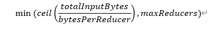

## 语法优化
### 分组聚合优化
Hive中未经优化的分组聚合，是通过一个MapReduce Job实现的。Map端负责读取数据，并按照分组字段分区，通过Shuffle，将数据发往Reduce端，各组数据在Reduce端完成最终的聚合运算。
Hive对分组聚合的优化主要围绕着减少Shuffle数据量进行，具体做法是map-side聚合。所谓map-side聚合，就是在map端维护一个hash table，利用其完成部分的聚合，然后将部分聚合的结果，按照分组字段分区，发送至reduce端，完成最终的聚合。map-side聚合能有效减少shuffle的数据量，提高分组聚合运算的效率。

> map-side 聚合相关的参数如下：
```sql
--启用map-side聚合
set hive.map.aggr=true;

--用于检测源表数据是否适合进行map-side聚合。检测的方法是：先对若干条数据进行map-side聚合，若聚合后的条数和聚合前的条数比值小于该值，则认为该表适合进行map-side聚合；否则，认为该表数据不适合进行map-side聚合，后续数据便不再进行map-side聚合。
set hive.map.aggr.hash.min.reduction=0.5;

--用于检测源表是否适合map-side聚合的条数。
set hive.groupby.mapaggr.checkinterval=100000;

--map-side聚合所用的hash table，占用map task堆内存的最大比例，若超出该值，则会对hash table进行一次flush。
set hive.map.aggr.hash.force.flush.memory.threshold=0.9;
```
### JOIN 优化
Hive拥有多种join算法，包括Common Join，Map Join，Bucket Map Join，Sort Merge Buckt Map Join等，下面对每种join算法做简要说明：
#### JOIN 算法
##### Common JOIN
Common Join是Hive中最稳定的join算法，其通过一个MapReduce Job完成一个join操作。Map端负责读取join操作所需表的数据，并按照关联字段进行分区，通过Shuffle，将其发送到Reduce端，相同key的数据在Reduce端完成最终的Join操作。如下图所示


需要注意的是，sql语句中的join操作和执行计划中的Common Join任务并非一对一的关系，一个sql语句中的相邻的且关联字段相同的多个join操作可以合并为一个Common Join任务。

##### Map JOIN

Map Join算法可以通过两个只有map阶段的Job完成一个join操作。其适用场景为大表join小表。若某join操作满足要求，则第一个Job会读取小表数据，将其制作为hash table，并上传至Hadoop分布式缓存（本质上是上传至HDFS）。第二个Job会先从分布式缓存中读取小表数据，并缓存在Map Task的内存中，然后扫描大表数据，这样在map端即可完成关联操作。如下图所示：


##### Bucket Map JOIN
Bucket Map Join是对Map Join算法的改进，其打破了Map Join只适用于大表join小表的限制，可用于大表join大表的场景。
Bucket Map Join的核心思想是：若能保证参与join的表均为分桶表，且关联字段为分桶字段，且其中一张表的分桶数量是另外一张表分桶数量的整数倍，就能保证参与join的两张表的分桶之间具有明确的关联关系，所以就可以在两表的分桶间进行Map Join操作了。这样一来，第二个Job的Map端就无需再缓存小表的全表数据了，而只需缓存其所需的分桶即可。其原理如图所示：

##### Sort Merge Bucket Map Join
（简称SMB Map Join）基于Bucket Map Join。SMB Map Join要求，参与join的表均为分桶表，且需保证分桶内的数据是有序的，且分桶字段、排序字段和关联字段为相同字段，且其中一张表的分桶数量是另外一张表分桶数量的整数倍。
SMB Map Join同Bucket Join一样，同样是利用两表各分桶之间的关联关系，在分桶之间进行join操作，不同的是，分桶之间的join操作的实现原理。Bucket Map Join，两个分桶之间的join实现原理为Hash Join算法；而SMB Map Join，两个分桶之间的join实现原理为Sort Merge Join算法。
Hash Join和Sort Merge Join均为关系型数据库中常见的Join实现算法。Hash Join的原理相对简单，就是对参与join的一张表构建hash table，然后扫描另外一张表，然后进行逐行匹配。Sort Merge Join需要在两张按照关联字段排好序的表中进行，其原理如图所示：



Hive中的SMB Map Join就是对两个分桶的数据按照上述思路进行Join操作。可以看出，SMB Map Join与Bucket Map Join相比，在进行Join操作时，Map端是无需对整个Bucket构建hash table，也无需在Map端缓存整个Bucket数据的，每个Mapper只需按顺序逐个key读取两个分桶的数据进行join即可

#### Map JOIN 优化
Map Join有两种触发方式，一种是用户在SQL语句中增加hint提示，另外一种是Hive优化器根据参与join表的数据量大小，自动触发。
1）Hint提示

用户可通过如下方式，指定通过map join算法，并且ta将作为map join中的小表。这种方式已经过时，不推荐使用。
```hiveql
hive (default)>
select /*+ mapjoin(ta) */
ta.id,
tb.id
from table_a ta
join table_b tb
on ta.id=tb.id;
```
2）自动触发

Hive在编译SQL语句阶段，起初所有的join操作均采用Common Join算法实现。
之后在物理优化阶段，Hive会根据每个Common Join任务所需表的大小判断该Common Join任务是否能够转换为Map Join任务，若满足要求，便将Common Join任务自动转换为Map Join任务。
但有些Common Join任务所需的表大小，在SQL的编译阶段是未知的（例如对子查询进行join操作），所以这种Common Join任务是否能转换成Map Join任务在编译阶是无法确定的。
针对这种情况，Hive会在编译阶段生成一个条件任务（Conditional Task），其下会包含一个计划列表，计划列表中包含转换后的Map Join任务以及原有的Common Join任务。最终具体采用哪个计划，是在运行时决定.
相关参数如下：
```hiveql
--启动Map Join自动转换
set hive.auto.convert.join=true;

--一个Common Join operator转为Map Join operator的判断条件,若该Common Join相关的表中,存在n-1张表的已知大小总和<=该值,则生成一个Map Join计划,此时可能存在多种n-1张表的组合均满足该条件,则hive会为每种满足条件的组合均生成一个Map Join计划,同时还会保留原有的Common Join计划作为后备(back up)计划,实际运行时,优先执行Map Join计划，若不能执行成功，则启动Common Join后备计划。
set hive.mapjoin.smalltable.filesize=250000;

--开启无条件转Map Join
set hive.auto.convert.join.noconditionaltask=true;

--无条件转Map Join时的小表之和阈值,若一个Common Join operator相关的表中，存在n-1张表的大小总和<=该值,此时hive便不会再为每种n-1张表的组合均生成Map Join计划,同时也不会保留Common Join作为后备计划。而是只生成一个最优的Map Join计划。
set hive.auto.convert.join.noconditionaltask.size=10000000;

```

#### Bucket Map Join　优化

Bucket Map Join不支持自动转换，发须通过用户在SQL语句中提供如下Hint提示，并配置如下相关参数，方可使用。

1）Hint提示
```hiveql
      
hive (default)> 
select /*+ mapjoin(ta) */
    ta.id,
    tb.id
from table_a ta
join table_b tb on ta.id=tb.id;
```
2）相关参数
```hiveql
--关闭cbo优化，cbo会导致hint信息被忽略
set hive.cbo.enable=false;
--map join hint默认会被忽略(因为已经过时)，需将如下参数设置为false
set hive.ignore.mapjoin.hint=false;
--启用bucket map join优化功能
set hive.optimize.bucketmapjoin = true;

```
#### Sort Merge Bucket Map Join 优化
Sort Merge Bucket Map Join有两种触发方式，包括Hint提示和自动转换。Hint提示已过时，不推荐使用。下面是自动转换的相关参数：
```hiveql
--启动Sort Merge Bucket Map Join优化
set hive.optimize.bucketmapjoin.sortedmerge=true;
--使用自动转换SMB Join
set hive.auto.convert.sortmerge.join=true;
```

### 数据倾斜优化
数据倾斜问题，通常是指参与计算的数据分布不均，即某个key或者某些key的数据量远超其他key，导致在shuffle阶段，大量相同key的数据被发往同一个Reduce，进而导致该Reduce所需的时间远超其他Reduce，成为整个任务的瓶颈。
Hive中的数据倾斜常出现在分组聚合和join操作的场景中，下面分别介绍在上述两种场景下的优化思路。
#### 分组聚合数据倾斜

Hive中未经优化的分组聚合，是通过一个MapReduce Job实现的。Map端负责读取数据，并按照分组字段分区，通过Shuffle，将数据发往Reduce端，各组数据在Reduce端完成最终的聚合运算。
如果group by分组字段的值分布不均，就可能导致大量相同的key进入同一Reduce，从而导致数据倾斜问题。
由分组聚合导致的数据倾斜问题，有以下两种解决思路：

1）Map-Side聚合

开启Map-Side聚合后，数据会现在Map端完成部分聚合工作。这样一来即便原始数据是倾斜的，经过Map端的初步聚合后，发往Reduce的数据也就不再倾斜了。最佳状态下，Map-端聚合能完全屏蔽数据倾斜问题。
相关参数如下：
```hiveql
--启用map-side聚合
set hive.map.aggr=true;

--用于检测源表数据是否适合进行map-side聚合。检测的方法是：先对若干条数据进行map-side聚合，若聚合后的条数和聚合前的条数比值小于该值，则认为该表适合进行map-side聚合；否则，认为该表数据不适合进行map-side聚合，后续数据便不再进行map-side聚合。
set hive.map.aggr.hash.min.reduction=0.5;

--用于检测源表是否适合map-side聚合的条数。
set hive.groupby.mapaggr.checkinterval=100000;

--map-side聚合所用的hash table，占用map task堆内存的最大比例，若超出该值，则会对hash table进行一次flush。
set hive.map.aggr.hash.force.flush.memory.threshold=0.9;
```

2）Skew-GroupBy优化

Skew-GroupBy的原理是启动两个MR任务，第一个MR按照随机数分区，将数据分散发送到Reduce，完成部分聚合，第二个MR按照分组字段分区，完成最终聚合。
相关参数如下：
```hiveql
--启用分组聚合数据倾斜优化
set hive.groupby.skewindata=true;

```
#### JOIN数据倾斜
未经优化的join操作，默认是使用common join算法，也就是通过一个MapReduce Job完成计算。Map端负责读取join操作所需表的数据，并按照关联字段进行分区，通过Shuffle，将其发送到Reduce端，相同key的数据在Reduce端完成最终的Join操作。
如果关联字段的值分布不均，就可能导致大量相同的key进入同一Reduce，从而导致数据倾斜问题。
由join导致的数据倾斜问题，有如下三种解决方案


1）map join

使用map join算法，join操作仅在map端就能完成，没有shuffle操作，没有reduce阶段，自然不会产生reduce端的数据倾斜。该方案适用于大表join小表时发生数据倾斜的场景。
相关参数如下：
```hiveql
--启动Map Join自动转换
set hive.auto.convert.join=true;

--一个Common Join operator转为Map Join operator的判断条件,若该Common Join相关的表中,存在n-1张表的大小总和<=该值,则生成一个Map Join计划,此时可能存在多种n-1张表的组合均满足该条件,则hive会为每种满足条件的组合均生成一个Map Join计划,同时还会保留原有的Common Join计划作为后备(back up)计划,实际运行时,优先执行Map Join计划，若不能执行成功，则启动Common Join后备计划。
set hive.mapjoin.smalltable.filesize=250000;

--开启无条件转Map Join
set hive.auto.convert.join.noconditionaltask=true;

--无条件转Map Join时的小表之和阈值,若一个Common Join operator相关的表中，存在n-1张表的大小总和<=该值,此时hive便不会再为每种n-1张表的组合均生成Map Join计划,同时也不会保留Common Join作为后备计划。而是只生成一个最优的Map Join计划。
set hive.auto.convert.join.noconditionaltask.size=10000000;
```

2）skew join

skew join的原理是，为倾斜的大key单独启动一个map join任务进行计算，其余key进行正常的common join。原理图如下：

相关参数如下：
```hiveql
--启用skew join优化
set hive.optimize.skewjoin=true;
--触发skew join的阈值，若某个key的行数超过该参数值，则触发
set hive.skewjoin.key=100000;
这种方案对参与join的源表大小没有要求，但是对两表中倾斜的key的数据量有要求，要求一张表中的倾斜key的数据量比较小（方便走mapjoin）。
```

3）调整SQL语句

若参与join的两表均为大表，其中一张表的数据是倾斜的，此时也可通过以下方式对SQL语句进行相应的调整。
假设原始SQL语句如下：A，B两表均为大表，且其中一张表的数据是倾斜的。
```hiveql
select
    *
from A
join B
  on A.id=B.id;
```
其join过程如下：


图中1001为倾斜的大key，可以看到，其被发往了同一个Reduce进行处理。


调整SQL语句如下：
```hiveql
select
    *
from(
        select --打散操作
               concat(id,'_',cast(rand()*2 as int)) id,
               value
        from A
    )ta
        join(
    select --扩容操作
           concat(id,'_',0) id,
           value
    from B
    union all
    select
        concat(id,'_',1) id,
        value
    from B
)tb
            on ta.id=tb.id;
```

调整之后的SQL语句执行计划如下图所示



### 任务并行度优化
对于一个分布式的计算任务而言，设置一个合适的并行度十分重要。Hive的计算任务由MapReduce完成，故并行度的调整需要分为Map端和Reduce端。

#### Map端并行度
Map端的并行度，也就是Map的个数。是由输入文件的切片数决定的。一般情况下，Map端的并行度无需手动调整。
以下特殊情况可考虑调整map端并行度：

**1）查询的表中存在大量小文件**

按照Hadoop默认的切片策略，一个小文件会单独启动一个map task负责计算。若查询的表中存在大量小文件，则会启动大量map task，造成计算资源的浪费。这种情况下，可以使用Hive提供的CombineHiveInputFormat，多个小文件合并为一个切片，从而控制map task个数。相关参数如下：
```shell
set hive.input.format=org.apache.hadoop.hive.ql.io.CombineHiveInputFormat;
```


**2）map端有复杂的查询逻辑**

若SQL语句中有正则替换、json解析等复杂耗时的查询逻辑时，map端的计算会相对慢一些。若想加快计算速度，在计算资源充足的情况下，可考虑增大map端的并行度，令map task多一些，每个map task计算的数据少一些。

相关参数如下：

```shell
--一个切片的最大值
set mapreduce.input.fileinputformat.split.maxsize=256000000;
```

#### Reduce端并行度
Reduce端的并行度，也就是Reduce个数。相对来说，更需要关注。Reduce端的并行度，可由用户自己指定，也可由Hive自行根据该MR Job输入的文件大小进行估算。

Reduce端的并行度的相关参数如下：
```shell
--指定Reduce端并行度，默认值为-1，表示用户未指定
set mapreduce.job.reduces;
--Reduce端并行度最大值
set hive.exec.reducers.max;
--单个Reduce Task计算的数据量，用于估算Reduce并行度
set hive.exec.reducers.bytes.per.reducer;
Reduce端并行度的确定逻辑如下：
若指定参数mapreduce.job.reduces的值为一个非负整数，则Reduce并行度为指定值。否则，Hive自行估算Reduce并行度，估算逻辑如下：
假设Job输入的文件大小为totalInputBytes
参数hive.exec.reducers.bytes.per.reducer的值为bytesPerReducer。
参数hive.exec.reducers.max的值为maxReducers。
```

则Reduce端的并行度为：



根据上述描述，可以看出，Hive自行估算Reduce并行度时，是以整个MR Job输入的文件大小作为依据的。因此，在某些情况下其估计的并行度很可能并不准确，此时就需要用户根据实际情况来指定Reduce并行度了。

### 小文件合并优化

小文件合并优化，分为两个方面，分别是Map端输入的小文件合并，和Reduce端输出的小文件合并。

**Map端输入文件合并**

合并Map端输入的小文件，是指将多个小文件划分到一个切片中，进而由一个Map Task去处理。目的是防止为单个小文件启动一个Map Task，浪费计算资源。

相关参数为:
```hiveql
--可将多个小文件切片，合并为一个切片，进而由一个map任务处理
set hive.input.format=org.apache.hadoop.hive.ql.io.CombineHiveInputFormat; 
```
****Reduce输出文件合并****

合并Reduce端输出的小文件，是指将多个小文件合并成大文件。目的是减少HDFS小文件数量。其原理是根据计算任务输出文件的平均大小进行判断，若符合条件，则单独启动一个额外的任务进行合并。

相关参数为:

```shell
--开启合并map only任务输出的小文件
set hive.merge.mapfiles=true;

--开启合并map reduce任务输出的小文件
set hive.merge.mapredfiles=true;

--合并后的文件大小
set hive.merge.size.per.task=256000000;

--触发小文件合并任务的阈值，若某计算任务输出的文件平均大小低于该值，则触发合并
set hive.merge.smallfiles.avgsize=16000000;

```
### 其他优化
#### CBO优化
#### 谓词下推
#### 本地模式
#### 并行执行
#### 严格模式
Hive可以通过设置某些参数防止危险操作：

**1）分区表不使用分区过滤**

将hive.strict.checks.no.partition.filter设置为true时，对于分区表，除非where语句中含有分区字段过滤条件来限制范围，否则不允许执行。换句话说，就是用户不允许扫描所有分区。进行这个限制的原因是，通常分区表都拥有非常大的数据集，而且数据增加迅速。没有进行分区限制的查询可能会消耗令人不可接受的巨大资源来处理这个表。

**2）使用order by没有limit过滤**

将hive.strict.checks.orderby.no.limit设置为true时，对于使用了order by语句的查询，要求必须使用limit语句。因为order by为了执行排序过程会将所有的结果数据分发到同一个Reduce中进行处理，强制要求用户增加这个limit语句可以防止Reduce额外执行很长一段时间（开启了limit可以在数据进入到Reduce之前就减少一部分数据）。

**3）笛卡尔积**

将hive.strict.checks.cartesian.product设置为true时，会限制笛卡尔积的查询。对关系型数据库非常了解的用户可能期望在执行JOIN查询的时候不使用ON语句而是使用where语句，这样关系数据库的执行优化器就可以高效地将WHERE语句转化成那个ON语句。不幸的是，Hive并不会执行这种优化，因此，如果表足够大，那么这个查询就会出现不可控的情况。


### 参数优化
总结上面的各种优化方式,其中大部分与Hive 参数有关系,这里对这些参数做个总结
