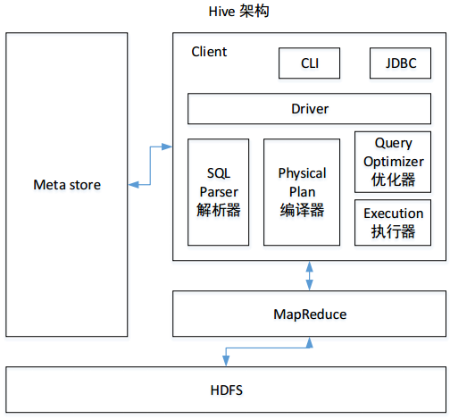
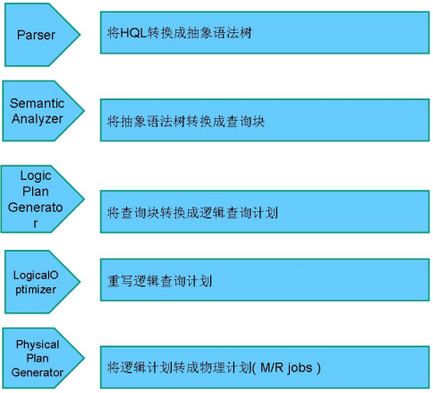

### Hive架构简述


**用户接口Client**：Hive可以通过CLI（Command-line Interface，即命令行），JDBC/ODBC( jdbc 访问 hive)、WEBUI（浏览器访问 hive）。

**元数据Metastore**：Hive的元数据保存在数据库中，如保存在MySQL，SQLServer，PostgreSQL，Oracle及Derby等数据库中（默认是derby）。Hive中的元数据信息包含表名、表所属的数据库（默认是 default）、表的拥有者、列/分区字段、表的类型（是否是外部表）、表的数据所在目录等。（其实就是sql表与hdfs文件之间的映射Path）

**驱动器Driver**

1. 解析器（SQL Parser）：将 SQL 字符串转换成抽象语法树 AST，这一步一般都用第三方工具库完成，比如 antlr；Antlr定义SQL的语法规则，完成SQL词法、语法解析，将SQL转化为抽象语法树AST Tree
2. 编译器（Physical Plan）：将 AST 编译生成逻辑执行计划。
3. 优化器（Query Optimizer）：对逻辑执行计划进行优化。
4. 执行器（Execution）：把逻辑执行计划转换成可以运行的物理计划。对于 Hive 来说，就是 MR/Spark。

Hive 通过给用户提供的一系列交互接口，接收到用户的指令(SQL)，使用自己的 Driver，结合元数据(MetaStore)，将这些指令翻译成 MapReduce，提交到 Hadoop 中执行，最后，将执行返回的结果输出到用户交互接口。


### HiveSQL转换为MR的过程 

HiveSQL ->AST(抽象语法树) -> QB(查询块) ->OperatorTree（操作树）->优化后的操作树->mapreduce任务树->优化后的mapreduce任务树



>  过程描述如下：

* SQL Parser（SQL解析器)：Antlr定义SQL的语法规则，完成SQL词法、语法解析，将SQL转化为抽象语法树AST Tree；
* Semantic Analyzer（语义分析）：遍历AST Tree，抽象出查询的基本组成单元QueryBlock；
* Logical plan（逻辑执行计划）：遍历QueryBlock，翻译为执行操作树OperatorTree；
* Logical plan optimizer（逻辑优化器）: 逻辑层优化器进行OperatorTree变换，合并不必要的ReduceSinkOperator，减少shuffle数据量；
* Physical plan（物理执行计划）：遍历OperatorTree，翻译为MapReduce任务；
* Physical plan optimizer（物理优化器）：物理层优化器进行MapReduce任务的变换，生成最终的执行计划

### Hive内部表、外部表、分区表、分桶表的区别，以及各自的使用场景

- **内部表**

  如果Hive中没有特别指定，则默认创建的表都是**管理表**，也称**内部表**。由Hive负责管理表中的数据，管理表不共享数据。删除管理表时，会删除管理表中的数据和元数据信息。

- **外部表**

  当一份数据需要被共享时，可以创建一个外部表指向这份数据。

  删除该表并不会删除掉原始数据，删除的是表的元数据。当表结构或者分区数发生变化时，需要进行一步修复的操作。

- **分区表**

  分区表使用的是表外字段，需要指定字段类型，并通过关键字partitioned by(partition_name string)声明，但是分区划分粒度较粗 。优势也很明显，就是将数据按区域划分开，查询时不用扫描无关的数据，加快查询速度 。

- **分桶表**

  分桶使用的是表内字段，已经知道字段类型，不需要再指定。通过关键字 `clustered by(column_name) into … buckets`声明。**分桶是更细粒度的划分、管理数据，可以对表进行先分区再分桶的划分策略**

​    分桶最大的优势就是：用于数据取样，可以起到优化加速的作用。

> **拓展：** 关于**内部表**，**外部表**，**分区表**，**分桶表** 知识的考察是面试的**重点**，需要留意。其中**分桶逻辑**为：对分桶字段求哈希值，用哈希值与分桶的数量取余，余几，这个数据就放在那个桶内

### Order By，Sort By，Distrbute By，Cluster By的区别

- **Order By(全局排序)**

  order by 会对输入做全局排序，因此只有一个reduce（多个reducer无法保证全局有序），也正因为只有一个 reducer，所以当输入的数据规模较大时，会导致计算的时间较长。

> **注意：** Order by 和 数据库中的 Order by 功能一致，按照某一个或者字段排序输出。与数据库中 order by的区别在于在 hive 的严格模式下(**hive.mapred.mode = strict**)下，必须指定 limit ，否则执行会报错！

- **Sort By(每个MapReduce排序)**

  sort by并不是全局排序，其在数据进入reducer前完成排序。因此，如果用sort by进行排序，并且设置 mapred.reduce.tasks>1， 则sort by只保证每个reducer的输出有序，不保证全局有序。

> **拓展：** ①sort by 不受 hive.mapred.mode 是否为strict ,nostrict 的影响 ②sort by 的数据只能保证在同一reduce中的数据可以按指定字段排序 ③使用sort by 你可以指定执行的reduce 个数 （set mapred.reduce.tasks=）,对输出的数据再执行归并排序，即可以得到全部结果 **注意：** 可以用 limit 子句大大减少数据量。使用 limit n 后，传输到 reduce 端（单机）的数据记录数就减少到 n* （map个数）。否则由于数据过大可能出不了结果。

- **Distrbute By(每个分区排序)**

  在有些情况下，我们需要控制某个特定行应该到哪个 reducer ，通常是为了进行后续的聚集操作。distribute by 子句可以做这件事。distribute by类似 MR 中 partition（自定义分区），进行分区，结合 sort by 使用。distribute by 和 sort by 的常见使用场景有：

  	1. Map输出的文件大小不均
  	1. Reduce输出文件不均
  	1. 小文件过多文件超大

- **Cluster By**

  当 distribute by 和 sorts by字段相同时，可以使用 cluster by 方式代替。cluster by除了具有 distribute by 的功能外还兼具 sort by 的功能。但是排序只能是 **升序** 排序，不能像distribute by 一样去指定排序的规则为 **ASC** 或者 **DESC**

### 动态分区和静态分区的区别和使用场景

- **静态分区：**

​    定义：对于静态分区，从字面就可以理解：表的分区数量和分区值是固定的。静态分区需要手动指定，列是在编译时期通过用户传递来决定的。

​    应用场景：需要提前知道所有分区。适用于分区定义得早且数量少的用例，不适用于生产。

- **动态分区：**

​    定义：是基于查询参数的位置去推断分区的名称，只有在 SQL 执行时才能确定，会根据数据自动的创建新的分区。

​    应用场景：有很多分区，无法提前预估新分区，动态分区是合适的，一般用于生产环境

### HiveSQL 语句中 select from where group by having order by 的执行顺序

实际上，在 hive 和 mysql 中都可以通过 `explain+sql` 语句，来查看**执行顺序**。对于一条标准 sql 语句，它的书写顺序是这样的：

​    `select … from … where … group by … having … order by … limit …`

（1）mysql 语句执行顺序：

​    `from... where...group by... having.... select ... order by... limit …`

（2）hive 语句执行顺序：

​    `from … where … select … group by … having … order by … limit …`

> **拓展：** 要搞清楚面试官问执行顺序背后的原因是什么，不是单纯的看你有没有背过这道题，而是看你是否能够根据执行顺序，写出不被人喷的 SQL
> **根据执行顺序，我们平时编写时需要记住以下几点：**
>
> - 使用分区剪裁、列剪裁，分区一定要加
> - 少用 COUNT DISTINCT，group by 代替 distinct
> - 是否存在多对多的关联
> - 连接表时使用相同的关键词，这样只会产生一个 job
> - 减少每个阶段的数据量，只选出需要的，在 join 表前就进行过滤
> - 大表放后面
> - 谓词下推：where 谓词逻辑都尽可能提前执行，减少下游处理的数据量
> - sort by 代替 order by

### Hive如何避免小文件的产生,你会如何处理大量小文件

小文件产生的原因有很多，例如：读取数据源时的大量小文件,使用动态分区插入数据时产生，Reduce/Task数量较多。

​    我们都知道，HDFS文件元数据存储在 NameNode 的内存中，在 内存空间有限的情况下，小文件过多会影响NameNode 的寿命，同时影响计算引擎的任务数量，比如每个小的文件都会生成一个Map任务。

​    那到底该如何解决小文件过多的问题呢？

​    **解决的方法有：**

​    （1）合并小文件：对小文件进行归档（Har）、自定义Inputformat将小文件存储成SequenceFile文件。

​    （2）采用ConbinFileInputFormat来作为输入，解决输入端大量小文件场景。

​    （3）对于大量小文件Job，可以开启JVM重用。

​    （4）当然，也可以直接设置相关的参数

​    设置map输入的小文件合并：

```
set mapped. max split size=256000000
//一个节点上 split的至少的大小〔这个值决定了多个 DataNode上的文件是否需要合并
set mapred. in split. size per.node=100000000
//一个交换机下 split的至少的大小〔这个值决定了多个交换机上的文件是否需要合并
/执行Map前进行小文件合井
set hive. input format=org. apache hadoop. hive. ql.io.CombineHiveInputFormat:
```

​    设置 map 输出 和 reduce 输出 进行合并的相关参数

```
//设置map端输出进行合并,默认为true
set hive. merge mapfiles =true
//设置 reduce端输出进行合并,默认为 false
set hive. merge. mapredfiles=true
//设置合并文件的大小
set hive. merge.size.per.task =256*1000*1000
//当输出文件的平均大小小于该值时,启动一个独立的 MapReduce任务进行文件 merge
set hive.merge.smallfiles.avgsize= 16000000
```

### Hive的两张表关联，使用MapReduce怎么实现

如果其中有一张表为小表，直接使用map端join的方式（map端加载小表）进行聚合。

如果两张都是大表，那么采用联合key，联合key的第一个组成部分是join on中的公共字段，第二部分是一个flag，0代表表A，1代表表B，由此让Reduce区分客户信息和订单信息；在Mapper中同时处理两张表的信息，将join on公共字段相同的数据划分到同一个分区中，进而传递到一个Reduce中，然后在Reduce中实现聚合

