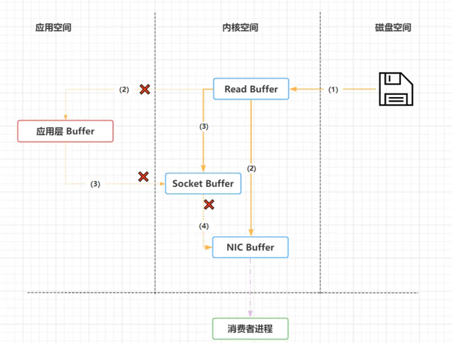

## Kafka 设计架构

架构图如下：


> Kafka 架构分为以下几个部分：

* Producer：消息生产者，就是向 kafka broker 发消息的客户端。
* Consumer：消息消费者，向 kafka broker 取消息的客户端。
* Topic：可以理解为一个队列，一个 Topic 又分为一个或多个分区。
* Consumer Group：这是 kafka 用来实现一个 topic 消息的广播（发给所有的 consumer）和单播（发给任意一个 consumer）的手段。一个 topic 可以有多个 Consumer Group。
* Broker：一台 kafka 服务器就是一个 broker。一个集群由多个 broker 组成。一个 broker 可以容纳多个 topic。
* Partition：为了实现扩展性，一个非常大的 topic 可以分布到多个 broker上，每个 partition 是一个有序的队列。partition 中的每条消息都会被分配一个有序的id（offset）。将消息发给 consumer，kafka 只保证按一个 partition 中的消息的顺序，不保证一个 topic 的整体（多个 partition 间）的顺序。
*  Offset：kafka 的存储文件都是按照 offset.kafka 来命名，用 offset 做名字的好处是方便查找。例如你想找位于 2049 的位置，只要找到 2048.kafka 的文件即可。当然 the first offset 就是 00000000000.kafka

## Kafka 是如何做到消息的有序性

 kafka 中的每个 partition 中的消息在写入时都是有序的，而且单独一个 partition 只能由一个消费者去消费，可以在里面保证消息的顺序性。但是分区之间的消息是不保证有序的。

## Kafka 的高可靠性是怎么实现的

### 数据可靠性

在 Kafka 0.8.0 之前，Kafka 是没有副本的概念的，那时候人们只会用 Kafka 存储一些不重要的数据，因为没有副本，数据很可能会丢失。但是随着业务的发展，支持副本的功能越来越强烈，所以为了保证数据的可靠性，Kafka 从 0.8.0 版本开始引入了分区副本（详情请参见 KAFKA-50）。也就是说每个分区可以人为的配置几个副本（比如创建主题的时候指定 replication-factor，也可以在 Broker 级别进行配置 default.replication.factor），一般会设置为3。
**Kafka 可以保证单个分区里的事件是有序的**，分区可以在线（可用），也可以离线（不可用）。在众多的分区副本里面有一个副本是 Leader，其余的副本是 follower，所有的读写操作都是经过 Leader 进行的，同时 follower 会定期地去 leader 上的复制数据。当 Leader 挂了的时候，其中一个 follower 会重新成为新的 Leader。通过分区副本，引入了数据冗余，同时也提供了 Kafka 的数据可靠性。
**Kafka 的分区多副本架构是 Kafka 可靠性保证的核心，把消息写入多个副本可以使 Kafka 在发生崩溃时仍能保证消息的持久性**。

> Producer 往 Broker 发送消息

如果我们要往 Kafka 对应的主题发送消息，我们需要通过 Producer 完成。前面我们讲过 Kafka 主题对应了多个分区，每个分区下面又对应了多个副本；为了让用户设置数据可靠性， Kafka 在 Producer 里面提供了消息确认机制。也就是说我们可以通过配置来决定消息发送到对应分区的几个副本才算消息发送成功。可以在定义 Producer 时通过 acks 参数指定（在 0.8.2.X 版本之前是通过 request.required.acks 参数设置的）。
**这个参数支持以下三种值**

* acks = 0：意味着如果生产者能够通过网络把消息发送出去，那么就认为消息已成功写入Kafka。在这种情况下还是有可能发生错误，比如发送的对象无能被序列化或者网卡发生故障，但如果是分区离线或整个集群长时间不可用，那就不会收到任何错误。在 acks=0 模式下的运行速度是非常快的（这就是为什么很多基准测试都是基于这个模式），你可以得到惊人的吞吐量和带宽利用率，不过如果选择了这种模式， 一定会丢失一些消息。
* acks = 1：意味若 Leader 在收到消息并把它写入到分区数据文件（不一定同步到磁盘上）时会返回确认或错误响应。在这个模式下，如果发生正常的 Leader 选举，生产者会在选举时收到一个 LeaderNotAvailableException 异常，如果生产者能恰当地处理这个错误，它会重试发送悄息，最终消息会安全到达新的 Leader 那里。不过在这个模式下仍然有可能丢失数据，比如消息已经成功写入 Leader，但在消息被复制到 follower 副本之前 Leader发生崩溃。
* acks = all（这个和 request.required.acks = -1 含义一样）：意味着 Leader 在返回确认或错误响应之前，会等待所有同步副本都收到悄息。如果和 min.insync.replicas 参数结合起来，就可以决定在返回确认前至少有多少个副本能够收到悄息，生产者会一直重试直到消息被成功提交。不过这也是最慢的做法，因为生产者在继续发送其他消息之前需要等待所有副本都收到当前的消息。
  根据实际的应用场景，我们设置不同的 acks，以此保证数据的可靠性。

 另外，Producer 发送消息还可以选择同步（默认，通过 producer.type=sync 配置） 或者异步（producer.type=async）模式。如果设置成异步，虽然会极大的提高消息发送的性能，但是这样会增加丢失数据的风险。如果需要确保消息的可靠性，必须将 producer.type 设置为 sync.

### 数据一致性

这里介绍的数据一致性主要是说不论是老的 Leader 还是新选举的 Leader，Consumer 都能读到一样的数据。那么 Kafka 是如何实现的呢？


假设分区的副本为3，其中副本0是 Leader，副本1和副本2是 follower，并且在 ISR 列表里面。虽然副本0已经写入了 Message4，但是 Consumer 只能读取到 Message2。因为所有的 ISR 都同步了 Message2，只有 High Water Mark 以上的消息才支持 Consumer 读取，而 High Water Mark 取决于 ISR 列表里面偏移量最小的分区，对应于上图的副本2，这个很类似于木桶原理。
这样做的原因是还没有被足够多副本复制的消息被认为是“不安全”的，如果 Leader 发生崩溃，另一个副本成为新 Leader，那么这些消息很可能丢失了。如果我们允许消费者读取这些消息，可能就会破坏一致性。试想，一个消费者从当前 Leader（副本0） 读取并处理了 Message4，这个时候 Leader 挂掉了，选举了副本1为新的 Leader，这时候另一个消费者再去从新的 Leader 读取消息，发现这个消息其实并不存在，这就导致了数据不一致性问题。
当然，引入了 High Water Mark 机制，会导致 Broker 间的消息复制因为某些原因变慢，那么消息到达消费者的时间也会随之变长（因为我们会先等待消息复制完毕）。延迟时间可以通过参数 `replica.lag.time.max.ms` 参数配置，它指定了副本在复制消息时可被允许的最大延迟时间

## ISR、OSR、AR 是什么

* ISR：In-Sync Replicas 副本同步队列
*  OSR：Out-of-Sync Replicas
*  AR：Assigned Replicas 所有副本

 ISR是由leader维护，follower从leader同步数据有一些延迟（具体可以参见 图文了解 Kafka 的副本复制机制），超过相应的阈值会把 follower 剔除出 ISR, 存入OSR（Out-of-Sync Replicas ）列表，新加入的follower也会先存放在OSR中。AR=ISR+OSR

## LEO、HW、LSO、LW等分别代表什么

* LEO：是 LogEndOffset 的简称，代表当前日志文件中下一条
* HW：水位或水印（watermark）一词，也可称为高水位(high watermark)，通常被用在流式处理领域（比如Apache Flink、Apache Spark等），以表征元素或事件在基于时间层面上的进度。在Kafka中，水位的概念反而与时间无关，而是与位置信息相关。严格来说，它表示的就是位置信息，即位移（offset）。取 partition 对应的 ISR中 最小的 LEO 作为 HW，consumer 最多只能消费到 HW 所在的位置上一条信息。
*  LSO：是 LastStableOffset 的简称，对未完成的事务而言，LSO 的值等于事务中第一条消息的位置(firstUnstableOffset)，对已完成的事务而言，它的值同 HW 相同
*  LW：Low Watermark 低水位, 代表 AR 集合中最小的 logStartOffset 值。

## 数据传输的事务有几种

数据传输的事务定义通常有以下三种级别：

1. 最多一次：消息不会被重复发送，最多被传输一次，但也有可能一次不传输
2. 最少一次：消息不会被漏发送，最少被传输一次，但也有可能被重复传输
3.  精确的一次（Exactly once）：不会漏传输也不会重复传输，每个消息都传输被接收

## Kafka消息是采用Pull模式，还是Push模式

Kafka最初考虑的问题是，customer应该从brokes拉取消息还是brokers将消息推送到consumer，也就是pull还push。在这方面，Kafka遵循了一种大部分消息系统共同的传统的设计：producer将消息推送到broker，consumer从broker拉取消息。
一些消息系统比如Scribe和Apache Flume采用了push模式，将消息推送到下游的consumer。这样做有好处也有坏处：由broker决定消息推送的速率，对于不同消费速率的consumer就不太好处理了。消息系统都致力于让consumer以最大的速率最快速的消费消息，但不幸的是，push模式下，当broker推送的速率远大于consumer消费的速率时，consumer恐怕就要崩溃了。最终Kafka还是选取了传统的pull模式。
  Pull模式的另外一个好处是consumer可以自主决定是否批量的从broker拉取数据。Push模式必须在不知道下游consumer消费能力和消费策略的情况下决定是立即推送每条消息还是缓存之后批量推送。如果为了避免consumer崩溃而采用较低的推送速率，将可能导致一次只推送较少的消息而造成浪费。Pull模式下，consumer就可以根据自己的消费能力去决定这些策略。 Pull有个缺点是，如果broker没有可供消费的消息，将导致consumer不断在循环中轮询，直到新消息到t达。为了避免这点，Kafka有个参数可以让consumer阻塞知道新消息到达(当然也可以阻塞知道消息的数量达到某个特定的量这样就可以批量发送）

## Kafka 高效文件存储设计特点

1. Kafka把topic中一个parition大文件分成多个小文件段，通过多个小文件段，就容易定期清除或删除已经消费完文件，减少磁盘占用。
2. 通过索引信息可以快速定位message和确定response的最大大小。
3. 通过index元数据全部映射到memory，可以避免segment file的IO磁盘操作。
4. 通过索引文件稀疏存储，可以大幅降低index文件元数据占用空间大小。

## Kafka 的负载均衡

在Kafka中，当有新消费者加入或者订阅的topic数发生变化时，会触发Rebalance(再均衡：在同一个消费者组当中，分区的所有权从一个消费者转移到另外一个消费者)机制，Rebalance顾名思义就是重新均衡消费者消费。Rebalance的过程如下：

1. 第一步：所有成员都向coordinator发送请求，请求入组。一旦所有成员都发送了请求，coordinator会从中选择一个consumer担任leader的角色，并把组成员信息以及订阅信息发给leader。
2. 第二步：leader开始分配消费方案，指明具体哪个consumer负责消费哪些topic的哪些partition。一旦完成分配，leader会将这个方案发给coordinator。coordinator接收到分配方案之后会把方案发给各个consumer，这样组内的所有成员就都知道自己应该消费哪些分区了。所以对于Rebalance来说，Coordinator起着至关重要的作用

## Kafka分区分配策略


 在 Kafka 内部存在两种默认的分区分配策略：Range 和 RoundRobin。当以下事件发生时，Kafka 将会进行一次分区分配：

* 同一个 Consumer Group 内新增消费者
* 消费者离开当前所属的Consumer Group，包括shuts down 或 crashes
* 订阅的主题新增分区 将分区的所有权从一个消费者移到另一个消费者称为重新平衡（rebalance），如何rebalance就涉及到下面提到的分区分配策略。下面我们将详细介绍 Kafka 内置的两种分区分配策略。本文假设我们有个名为 T1 的主题，其包含了10个分区，然后我们有两个消费者（C1，C2）来消费这10个分区里面的数据，而且 C1 的 num.streams = 1，C2 的 num.streams = 2

### **Range strategy**

  Range策略是对每个主题而言的，首先对同一个主题里面的分区按照序号进行排序，并对消费者按照字母顺序进行排序。在我们的例子里面，排完序的分区将会是0, 1, 2, 3, 4, 5, 6, 7, 8, 9；消费者线程排完序将会是C1-0, C2-0, C2-1。然后将partitions的个数除于消费者线程的总数来决定每个消费者线程消费几个分区。如果除不尽，那么前面几个消费者线程将会多消费一个分区。
  在我们的例子里面，我们有10个分区，3个消费者线程，10 / 3 = 3，而且除不尽，那么消费者线程 C1-0 将会多消费一个分区，所以最后分区分配的结果看起来是这样的：

- C1-0 将消费 0, 1, 2, 3 分区

- C2-0 将消费 4, 5, 6 分区

- C2-1 将消费 7, 8, 9 分区

  

 假如我们有11个分区，那么最后分区分配的结果看起来是这样的：

- C1-0 将消费 0, 1, 2, 3 分区
- C2-0 将消费 4, 5, 6, 7 分区
- C2-1 将消费 8, 9, 10 分区
    

假如我们有2个主题(T1和T2)，分别有10个分区，那么最后分区分配的结果看起来是这样的：

- C1-0 将消费 T1主题的 0, 1, 2, 3 分区以及 T2主题的 0, 1, 2, 3分区
- C2-0 将消费 T1主题的 4, 5, 6 分区以及 T2主题的 4, 5, 6分区
- C2-1 将消费 T1主题的 7, 8, 9 分区以及 T2主题的 7, 8, 9分区

可以看出，C1-0 消费者线程比其他消费者线程多消费了2个分区，这就是Range strategy的一个很明显的弊端。 

### RoundRobin strategy

使用RoundRobin策略有两个前提条件必须满足：

- 同一个Consumer Group里面的所有消费者的num.streams必须相等；
- 每个消费者订阅的主题必须相同。
   

 所以这里假设前面提到的2个消费者的num.streams = 2。RoundRobin策略的工作原理：将所有主题的分区组成 TopicAndPartition 列表，然后对 TopicAndPartition 列表按照 hashCode 进行排序，这里文字可能说不清，看下面的代码应该会明白：

```
val allTopicPartitions = ctx.partitionsForTopic.flatMap { case(topic, partitions) =>
  info("Consumer %s rebalancing the following partitions for topic %s: %s"
       .format(ctx.consumerId, topic, partitions))
  partitions.map(partition => {
   TopicAndPartition(topic, partition)
  })
}.toSeq.sortWith((topicPartition1, topicPartition2) => {
  /*
   * Randomize the order by taking the hashcode to reduce the likelihood of all partitions of a given topic ending
   * up on one consumer (if it has a high enough stream count).
   */
  topicPartition1.toString.hashCode < topicPartition2.toString.hashCode
})
```


最后按照round-robin风格将分区分别分配给不同的消费者线程。

在我们的例子里面，假如按照 hashCode 排序完的topic-partitions组依次为T1-5, T1-3, T1-0, T1-8, T1-2, T1-1, T1-4, T1-7, T1-6, T1-9，我们的消费者线程排序为C1-0, C1-1, C2-0, C2-1，最后分区分配的结果为：

- C1-0 将消费 T1-5, T1-2, T1-6 分区；
- C1-1 将消费 T1-3, T1-1, T1-9 分区；
-  C2-0 将消费 T1-0, T1-4 分区；
- C2-1 将消费 T1-8, T1-7 分区。

 多个主题的分区分配和单个主题类似。

## Kafka 为什么性能很高

 Kafka是分布式消息系统，需要处理海量的消息，Kafka的设计是把所有的消息都写入速度低容量大的硬盘，以此来换取更强的存储能力，但实际上，使用硬盘并没有带来过多的性能损失。kafka主要使用了以下几个方式实现了超高的吞吐率

### 顺序读写

众所周知Kafka是将消息记录持久化到本地磁盘中的，一般人会认为磁盘读写性能差，可能会对Kafka性能如何保证提出质疑。实际上不管是内存还是磁盘，快或慢关键在于寻址的方式，磁盘分为顺序读写与随机读写，内存也一样分为顺序读写与随机读写。基于磁盘的随机读写确实很慢，但磁盘的顺序读写性能却很高，一般而言要高出磁盘随机读写三个数量级，一些情况下磁盘顺序读写性能甚至要高于内存随机读写

这里给出著名学术期刊 ACM Queue 上的性能对比图

磁盘的顺序读写是磁盘使用模式中最有规律的，并且操作系统也对这种模式做了大量优化，Kafka就是使用了磁盘顺序读写来提升的性能。Kafka的message是不断追加到本地磁盘文件末尾的，而不是随机的写入，这使得Kafka写入吞吐量得到了显著提升

上图就展示了Kafka是如何写入数据的， 每一个Partition其实都是一个文件 ，收到消息后Kafka会把数据插入到文件末尾（虚框部分）。

这种方法有一个缺陷—— 没有办法删除数据 ，所以Kafka是不会删除数据的，它会把所有的数据都保留下来，每个消费者（Consumer）对每个Topic都有一个offset用来表示 读取到了第几条数据

两个消费者，Consumer1有两个offset分别对应Partition0、Partition1（假设每一个Topic一个Partition）；Consumer2有一个offset对应Partition2。这个offset是由客户端SDK负责保存的，Kafka的Broker完全无视这个东西的存在；一般情况下SDK会把它保存到zookeeper里面。(所以需要给Consumer提供zookeeper的地址)。

如果不删除硬盘肯定会被撑满，所以Kakfa提供了两种策略来删除数据。一是基于时间，二是基于partition文件大小
### PageCache

为了优化读写性能，Kafka利用了操作系统本身的Page Cache，就是利用操作系统自身的内存而不是JVM空间内存。这样做的好处有：

* 避免Object消耗：如果是使用 Java 堆，Java对象的内存消耗比较大，通常是所存储数据的两倍甚至更多。
* 避免GC问题：随着JVM中数据不断增多，垃圾回收将会变得复杂与缓慢，使用系统缓存就不会存在GC问题

相比于使用JVM或in-memory cache等数据结构，利用操作系统的Page Cache更加简单可靠。首先，操作系统层面的缓存利用率会更高，因为存储的都是紧凑的字节结构而不是独立的对象。其次，操作系统本身也对于Page Cache做了大量优化，提供了 write-behind、read-ahead以及flush等多种机制。再者，即使服务进程重启，系统缓存依然不会消失，避免了in-process cache重建缓存的过程。

通过操作系统的Page Cache，Kafka的读写操作基本上是基于内存的，读写速度得到了极大的提升。

### 零拷贝
参考：

* https://cloud.tencent.com/developer/article/1421266

* [通俗易懂的Kafka零拷贝机制](https://blog.csdn.net/yxf19034516/article/details/108518194)

linux操作系统 “零拷贝” 机制使用了sendfile方法， 允许操作系统将数据从Page Cache 直接发送到网络，只需要最后一步的copy操作将数据复制到 NIC 缓冲区， 这样避免重新复制数据 。示意图如下

所谓的零拷贝是指将数据在内核空间直接从磁盘文件复制到网卡中，而不需要经由用户态的应用程序之手。这样既可以提高数据读取的性能，也能减少核心态和用户态之间的上下文切换，提高数据传输效率。
  在正式介绍零拷贝结束（Zero-Copy）之前，我们先简单介绍一下DMA（Direct Memory Access）技术。DMA，又称之为直接内存访问，是零拷贝技术的基石。DMA 传输将数据从一个地址空间复制到另外一个地址空间。当CPU 初始化这个传输动作，传输动作本身是由 DMA 控制器来实行和完成。因此通过DMA，硬件则可以绕过CPU，自己去直接访问系统主内存。很多硬件都支持DMA，其中就包括网卡、声卡、磁盘驱动控制器等。
  有了DMA技术的支持之后，网卡就可以直接区访问内核空间的内存，这样就可以实现内核空间和应用空间之间的零拷贝了，极大地提升传输性能。下图展示了Kafka零拷贝的数据传输过程。数据传输的的过程就简化成了：

1. 操作系统将数据从磁盘中加载到内核空间的Read Buffer（页缓存区）中。

2. 操作系统之间将数据从内核空间的Read Buffer（页缓存区）传输到网卡中，并通过网卡将数据发送给接收方。

3. 操作系统将数据的描述符拷贝到Socket Buffer中。Socket 缓存中仅仅会拷贝一个描述符过去，不会拷贝数据到 Socket 缓存。
     Kafka数据零拷贝的过程如下图所示
     
     通过零拷贝技术，就不需要把 内核空间页缓存里的数据拷贝到应用层缓存，再从应用层缓存拷贝到 Socket 缓存了，两次拷贝都省略了，所以叫做零拷贝。这个过程大大的提升了数据消费时读取文件数据的性能。Kafka 从磁盘读数据的时候，会先看看内核空间的页缓存中是否有，如果有的话，直接通过网关发送出去


### 分区分段+索引

Kafka的message是按topic分类存储的，topic中的数据又是按照一个一个的partition即分区存储到不同broker节点。每个partition对应了操作系统上的一个文件夹，partition实际上又是按照segment分段存储的。这也非常符合分布式系统分区分桶的设计思想。

通过这种分区分段的设计，Kafka的message消息实际上是分布式存储在一个一个小的segment中的，每次文件操作也是直接操作的segment。为了进一步的查询优化，Kafka又默认为分段后的数据文件建立了索引文件，就是文件系统上的.index文件。这种分区分段+索引的设计，不仅提升了数据读取的效率，同时也提高了数据操作的并行度

### 批量读写

Kafka数据读写也是批量的而不是单条的。

除了利用底层的技术外，Kafka还在应用程序层面提供了一些手段来提升性能。最明显的就是使用批次。在向Kafka写入数据时，可以启用批次写入，这样可以避免在网络上频繁传输单个消息带来的延迟和带宽开销。

### 批量压缩

在很多情况下，系统的瓶颈不是CPU或磁盘，而是网络IO，对于需要在广域网上的数据中心之间发送消息的数据流水线尤其如此。进行数据压缩会消耗少量的CPU资源,不过对于kafka而言,网络IO更应该需要考虑。

1. 如果每个消息都压缩，但是压缩率相对很低，所以Kafka使用了批量压缩，即将多个消息一起压缩而不是单个消息压缩
2. Kafka允许使用递归的消息集合，批量的消息可以通过压缩的形式传输并且在日志中也可以保持压缩格式，直到被消费者解压缩
3. Kafka支持多种压缩协议，包括Gzip和Snappy压缩协议

Kafka速度的秘诀在于，它把所有的消息都变成一个批量的文件，并且进行合理的批量压缩，减少网络IO损耗，通过mmap提高I/O速度，写入数据的时候由于单个Partion是末尾添加所以速度最优；读取数据的时候配合sendfile直接暴力输出。

## Kafka如何实现精确一次

**Kafka 分别通过 幂等性（Idempotence）和事务（Transaction）这两种机制实现了 精确一次（exactly once）语义。**

### 幂等性（Idempotence）

`幂等`这个词原是数学领域中的概念，指的是某些操作或函数能够被执行多次，但每次得到的结果都是不变的。

**幂等性最大的优势在于我们可以安全地重试任何幂等性操作，反正它们也不会破坏我们的系统状态。**

在 Kafka 中，Producer 默认不是幂等性的，但我们可以创建幂等性 Producer。它其实是 0.11.0.0 版本引入的新功能。指定 Producer 幂等性的方法很简单，仅需要设置一个参数即可，即 `props.put(“enable.idempotence”, ture)`，或 `props.put(ProducerConfig.ENABLE_IDEMPOTENCE_CONFIG， true)`。

enable.idempotence 被设置成 true 后，Producer 自动升级成幂等性 Producer，其他所有的代码逻辑都不需要改变。Kafka 自动帮你做消息的重复去重。

底层具体的原理很简单，就是经典的用`空间去换时间`的优化思路，即**在 Broker 端多保存一些字段。当 Producer 发送了具有相同字段值的消息后，Broker 能够自动知晓这些消息已经重复了，于是可以在后台默默地把它们“丢弃”掉**。

> 当然，实际的实现原理并没有这么简单，但你大致可以这么理解

Kafka 为了实现幂等性，它在底层设计架构中引入了 ProducerID 和 SequenceNumber。

Producer 需要做的只有两件事：

- 1）初始化时像向 Broker 申请一个 ProducerID
- 2）为每条消息绑定一个 SequenceNumber

Kafka Broker 收到消息后会以 ProducerID 为单位存储 SequenceNumber，也就是说即时 Producer 重复发送了， Broker 端也会将其过滤掉。

实现比较简单，同样的限制也比较大：

- 首先，它只能保证单分区上的幂等性

  。即一个幂等性 Producer 能够保证某个主题的一个分区上不出现重复消息，它无法实现多个分区的幂等性。

  - 因为 SequenceNumber 是以 Topic + Partition 为单位单调递增的，如果一条消息被发送到了多个分区必然会分配到不同的 SequenceNumber ,导致重复问题。

- 其次，它只能实现单会话上的幂等性

  。不能实现跨会话的幂等性。当你重启 Producer 进程之后，这种幂等性保证就丧失了。

  - 重启 Producer 后会分配一个新的 ProducerID，相当于之前保存的 SequenceNumber 就丢失了。

### 事务（Transaction）

Kafka 的事务概念类似于我们熟知的数据库提供的事务。

Kafka 自 0.11 版本开始也提供了对事务的支持，目前主要是在 read committed 隔离级别上做事情。它能保证多条消息原子性地写入到目标分区，同时也能保证 Consumer 只能看到事务成功提交的消息。

事务型 Producer 能够保证将消息原子性地写入到多个分区中。这批消息要么全部写入成功，要么全部失败。另外，事务型 Producer 也不惧进程的重启。Producer 重启回来后，Kafka 依然保证它们发送消息的精确一次处理。

设置事务型 Producer 的方法也很简单，满足两个要求即可：

- 和幂等性 Producer 一样，开启 enable.idempotence = true。
- 设置 Producer 端参数 transactional. id。最好为其设置一个有意义的名字。

此外，你还需要在 Producer 代码中做一些调整，如这段代码所示：

```java

producer.initTransactions();
try {
            producer.beginTransaction();
            producer.send(record1);
            producer.send(record2);
            producer.commitTransaction();
} catch (KafkaException e) {
            producer.abortTransaction();
}

```


和普通 Producer 代码相比，事务型 Producer 的显著特点是调用了一些事务 API，如 initTransaction

beginTransaction、commitTransaction 和 abortTransaction，它们分别对应事务的初始化、事务开始、事务提交以及事务终止。

这段代码能够保证 Record1 和 Record2 被当作一个事务统一提交到 Kafka，要么它们全部提交成功，要么全部写入失败。

实际上即使写入失败，Kafka 也会把它们写入到底层的日志中，也就是说 Consumer 还是会看到这些消息。因此在 Consumer 端，读取事务型 Producer 发送的消息也是需要一些变更的。修改起来也很简单，设置 isolation.level 参数的值即可。当前这个参数有两个取值：

- read_uncommitted：这是默认值，表明 Consumer 能够读取到 Kafka 写入的任何消息，不论事务型 Producer 提交事务还是终止事务，其写入的消息都可以读取。
  - 很显然，如果你用了事务型 Producer，那么对应的 Consumer 就不要使用这个值。
- read_committed：表明 Consumer 只会读取事务型 Producer 成功提交事务写入的消息。
  - 当然了，它也能看到非事务型 Producer 写入的所有消息。
