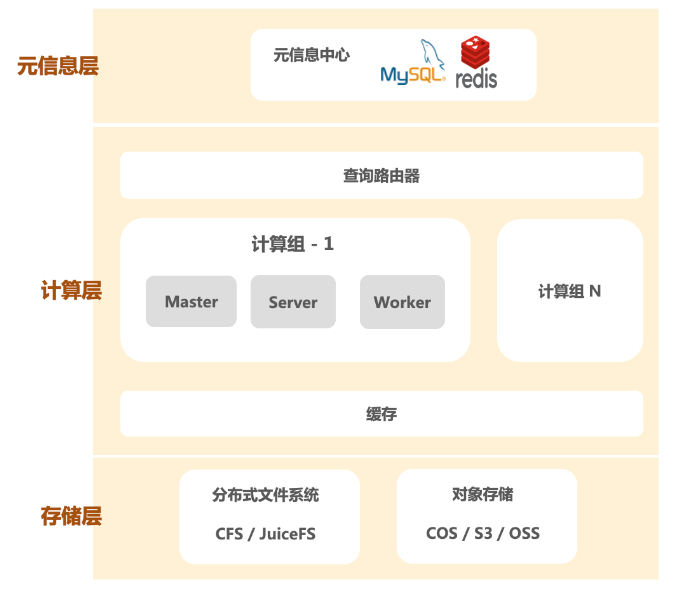
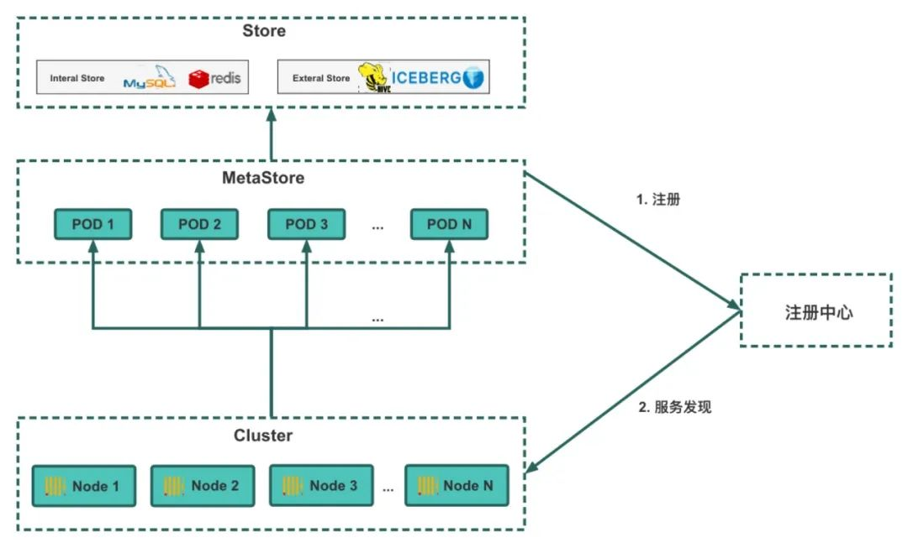
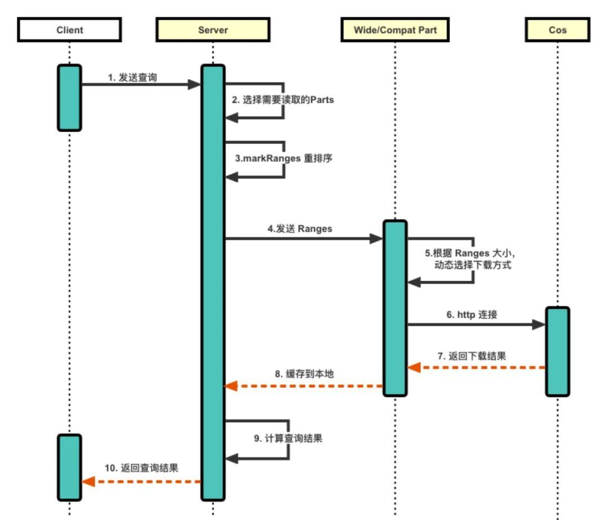
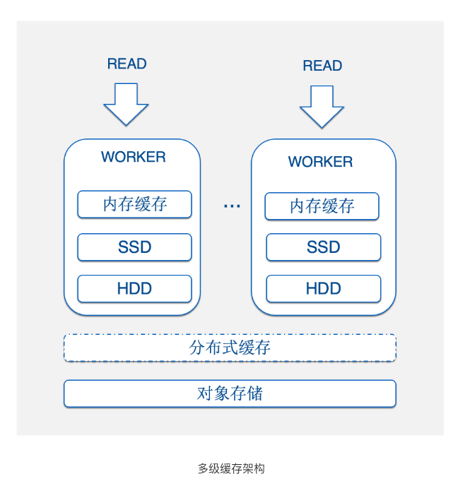
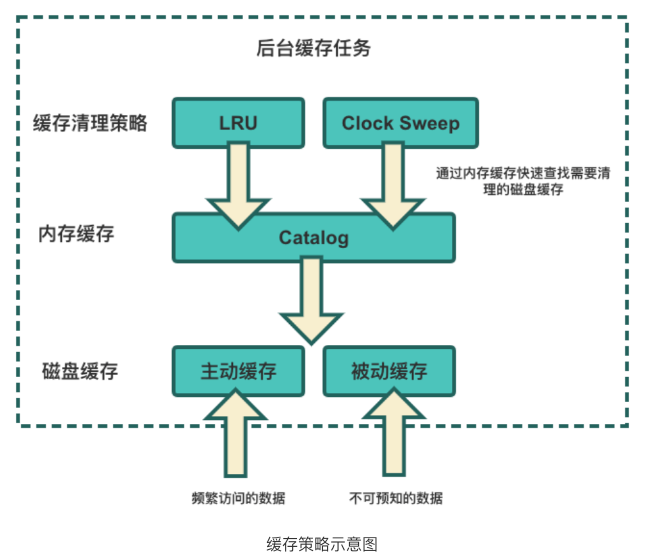
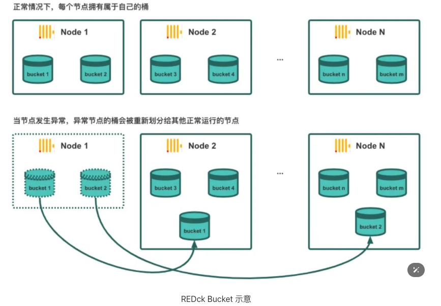
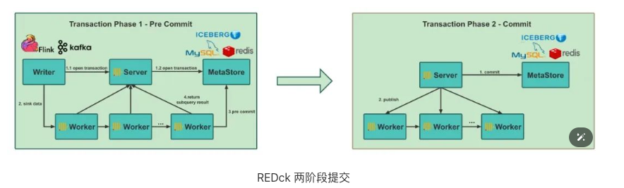

### 问题

在初期阶段 ClickHouse 展示了出色的性能，具备极快的查询响应速度，提供了灵活性和实时性，为小红书的数据分析服务提供了更强大的 Ad-Hoc 分析能力。但随着数据的累积，集群规模不断膨胀，现有的实时 OLAP 系统在使用中遇到以下问题：

**● 弹性扩展困难**

随着小红书业务的快速发展，扩容成为团队频繁进行的运维操作。ClickHouse 采用 Share-Nothing 架构， 每个节点的计算和存储资源强绑定，导致集群扩容受限于机器的调度周期。同时，扩容过程中会引入以周甚至以月为单位的数据迁移工作，对用户的查询产生影响，包括稳定性和一致性问题。

**● 资源利用率低**

ClickHouse 通过多副本机制来提高整体的可靠性，但也导致资源几何倍增。由于存储和计算比例失调， 在大多数场景下，数据存储量的需求远大于计算需求，却因为存算绑定而造成算力严重浪费。此外，许多业务存在明显的波峰和波谷，缺乏弹性扩展能力导致严重的资源冗余。

**● 稳定性问题**

ClickHouse **在资源隔离能力方面较弱，容易引发用户查询体验的不稳定性问题**。在查询高峰期，资源紧张会导致查询失败率和查询时延显著增加。另外，ClickHouse 的多副本机制重度依赖 Zookeeper，当集群规模达到一定程度时，Zookeeper 的故障频率增高，限制了集群的扩展能力。

**● 数据同步问题**

ClickHouse 一直被用户诟病的问题就是缺乏成熟的分布式事务系统，数据同步时经常出现数据不一致的现象。

**● 可维护性问题**

ClickHouse 分布式表和底层复制表模式大大增加了表管理的难度，同时缺少必要的分布式管理功能，如节点加入、节点退出和副本均衡等，使得一旦集群数量变多，维护代价巨大。

基于上述原因，社区开源版的 ClickHouse 难以满足公司在广告、社区、直播、电商等业务需求方面的大规模应用。解决集群岌岌可危的存储上限和运维等问题，对团队来说迫在眉睫.

### 解决方案选型

**方案1：集群扩容**

集群扩容是一种常见解决存储瓶颈问题的方案。然而，**社区开源版的 ClickHouse 没有内置支持自动平衡数据负载的功能**，因此新加入的节点需要手动平衡负载，并同步其他集群的表结构。此外，扩容无法真正地解决海量数据业务的挑战，最终仍需要添加 TTL 来删除历史数据。同时，扩容后的集群在可用性方面存在风险，需要投入双倍机器资源以避免单点故障导致的数据丢失，增加了成本和复杂性。

综上，集群扩容方案不仅大大增加了运维难度，而且未能从根本上解决存储瓶颈问题。存储问题依然是一把时刻悬在团队头上的“达摩克利斯之剑“。

**方案2：存算分离**

另一个方案则是更困难的路，即自研云原生实时数仓。尽管该方案面临诸多挑战，如元信息中心化、存算分离改造、容器化等，需要团队从运维能力转向自主研发，但它能从根本上解决扩展性问题。

在传统数据库系统中，存储与计算通常强绑定，即共用相同机器资源。得益于当下云原生技术的飞速发展，越来越多的数据库系统选择拥抱存算分离架构，将存储层与计算层解耦，使得存储资源和计算资源分别弹性扩展成为可能。存算分离架构带来诸多益处：首先，将数据存储到云厂商提供的对象存储中，使数据存储拥有了近乎无限扩展的能力。其次，根据需求动态调整计算资源，满足高频实时计算的性能需求并控制成本。最后，在面对故障时，可以快速迁移和恢复外部数据存储，从而极大提高数据的可靠性。

如今，云原生数据库大多是基于存算分离架构实现，如 SnowFlake、Redshift、TiDB 等。可以说，存算分离已成为分布式数据库的主流方向。

### 存算分离架构

REDck 的存算分离架构如下图，具体包括三层：

**● 统一的元信息中心**

在开源 ClickHouse中，元信息存储在各个节点的本地磁盘目录下，并通过读取目录列表构建对应的元信息。而 REDck 构建的统一元信息服务是一个无状态的中心化服务，包括内部存储和外部存储等多种存储方式；内部存储模型选择关系型数据库（如 MySQL）或健值数据库（如 Redis），外部存储模式可以与 Hive 数仓以及 Iceberg 数据湖进行深度集成。

构建统一元信息服务层的好处是集群整体信息可以集中掌握，而不是离散到各个机器节点上。集中化的信息管理能力使得数据库引擎，更方便地实现存算分离和事务机制。目前每个集群拥有自己独立的元信息服务，未来可进一步实现多集群的元数据服务，即元数据服务只有一份，可以多个集群共享。

**● 计算层**

以计算组为基本单位，每个计算组内是一个多节点的分布式计算集群，用户通过网关对计算仓库进行访问，无需关心底层的 Server Node 和 Worker Node 等细节信息。计算任务将由 Server Node 按需调度至 Worker Node 上执行。在此之上集群还有 Master 角色负责管理协调集群中心状态。得益于存算分离的实现，集群能够轻松进行横向和纵向扩展。

**● 存储层**

存储层实现了分布式文件系统、对象存储等多种低成本存储方式，为数据库提供高效、可扩展的存储能力，以满足海量数据处理需求。

#### 统一元数据服务

将数据存储在云上的对象存储后，确保每个节点都能够访问数据的元信息是一项具有挑战性的任务。在开源 ClickHouse 中，元信息来源于磁盘的目录，通过读取目录列表构建相应的元信息。然而元信息分散在每个节点内部，每个节点都有独一无二的状态，当有节点宕机时，整个集群就无法使用。为了实现每个节点共享统一的元数据信息并提高可靠性，REDck 引入了统一元信息库和 Metastore 角色。Metastore 负责统一管理集群的元信息。每个计算节点启动后，只需要访问 Metastore 获取最新的元信息即可。

统一元信息库存储分为**内部存储**和**外部存储**两种方式，我们使用 MySQL 作为内部存储来存储元数据，并利用 MySQL 的事务特性确保整体一致性。Metastore 接管并维护整个集群的信息，使得集群无需再通过 Zookeeper 进行管理，从而解除了 Zookeeper 对 ClickHouse 的束缚。同时，对于元信息的存储，我们使用内部自研的 REDkv（类比开源 Redis）实现了一套文件系统映射，使集群完全脱离磁盘文件系统的限制，实现真正的云原生。在外部存储方面，我们积极与 Hive 数仓以及 Iceberg 数据湖进行深度集成，使得 REDck 可以直接从外部存储中读取元信息。

Metastore 与 REDck 之间的通信流程如下图所示，首先部署好的 MetaStore 会向注册中心发送注册请求，对服务进行注册。当 REDck 集群部署好后，会向注册中心请求进行服务发现，并访问发现的服务以获取元数据信息

**2.3 对象存储访问优化**

对象存储具有无限扩展、低成本、可靠性极高的特点。通过使用对象存储来存储数据，我们能够从根本上解决不断增长的数据存储需求，从此告别传统数据存储带来的烦恼。对象存储的可靠性使我们能够摒弃副本机制，从而解决了副本一致性、资源浪费、Zookeeper 稳定性等一系列棘手问题，为 REDck 节点的无状态化提供了基础。

但对象存储也并不是十全十美，引入对象存储之后，我们碰到了如下问题：

● **访问速度**：对象存储的总吞吐上限理论上只受带宽限制，但是单线程访问速度较低，远低于磁盘。

● **延迟**：目前对象存储访问主要通过 HTTP 协议，延迟较高（包括建立连接等操作的延迟可达到 20 毫秒级别），对部分小文件极其不友好。

● **稳定性**：如何减轻多家云厂商对象存储稳定性问题对计算层的影响。

对象存储作为 REDck 的基石，它的性能问题将成为整个数据库系统的瓶颈。为此，我们针对对象存储的读写问题进行了以下优化：

● **提升缓存机制**：通过缓存机制提升对象存储的访问速度，从而实现查询性能的百倍提升（详见缓存策略）。针对非缓存的数据，采用并行化手段提升数据下载速度，实现十倍的性能提升。

● **优化查询计算过程**：通过查询执行计划重排序、多线程自适应优化等手段，将 HTTP 延迟降低到用户可以忽略的程度。

● **重构访问模块**：对对象存储访问模块进行优化和重构，添加数据检查、超时检测和失败重试机制，提升访问的稳定性。

具体流程如下图所示：

1. 客户端将查询发送至服务端，服务端根据查询选择需要读取的 Parts，同时对 Parts 的 markRanges 进行重排序，使每个连接线程读取相同 Part 的 Mark，减少连接次数，从而降低 HTTP 延迟。
2. 将重排序后的 Ranges 传给对应的 Part 类，Part 根据 Ranges 的大小，动态选择下载方式（分为三种），可减少下载压力。

​	a.  对于大型的 Part，采用多线程多段下载的方式，最后将多段合并成一个 Part。

​	b.  对于小型的 Part，采用先缓存到内存，再下载到本地的方式。

​	c.  对于其他的 Part，选择直接下载到本地的方式。

3. 服务端获取到下载的 Part，并计算查询结果，返回给客户端。

#### 缓存优化

对象存储为我们实现存算分离提供了基础，但同时也带来了查询时必须从云上拉取而导致延迟的问题。尽管通过对象存储的优化手段解决了大部分场景下的拉取问题，但对于部分频繁访问的热数据，反复从云端拉取并不高效。为此我们提出了缓存策略，利用机器的磁盘用作对象存储的缓存盘，为高频查询需求提供高性能保障。

整个多级缓存架构如图所示：**内存缓存 -> 本地磁盘缓存 -> 分布式缓存**。从上到下，缓存的性能由高到低，可用性和容量由低到高，分别适用于不同类型和热度的数据。这种多级缓存架构帮助我们以最少的成本为用户提供极致的查询性能体验。针对数据的特征，我们提供了两种缓存策略：

● **被动缓存：**适用于不可预知的数据，在用户查询时，临时缓存对应的数据，以提高后续查询的性能。

● **主动缓存：**适用于可以预知会被频繁访问的数据。集群启动后，系统会在后台主动根据用户设定的规则和用户的查询历史，智能推算用户今天可能会查询的数据，并将这些数据预先从对象存储缓存到本地磁盘，用户查询时直接从本地读取，性能与本地磁盘相当。

同时，由于本地磁盘空间有限，我们提供了两种缓存淘汰策略：LRU 和 Clock Sweep。为进一步优化缓存清理的速度，我们在内存中构建了磁盘的 Catalog，以便快速筛选需要淘汰的缓存数据。

#### 数据分桶

如前所述，为了实现分布式任务调度，我们引入一个全局选举的 Master 角色。然而在执行分配任务过程中，如果没有合适的调度策略，数据分布可能过于分散，导致聚合和多表连接的性能下降，并经常会伴随机器内存溢出（OOM）和计算倾斜等问题。为了解决这些问题，我们在 REDck 中引入了**桶 (Bucket)** 的概念。

桶是指将表或分区中指定列的值为 Key 进行 Hash，将其 Hash 到指定的桶中，例如实验平台中将用户 ID 指定为 Bucket 划分的 Key。通过数据分桶，我们获得以下几个优化效果：

● 在单点查询时，可以通过分桶键进行快速过滤，实现高速索引的功能，从而减少数据读取量。

● 通过分桶优化聚合和多表连接查询的性能，避免数据 Shuffle。

通过将数据按 Bucket 划分，我们在任务调度过程中以 Bucket 为单位，灵活调度 Bucket 和节点之间的映射关系，为弹性扩缩容提供了基础。

2.7 分布式事务
经过一系列优化措施，如对象存储的优化、增加缓存策略、添加分布式任务调度、引入 Bucket 的概念等，REDck 的基本使用已经比较稳定。然而，在大规模部署集群后，我们发现从 Hive/Spark 导入数据到 ClickHouse 的过程中，由于不支持事务机制，经常会发生写入重复数据的问题。这是由于开源的 ClickHouse 本身缺少成熟的事务机制，也一直是众多用户所诟病的点。虽然 ClickHouse 内有一套 Transaction 机制，但仅适用于单机模式，无法应用于我们部属的分布式集群。因此，为了实现 REDck 的 Exactly-Once 功能，减少数据导入过程中的失败和数据不一致，提高系统导数的稳定性，带来的收益是很可观的。

基于统一管理的元数据中心，我们实现了 REDck 的事务机制，对数据摄入进行事务管理，并通过 Metastore 角色统一管理全局的数据可见性，从而实现两阶段事务提交功能。这一改进使得我们能够确保数据写入的一致性和可靠性，避免重复数据的产生。

#### 落地效果

经两年多的发展，REDck 已全面上线，覆盖公司广告、电商、直播等多个领域的 10+ 条业务线，取得了显著效果：

● **降低成本：**通过存算分离改造，解决了实验平台集群窘迫资源上限的问题。改造前，集群的存储空间仅为 TB 级别，改造后，理论上可以存储无限的数据，实际上我们存储了 **PB 级别**的数据，其中最大的计算组规模达到**万 Core 规模**，单个集群最大存储量达**十 PB**。此外，用户的查询时间范围也从以月为单位增长到**以年为单位**。相比于原本的 ClickHouse，REDck 单位 CPU 能处理的数据量增长了 **10 倍**之多，大幅度减少了 CPU 资源浪费。同时基于存算分离的架构，我们节省了多副本机制带来的成本压力，单位存储成本也降低了 **10 倍**之多。

● **提高效率：**在写入性能方面，通过使用 Spark 对离线链路进行全面改造，离线导入性能提升了**一倍**。在查询性能方面，尽管引入了分布式元数据服务和性能较慢的对象存储，但 REDck 通过**对象存储读优化**、**多级缓存**、**预热**等技术手段，优化单机查询性能，查询性能媲美原生ClickHouse。同时存算分离带来了弹性扩展方面的优势，可以在业务高峰期进行**分钟级别**的动态扩容，用户再也不用担心高峰期的查询拥堵问题。

● **高可用性：**摒弃原生 ClickHouse 冗余且难以管理的多副本模式，REDck 依托对象存储，通过多种优化手段使数据可靠性达到 **99.9%**。实现存算分离后，数据存储在云端，单个节点的宕机不会影响整个集群的正常执行，整体的可用性能达到 **99.9%**。

● **可扩展性：**REDck 的云原生特性显著降低了集群扩展的运维压力，集群扩容的时间周期由周级别降低为**分钟级别**。这得益于通过统一的元信息服务消除了 Zookeeper 这个明显的中心化瓶颈，横向无限扩展虚拟仓库以支持不同业务的环境部署，纵向可随需扩展虚拟仓库的节点以增强抗压能力，实现**负载均衡**。目前，最大虚拟仓库可以扩展到 **100+** 节点规模。此外，REDck 采用统一的表引擎，将分布式表、Zookeeper、Replica 等概念对用户屏蔽，使运维管理更加便捷。