<a name="luBL1"></a>
## 特性

ClickHouse 是一个开源的列式数据库管理系统，专门用于处理大规模的数据分析工作负载。以下是 ClickHouse 的一些主要特点：

1. **列式存储：** ClickHouse 采用列式存储引擎，将相同列的数据存储在一起，这样可以大大提高查询性能，特别是在处理大量列的分析查询时。
2. **高性能：** ClickHouse 的设计目标之一是提供高性能的查询和分析。它能够快速执行复杂的分析查询，适用于大规模数据集。
3. **并行处理：** ClickHouse 能够利用多核和多节点的并行处理能力，从而加速查询和分析操作。它支持水平扩展，可以在多台机器上构建分布式系统。
4. **实时插入：** ClickHouse 提供了实时数据插入的能力，允许在不停止服务的情况下不断地往数据库中添加数据。
5. **压缩：** ClickHouse 使用多种压缩算法来减小存储空间占用，同时在查询时进行解压，以降低磁盘和网络带宽的使用。
6. **支持复杂查询：** ClickHouse 支持各种复杂的 SQL 查询，包括聚合、排序、连接等操作，使其适用于复杂的数据分析场景。
7. **分布式架构：** ClickHouse 可以在多个节点上运行，形成一个分布式系统。这样可以通过横向扩展来处理更大规模的数据。
8. **灵活的数据模型：** ClickHouse 支持灵活的数据模型，可以处理各种数据类型，包括数值、字符串、日期等。
9. **支持多种数据格式：** ClickHouse 支持多种数据格式的导入和导出，包括 CSV、TSV、JSON、Parquet 等。
10. **可扩展性：** ClickHouse 提供了许多插件和扩展点，使得用户可以根据自己的需求进行定制和扩展。
    <a name="RfOUL"></a>
## 不足

1. **事务支持有限：** ClickHouse 不是一个传统的事务性数据库系统，因此在处理事务性工作负载时可能受限。它更适用于大规模数据分析而不是 OLTP（在线事务处理）场景。
2. **复杂性：** 对于初学者来说，ClickHouse 可能有一些学习曲线，特别是对于那些不熟悉列式数据库的人。配置和优化可能需要一些专业知识。
3. **不适合频繁的更新操作：** ClickHouse 在设计上更适合进行批量插入和大规模的分析查询，而不是频繁的更新操作。更新操作可能会导致性能下降。
4. **缺少完整的SQL标准支持：** 尽管 ClickHouse 提供了许多 SQL 功能，但它可能缺少一些传统关系型数据库系统支持的标准 SQL 功能，这可能会影响某些应用的迁移和兼容性。
5. **社区和生态系统相对较小：** 相对于一些主流数据库系统，ClickHouse 的社区和生态系统可能相对较小，这可能导致在某些情况下难以找到广泛的支持和工具。
6. **内存占用：** 在某些情况下，ClickHouse 可能对内存的使用较为敏感，尤其是在处理大规模数据时。这可能需要仔细调整配置以确保系统的性能和稳定性。
7. **索引限制：** ClickHouse 的索引系统相对简单，不支持像一些传统关系型数据库系统那样的复杂索引结构。这可能影响某些查询的性能。
8. **数据一致性和可用性权衡：** ClickHouse 在设计上更注重性能和可用性，而对数据一致性要求相对较低。在一些需要强一致性的场景中，可能需要权衡这方面的需求。
   <a name="uwe43"></a>
## 为什么很快

1. 将硬件性能发挥到极致<br />基于将硬件功效最大化的目的，ClickHouse会在内存中进行GROUP BY，并且使用HashTable装载数据。
2. 算法方面精益求精<br />在ClickHouse的底层实现中，经常会面对一些重复的场景，例如字符串子串查询、数组排序、使用HashTable等。对于不同的场景会用不同的算法。
3. 勇于尝鲜，不行就换<br />除了字符串之外，其余的场景也与它类似，ClickHouse会使用最合适、最快的算法。如果世面上出现了号称性能强大的新算法，ClickHouse团队会立即将其纳入并进行验证。如果效果不错，就保留使用；如果性能不尽人意，就将其抛弃。
4. 特定场景，特殊优化<br />针对同一个场景的不同状况，选择使用不同的实现方式，尽可能将性能最大化。关于这一点，其实在前面介绍字符串查询时，针对不同场景选择不同算法的思路就有体现了。类似的例子还有很多，例如去重计数uniqCombined函数，会根据数据量的不同选择不同的算法：当数据量较小的时候，会选择Array保存；当数据量中等的时候，会选择HashSet；而当数据量很大的时候，则使用HyperLogLog算法。<br />对于数据结构比较清晰的场景，会通过代码生成技术实现循环展开，以减少循环次数。接着就是大家熟知的大杀器—向量化执行了。SIMD被广泛地应用于文本转换、数据过滤、数据解压和JSON转换等场景。相较于单纯地使用CPU，利用寄存器暴力优化也算是一种降维打击了。
5. 持续测试，持续改进<br />如果只是单纯地在上述细节上下功夫，还不足以构建出如此强大的ClickHouse，还需要拥有一个能够持续验证、持续改进的机制。由于Yandex的天然优势，ClickHouse经常会使用真实的数据进行测试，这一点很好地保证了测试场景的真实性。与此同时，ClickHouse也是我见过的发版速度最快的开源软件了，差不多每个月都能发布一个版本。没有一个可靠的持续集成环境，这一点是做不到的。正因为拥有这样的发版频率，ClickHouse才能够快速迭代、快速改进。
6. 行存储和列存储<br />分析场景中，我们一般会读大量的行而取少量的列，在列式存储结构下，我们只需要取对应的列数据就可以，不参与计算的列完全不会被扫描到，这会极大的降低磁盘 IO 的消耗。
7. 数据压缩<br />基于列式存储的结构，同一列中的数据属于同一类型，压缩效果会更加显著。列存储往有着高达十倍甚至更高的压缩比，节省了大量的存储空间，降低了存储成本。
8. 向量化执行引擎<br />SIMD（Single Instruction Multiple Data）即单条指令操作多条数据，它是通过数据并行以提高性能的一种方式，可以简单理解为在寄存器层面对程序中的数据做并行处理，Clickhouse 在能够提升计算效率的地方大量使用了 SIMD，通过使用 SIMD，基本上能带来几倍的性能提升，像阿里云的 PolarDB-X 也引入了向量化执行引擎，为表达式计算带来了几十倍的性能提升。
9. 多线程与分布式<br />分布式领域存在一条定律，计算移动比数据移动更加划算，这也是其核心所在，将数据的计算直接发放到数据所在的服务器，多机并行处理，再把最终的结果汇集在一起；另外 Clickhouse 也通过线程级别并行的方式为效率进一步提速，极致去利用服务器的资源。
10. 多样化的表引擎
    <a name="QYWu6"></a>
## 表引擎
<a name="pjlQt"></a>
### 日志系列
Log系列表引擎功能相对简单，主要用于快速写入小表(1百万行左右的表)，然后全部读出的场景。即一次写入多次查询。<br />Log系列表引擎的特点<br />**共性特点**

- 数据存储在磁盘上
- 当写数据时，将数据追加到文件的末尾

**不支持**

- 并发读写，当向表中写入数据时，针对这张表的查询会被阻塞，直至写入动作结束
- 不支持索引
- 不支持原子写：如果某些操作(异常的服务器关闭)中断了写操作，则可能会获得带有损坏数据的表
- 不支持ALTER操作(这些操作会修改表设置或数据，比如delete、update等等)
  <a name="DFz9f"></a>
#### TinyLog
最简单的表引擎，用于将数据存储在磁盘上。每列都存储在单独的压缩文件中。写入时，数据将附加到文件末尾。<br />并发数据访问限制：

- 如果同时从表中读取并在不同的查询中写入，则读取操作将抛出异常
- 如果同时写入多个查询中的表，则数据将被破坏。

这种表引擎的典型用法是 write-once：首先只写入一次数据，然后根据需要多次读取。查询在单个流中执行。换句话说，此引擎适用于相对较小的表（建议最多1,000,000行）。如果您有许多小表，则使用此表引擎是适合的，因为它比Log引擎更简单（需要打开的文件更少）。当您拥有大量小表时，可能会导致性能低下，但在可能已经在其它 DBMS 时使用过，则您可能会发现切换使用 TinyLog 类型的表更容易。**不支持索引**。
<a name="hbTaB"></a>
#### Log
**Log** 与 **TinyLog** 的不同之处在于，«标记» 的小文件与列文件存在一起。这些标记写在每个数据块上，并且包含偏移量，这些偏移量指示从哪里开始读取文件以便跳过指定的行数。这使得可以在多个线程中读取表数据。对于并发数据访问，可以同时执行读取操作，**而写入操作则阻塞读取和其它写入**。**Log**引擎不支持索引。同样，如果写入表失败，则该表将被破坏，并且从该表读取将返回错误。**Log**引擎适用于临时数据，write-once 表以及测试或演示目的
<a name="rHwTt"></a>
### MergeTree系列
<a name="biCrw"></a>
#### ReplacingMergeTree
ReplacingMergeTree 是 MergeTree 的一个变种，它存储特性完全继承 MergeTree，只是多了一个去重的功能。<br />尽管 MergeTree 可以设置主键，但是 primary key 其实没有唯一约束的功能。<br />如果你想处理掉重复的数据，可以借助这个 ReplacingMergeTree。<br />**去重时机**<br />数据的去重只会在合并的过程中出现。合并会在未知的时间在后台进行，所以你无法预先作出计划。有一些数据可能仍未被处理。没有合并的话可能还没有去重。<br />**去重范围**<br />如果表经过了分区，**去重只会在分区内部进行去重**，不能执行跨分区的去重。<br />所以 ReplacingMergeTree 能力有限，ReplacingMergeTree 适用于在后台清除重复的数据以节省空间，但是它不保证没有重复的数据出现<br />**去重逻辑**<br />如下图SQL,以create_time字段来去重,create_time最大的将会替换旧的行。如果ReplacingMergeTree没有参数，默认以插入顺序来替换。后插入的数据替换旧的数据。<br />替换的时候以Order By后面的字段为主键进行替换，主键相同的数据，然后根据create_time或者插入顺序来去重。
```sql
create table order_table4
(
  id           UInt32,
  item_id       String,
  total_amount Decimal(16, 2),
  create_time  Datetime
) engine = ReplacingMergeTree(create_time)
      partition by toYYYYMMDD(create_time) primary key (id)
order by (id, item_id);
```
<a name="jRqUY"></a>
#### SummingMergeTree
求和引擎继承自 MergeTree。区别在于，当合并 SummingMergeTree 表的数据片段时，ClickHouse 会把所有具有相同主键的行合并为一行，该行包含了被合并的行中具有数值数据类型的列的汇总值。如果主键的组合方式使得单个键值对应于大量的行，则可以显著的减少存储空间并加快数据查询的速度。
```sql
--本地表
create table summing_table_test1 
(
v1 Int32,
v2 Int32,
name String,
total_date DateTime
) ENGINE = SummingMergeTree((v1,v2))
order by (name)
partition by toDate(total_date)
SETTINGS index_granularity = 8192;

--写入测试数据：

insert into summing_table_test1
values (1,2,'a',now()),(2,2,'a',now()-1*60*60),(3,4,'b',now());

--强制合并
optimize table test.summing_table_test1  FINAL;
--查询数据：

SELECT *
FROM test.summing_table_test1

Query id: 2da82c96-2a90-496a-83fe-8a6528ba336c

┌─v1─┬─v2─┬─name─┬──────────total_date─┐
│ 3 │ 4 │ a │ 2021-10-13 11:41:12 │
│ 3 │ 4 │ b │ 2021-10-13 11:41:12 │
└────┴────┴──────┴─────────────────────┘
```
<a name="JArmD"></a>
#### AggregatingMergeTree
该表引擎继承自MergeTree，可以使用 AggregatingMergeTree 表来做增量数据统计聚合。如果要按一组规则来合并减少行数，则使用 AggregatingMergeTree 是合适的。AggregatingMergeTree是通过预先定义的聚合函数计算数据并通过二进制的格式存入表内。<br />ClickHouse 会将一个数据片段内所有具有相同主键（准确的说是 [排序键](https://clickhouse.com/docs/zh/engines/table-engines/mergetree-family/mergetree)）的行替换成一行，这一行会存储一系列聚合函数的状态。<br />可以使用 **AggregatingMergeTree** 表来做增量数据的聚合统计，包括物化视图的数据聚合<br />是SummingMergeTree的**加强版**，SummingMergeTree能做的是对非主键列进行sum聚合，而AggregatingMergeTree则可以**指定各种聚合函数**。** **一般这个引擎作为物化视图表的引擎。
```sql
CREATE TABLE emp_aggregatingmergeTree
(
emp_id UInt16 COMMENT '员工id',
name String COMMENT '员工姓名',
work_place String COMMENT '工作地点',
age UInt8 COMMENT '员工年龄',
depart String COMMENT '部门',
salary AggregateFunction(sum, Decimal32(2)) COMMENT '工资'
) ENGINE = AggregatingMergeTree() ORDER BY (emp_id, name) PRIMARY KEY emp_id PARTITION BY work_place;


ORDER BY (emp_id,name) -- 注意排序key是两个字段
PRIMARY KEY emp_id -- 主键是一个字段

--对于AggregateFunction类型的列字段，在进行数据的写入和查询时与其他的表引擎有很大区别，在写入数据时，需要调用-State函数；而在查询数据时，则需要调用相应的-Merge函数。对于上面的建表语句而言，需要使用sumState函数进行数据插入

-- 插入数据，
-- 注意：需要使用INSERT…SELECT语句进行数据插入
INSERT INTO TABLE emp_aggregatingmergeTree SELECT 1,'tom','上海',25,'信息部',sumState(toDecimal32(10000,2));
INSERT INTO TABLE emp_aggregatingmergeTree SELECT 1,'tom','上海',25,'信息部',sumState(toDecimal32(20000,2));
-- 查询数据
SELECT emp_id,name,sumMerge(salary) FROM emp_aggregatingmergeTree GROUP BY emp_id,name;
-- 结果输出
┌─emp_id─┬─name─┬─sumMerge(salary)─┐
│ 1 │ tom │ 30000.00 │
└────────┴──────┴──────────────────┘
```
**创建物化视图表**<br />AggregatingMergeTree通常作为物化视图的表引擎，与普通MergeTree搭配使用。物化视图是作为其他数据表上层的一种查询视图。
```sql
-- 创建一个MereTree引擎的明细表
-- 用于存储全量的明细数据
-- 对外提供实时查询
CREATE TABLE emp_mergetree_base
(
emp_id UInt16 COMMENT '员工id',
name String COMMENT '员工姓名',
work_place String COMMENT '工作地点',
age UInt8 COMMENT '员工年龄',
depart String COMMENT '部门',
salary Decimal32(2) COMMENT '工资'
) ENGINE = MergeTree() ORDER BY (emp_id, name) PARTITION BY work_place;

-- 创建一张物化视图
-- 使用AggregatingMergeTree表引擎
CREATE MATERIALIZED VIEW view_emp_agg ENGINE = AggregatingMergeTree() PARTITION BY emp_id ORDER BY (emp_id, name) AS
SELECT emp_id, name, sumState(salary) AS salary
FROM emp_mergetree_base
GROUP BY emp_id, name;

-- 向基础明细表emp_mergetree_base插入数据
INSERT INTO emp_mergetree_base VALUES (1,'tom','上海',25,'技术部',20000),(1,'tom','上海',26,'人事部',10000);

-- 查询物化视图
SELECT emp_id,name,sumMerge(salary) FROM view_emp_agg GROUP BY emp_id,name;
-- 结果
┌─emp_id─┬─name─┬─sumMerge(salary)─┐
│ 1 │ tom │ 50000.00 │
└────────┴──────┴──────────────────┘
```
<a name="hWsFZ"></a>
#### CollapsingMergeTree
CollapsingMergeTree就是一种通过以增代删的思路，支持行级数据修改和删除的表引擎。它通过定义一个sign标记位字段，记录数据行的状态。如果sign标记为1，则表示这是一行有效的数据；如果sign标记为-1，则表示这行数据需要被删除。当CollapsingMergeTree分区合并时，同一数据分区内，sign标记为1和-1的一组数据会被抵消删除。这种1和-1相互抵消的操作，犹如将一张瓦楞纸折叠了一般。这种直观的比喻，想必也正是折叠合并树（CollapsingMergeTree）名称的由来。<br />**CollapsingMergeTree** 会异步的删除（折叠）这些除了特定列 **Sign** 有 **1** 和 **-1** 的值以外，其余所有字段的值都相等的成对的行。没有成对的行会被保留。写入的行的顺序必须要保证先写sign=1，再写sign=-1才能合并。<br />如果数据的写入程序是单线程执行的，则能够较好地控制写入顺序；如果需要处理的数据量很大，数据的写入程序通常是多线程执行的，那么此时就不能保障数据的写入顺序了。在这种情况下，CollapsingMergeTree的工作机制就会出现问题。多个线程同时写入的需要VersionedCollapsingMergeTree版本支持。
<a name="xisi0"></a>
#### VersionedCollapsingMergeTree
VersionedCollapsingMergeTree表引擎的作用与CollapsingMergeTree完全相同，它们的不同之处在于，VersionedCollapsingMergeTree对数据的写入顺序没有要求，在同一个分区内，任意顺序的数据都能够完成折叠操作。VersionedCollapsingMergeTree是如何做到这一点的呢？其实从它的命名各位就应该能够猜出来，是版本号。<br />在定义VersionedCollapsingMergeTree的时候，除了需要指定sign标记字段以外，还需要指定一个UInt8类型的ver版本号字段。
```plsql
CREATE TABLE ver_collpase_table(
    id String,
    code Int32,
    create_time DateTime,
    sign Int8,
    ver UInt8
)ENGINE = VersionedCollapsingMergeTree(sign,ver)
PARTITION BY toYYYYMM(create_time)
ORDER BY id
```
VersionedCollapsingMergeTree是如何使用版本号字段的呢？其实很简单，在定义ver字段之后，VersionedCollapsingMergeTree会自动将ver作为排序条件并增加到ORDER BY的末端。以上面的ver_collpase_table表为例，在每个数据分区内，数据会按照ORDER BY id，ver DESC排序。所以无论写入时数据的顺序如何，在折叠处理时，都能回到正确的顺序。<br />当ClickHouse合并数据部分时，它会删除具有相同主键和版本但 **Sign**值不同的一对行. 所以行的顺序并不重要。
<a name="SKA1h"></a>
#### 副本引擎
只有 MergeTree 系列里的表可支持副本：

- ReplicatedMergeTree
- ReplicatedSummingMergeTree
- ReplicatedReplacingMergeTree
- ReplicatedAggregatingMergeTree
- ReplicatedCollapsingMergeTree
- ReplicatedVersionedCollapsingMergeTree
- ReplicatedGraphiteMergeTree

副本是表级别的，不是整个服务器级的。所以，服务器里可以同时有复制表和非复制表。<br />副本不依赖分片。每个分片有它自己的独立副本。<br />对于 **INSERT** 和 **ALTER **语句操作数据的会在压缩的情况下被复制（更多信息，看 [ALTER](https://clickhouse.com/docs/zh/engines/table-engines/mergetree-family/replication#query_language_queries_alter) ）。<br />而 **CREATE**，**DROP**，**ATTACH**，**DETACH** 和 **RENAME** 语句只会在单个服务器上执行，不会被复制。

- **CREATE TABLE** 在运行此语句的服务器上创建一个新的可复制表。如果此表已存在其他服务器上，则给该表添加新副本。
- **DROP TABLE** 删除运行此查询的服务器上的副本。
- **RENAME** 重命名一个副本。换句话说，可复制表不同的副本可以有不同的名称。

ClickHouse 使用 [Apache ZooKeeper](https://zookeeper.apache.org/) 存储副本的元信息。请使用 ZooKeeper 3.4.5 或更高版本。<br />**SELECT** 查询并不需要借助 ZooKeeper ，副本并不影响 **SELECT** 的性能，查询复制表与非复制表速度是一样的。查询分布式表时，ClickHouse的处理方式可通过设置 [max_replica_delay_for_distributed_queries](https://clickhouse.com/docs/zh/operations/settings/settings#settings-max_replica_delay_for_distributed_queries) 和 [fallback_to_stale_replicas_for_distributed_queries](https://clickhouse.com/docs/zh/operations/settings/settings) 修改。<br />**副本的特点**

1. 依赖ZooKeeper：在执行INSERT和ALTER查询的时候，ReplicatedMergeTree需要借助ZooKeeper的分布式协同能力，以实现多个副本之间的同步。但是在查询副本的时候，并不需要使用ZooKeeper。关于这方面的更多信息，会在稍后详细介绍。
2. 表级别的副本：副本是在表级别定义的，所以每张表的副本配置都可以按照它的实际需求进行个性化定义，包括副本的数量，以及副本在集群内的分布位置等。
3. 多主架构（Multi Master）：可以在任意一个副本上执行INSERT和ALTER查询，它们的效果是相同的。这些操作会借助ZooKeeper的协同能力被分发至每个副本以本地形式执行。
4. Block数据块：在执行INSERT命令写入数据时，会依据max_insert_block_size的大小（默认1048576行）将数据切分成若干个Block数据块。所以Block数据块是数据写入的基本单元，并且具有写入的原子性和唯一性。
5. 原子性：在数据写入时，一个Block块内的数据要么全部写入成功，要么全部失败。
6. 唯一性：在写入一个Block数据块的时候，会按照当前Block数据块的数据顺序、数据行和数据大小等指标，计算Hash信息摘要并记录在案。在此之后，如果某个待写入的Block数据块与先前已被写入的Block数据块拥有相同的Hash摘要（Block数据块内数据顺序、数据大小和数据行均相同），则该Block数据块会被忽略。这项设计可以预防由异常原因引起的Block数据块重复写入的问题。
   <a name="jhmWZ"></a>
### 分布式引擎
Distributed表引擎是分布式表的代名词，它自身不存储任何数据，而是作为数据分片的透明代理，能够自动路由数据至集群中的各个节点，所以Distributed表引擎需要和其他数据表引擎一起协同工作<br />
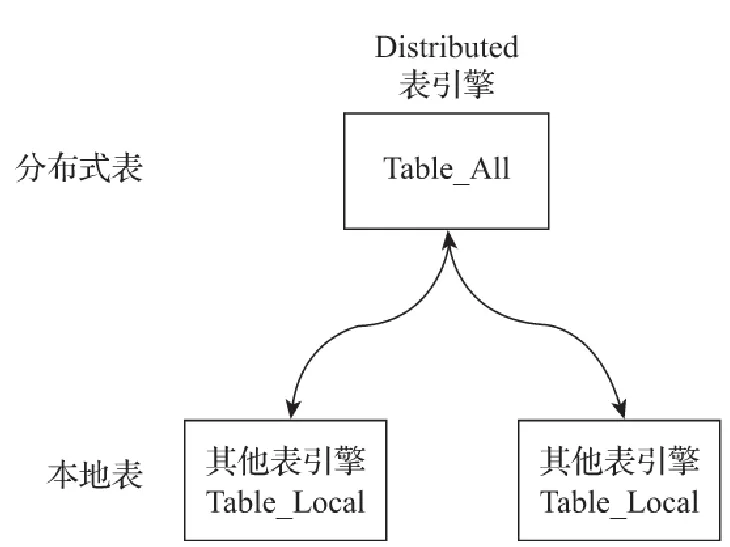
- 本地表：通常以_local为后缀进行命名。本地表是承接数据的载体，可以使用非Distributed的任意表引擎，一张本地表对应了一个数据分片。
- 分布式表：通常以_all为后缀进行命名。分布式表只能使用Distributed表引擎，它与本地表形成一对多的映射关系，日后将通过分布式表代理操作多张本地表。

对于分布式表与本地表之间表结构的一致性检查，Distributed表引擎采用了读时检查的机制，这意味着如果它们的表结构不兼容，只有在查询时才会抛出错误，而在创建表时并不会进行检查。不同ClickHouse节点上的本地表之间，使用不同的表引擎也是可行的，但是通常不建议这么做，保持它们的结构一致，有利于后期的维护并避免造成不可预计的错误。<br />**建表语句**
```sql
CREATE TABLE test_shard_2_all ON CLUSTER sharding_simple (
  id UInt64
)ENGINE = Distributed(sharding_simple, default, test_shard_2_local,rand())
```
**查询分类**<br />Distributed表的查询操作可以分为如下几类：

- 会作用于本地表的查询：对于INSERT和SELECT查询，Distributed将会以分布式的方式作用于local本地表。而对于这些查询的具体执行逻辑，将会在后续小节介绍。
- 只会影响Distributed自身，不会作用于本地表的查询：Distributed支持部分元数据操作，包括CREATE、DROP、RENAME和ALTER，其中ALTER并不包括分区的操作（ATTACH PARTITION、REPLACE PARTITION等）。这些查询只会修改Distributed表自身，并不会修改local本地表。例如要彻底删除一张分布式表，**则需要分别删除分布式表和本地表**。
- 不支持的查询：Distributed表不支持任何MUTATION类型的操作，包括ALTER DELETE和ALTER UPDATE。

分片规则<br />关于分片的规则这里将做进一步的展开说明。分片键要求返回一个整型类型的取值，包括Int系列和UInt系列。例如分片键可以是一个具体的整型列字段：
```sql
按照用户id的余数划分
Distributed(cluster, database, table ,userid)
```
也可以是一个返回整型的表达式：
```sql
--按照随机数划分
Distributed(cluster, database, table ,rand())
--按照用户id的散列值划分
Distributed(cluster, database, table , intHash64(userid))
```
如果不声明分片键，那么分布式表只能包含一个分片，这意味着只能映射一张本地表，否则，在写入数据时将会得到如下异常：
```sql
Method write is not supported by storage Distributed with more than one shard and no sharding key provided
```
<a name="nUQuK"></a>
#### 分布式查询流程
当Distributed表接收到SELECT查询的时候，它会依次查询每个分片的数据，再合并汇总返回。接下来将对数据查询时的重点逻辑进行介绍。<br />**1.多副本的路由规则**<br />在查询数据的时候，如果集群中的一个shard，拥有多个replica，那么Distributed表引擎需要面临副本选择的问题。它会使用负载均衡算法从众多replica中选择一个，而具体使用何种负载均衡算法，则由load_balancing参数控制：
```sql
load_balancing = random/nearest_hostname/in_order/first_or_random
```
有如下四种负载均衡算法：<br />1）random<br />random是默认的负载均衡算法，正如前文所述，在ClickHouse的服务节点中，拥有一个全局计数器errors_count，当服务发生任何异常时，该计数累积加1。而random算法会选择errors_count错误数量最少的replica，如果多个replica的errors_count计数相同，则在它们之中随机选择一个。<br />2）nearest_hostname<br />nearest_hostname可以看作random算法的变种，首先它会选择errors_count错误数量最少的replica，如果多个replica的errors_count计数相同，则选择集群配置中host名称与当前host最相似的一个。而相似的规则是以当前host名称为基准按字节逐位比较，找出不同字节数最少的一个<br />3）in_order<br />in_order同样可以看作random算法的变种，首先它会选择errors_count错误数量最少的replica，如果多个replica的errors_count计数相同，则按照集群配置中replica的定义顺序逐个选择。<br />4）first_or_random<br />first_or_random可以看作in_order算法的变种，首先它会选择errors_count错误数量最少的replica，如果多个replica的errors_count计数相同，它首先会选择集群配置中第一个定义的replica，如果该replica不可用，则进一步随机选择一个其他的。<br />**2.多分片查询的核心流程**<br />分布式查询与分布式写入类似，同样本着谁执行谁负责的原则，它会由接收SELECT查询的Distributed表，并负责串联起整个过程。首先它会将针对分布式表的SQL语句，按照分片数量将查询拆分成若干个针对本地表的子查询，然后向各个分片发起查询，最后再汇总各个分片的返回结果。如果对分布式表按如下方式发起查询<br />以sharding_simple集群的test_shard_2_all为例，假设在CH5节点对分布式表发起查询：
```sql
SELECT COUNT(*) FROM test_shard_2_all
```
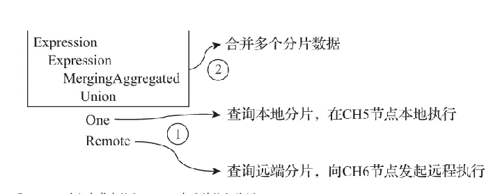
```sql
	SELECT COUNT() FROM default.test_shard_2_local
```
而在Remote步骤中，会建立与CH6节点的连接，并向其发起远程查询：
```sql
Connection (ch6.nauu.com:9000): Connecting. Database: …
```
CH6节点在接收到来自CH5的查询请求后，开始在本地执行。同样，SQL会转换成对本地表的查询：
```sql
executeQuery: (from CH5:45992, initial_query_id: 4831b93b-5ae6-4b18-bac9-e10cc9614353) WITH toUInt32(2) AS _shard_num 
SELECT COUNT() FROM default.test_shard_2_local
```
2）合并返回结果<br />多个分片数据均查询返回后，按如下方法在CH5节点将它们合并：
```sql
Read 2 blocks of partially aggregated data, total 2 rows.
Aggregator: Converting aggregated data to blocks
……
```
<a name="gbQjj"></a>
#### 分布式子查询
ClickHouse中的分布式子查询<br />**1）主子查询都查询本地表**
```sql
SELECT uniq(UserID) FROM local_table WHERE CounterID = 101500 AND UserID IN (SELECT UserID FROM local_table WHERE CounterID = 34)
 这种情况不会涉及网络数据传输，所有查询操作仅仅涉及执行节点，也仅仅会返回执行节点上的匹配数据。
```
**2）主查询使用分布式表，子查询使用本地表**<br />这种情况下，如果有n个节点，就会有n次查询操作，**但查询结果可能不正确**，因为关联的数据刚好在别的节点上，这里只是每个本地分片节点的表相互关联。
```sql
SELECT uniq(UserID) FROM distributed_table WHERE CounterID = 101500 
AND UserID IN (SELECT UserID FROM local_table WHERE CounterID = 34)
 这种情况ck就会对SQL进行重写，将分布式表转换成本地表，
 并将SQL分发到存在local_table表的所有节点进行执行，再将结果进行汇总回传
 其实可以理解成在每个存在local_table表的节点上都分别执行一遍第一种查询情况，最后进行合并回传。这种方式会因为数据不全导致结果错误，如果数据冗余，也会造成结果重复。
```
**3）主子查询都查询分布式表**<br />**这种情况数据查询结果是没有问题的**。但是查询次数会放大N的平方倍。模拟一下查询流程。假设有3个分片节点A,B,C。主查询和子查询都被分别分发到3个节点。

- 在A节点上，把主查询转换为本地表`SELECT uniq(UserID) FROM local_table WHERE CounterID = 101500`; 子查询因为是分布式表，为了保证数据关联没有问题，需要把子查询分发到所有的节点上，转换为本地表查询，所以`SELECT UserID FROM local_table WHERE CounterID = 34`在A,B,C上面执行了3次，然后把结果汇总到A节点上，接着A节点继续执行主查询和子查询结果的关联。
- 在B节点上，先把主查询转换为本地表查询，然后将子查询分发到B,C上面再次查询然后拉取数据到B节点汇总。
- 在C节点上，先把主查询转换为本地表查询，然后将子查询分发到A,B上面再次查询，然后拉取数据到C

节点汇总。<br />所以，这个子查询其实被执行了9次。如果有N个节点，就是N的平方次。查询被放大。浪费资源。
```sql
SELECT uniq(UserID) FROM distributed_table WHERE CounterID = 101500 
AND UserID IN (SELECT UserID FROM distributed_table WHERE CounterID = 34)
因此可以得出结论，在IN查询子句使用分布式表的时候，查询请求会被放大N的平方倍，
其中N等于集群内分片节点的数量，假如集群内有10个分片节点，
则在一次查询的过程中，会最终导致100次的查询请求，这显然是不可接受的
```
总结：

1. **查询不全，**由于分片的数据不均，会出现查询数据不全的问题，所以**JOIN表** 和 **IN子句** 也要使用 _all 分布式表;
2. **查询放大，**由于**JOIN表** 和** IN子句** 也是 _all 分布式表，所以每个分片又会向其他远端的分片发起分布式查询，最终的查询次数是 N 的平方(N=分片数量);
3. **解决思路，使用 GLOBAL IN **和 **GLOBAL JOIN **可以避免查询放大的问题
   <a name="xrrBM"></a>
#### Global IN
为了解决查询放大的问题，可以使用GLOBAL IN或JOIN进行优化。现在对刚才的SQL进行改造，为其增加GLOBAL修饰符：
```sql
SELECT uniq(id) FROM test_query_all WHERE repo = 100 
AND id GLOBAL IN (SELECT id FROM test_query_all WHERE repo = 200)
```
整个过程由上至下大致分成5个步骤：<br />（1）将IN子句单独提出，发起了一次分布式查询。<br />（2）将分布式表转local本地表后，分别在本地和远端分片执行查询。<br />（3）将IN子句查询的结果进行汇总，并放入一张临时的内存表进行保存。<br />（4）将内存表发送到远端分片节点。<br />（5）将分布式表转为本地表后，开始执行完整的SQL语句，IN子句直接使用临时内存表的数据。<br />至此，整个核心流程结束。可以看到，在使用GLOBAL修饰符之后，ClickHouse使用内存表临时保存了IN子句查询到的数据，并将其发送到远端分片节点，以此到达了数据共享的目的，从而避免了查询放大的问题。由于数据会在网络间分发，所以需要特别注意临时表的大小，IN或者JOIN子句返回的数据不宜过大。如果表内存在重复数据，也可以事先在子句SQL中增加DISTINCT以实现去重。
<a name="jdEXz"></a>
## 索引
<a name="SvIcU"></a>
### 主键索引
在ClickHouse中，每个数据部分（data part）都有自己的主索引。当他们被合并时，合并部分的主索引也被合并。<br />在大规模中情况下，磁盘和内存的效率是非常重要的。因此，不是为每一行创建索引，而是为一组数据行（称为颗粒（granule））构建一个索引条目。<br />之所以可以使用这种稀疏索引，是因为ClickHouse会按照主键列的顺序将一组行存储在磁盘上。<br />与直接定位单个行(如基于B-Tree的索引)不同，稀疏主索引允许它快速(通过对索引项进行二分查找)识别可能匹配查询的行组。<br />然后潜在的匹配行组(颗粒)以并行的方式被加载到ClickHouse引擎中(**由于不是精确到每一行的索引，只精确了一段索引粒度的行，所以只能说是潜在的匹配行**)，以便找到匹配的行。ClickHouse使用它的稀疏主索引来快速(通过二分查找算法)选择可能包含匹配查询的行的颗粒。<br />这种索引设计允许主索引很小(它可以而且必须完全适合主内存)，同时仍然显著加快查询执行时间：特别是对于数据分析用例中常见的范围查询。<br />出于数据处理的目的，表的列值在逻辑上被划分为多个颗粒。颗粒是流进ClickHouse进行数据处理的最小的不可分割数据集。这意味着，ClickHouse不是读取单独的行，而是始终读取(以流方式并并行地)整个行组（颗粒，一个索引关联的行的范围，默认为8192行）。<br />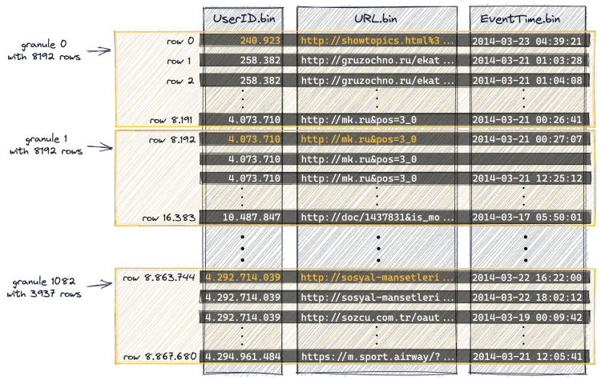<br />第一个(根据磁盘上的物理顺序)8192行(它们的列值)在逻辑上属于颗粒0，然后下一个8192行(它们的列值)属于颗粒1，以此类推。<br />**每个颗粒对应主索引的一个条目**<br />主索引是基于上图中显示的颗粒创建的。这个索引是一个未压缩的扁平数组文件(primary.idx)，包含从0开始的所谓的数字索引标记。<br />下面的图显示了索引存储了每个颗粒的最小主键列值(在上面的图中用橙色标记的值)。 例如：

- 第一个索引条目(下图中的“mark 0”)存储上图中颗粒0的主键列的最小值，
- 第二个索引条目(下图中的“mark 1”)存储上图中颗粒1的主键列的最小值，以此类推。

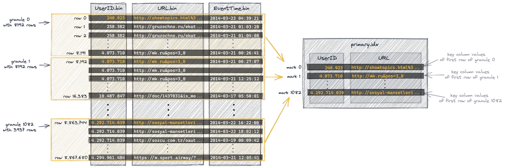<br />在我们的表中，索引总共有1083个条目，887万行数据和1083个颗粒: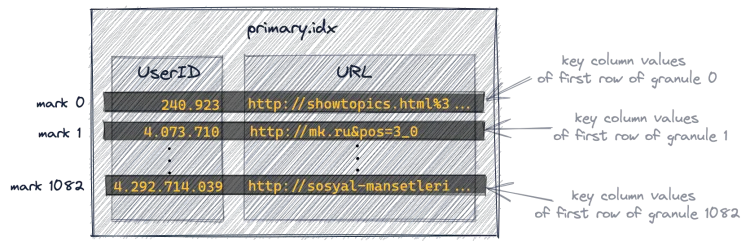
<a name="wJxZZ"></a>
### Mrk文件
ClickHouse中，我们表的所有颗粒的物理位置都存储在标记文件中。与数据文件类似，每个表的列有一个标记文件。<br />下图显示了三个标记文件UserID.mrk、URL.mrk、EventTime.mrk，为表的UserID、URL和EventTime列存储颗粒的物理位置。<br />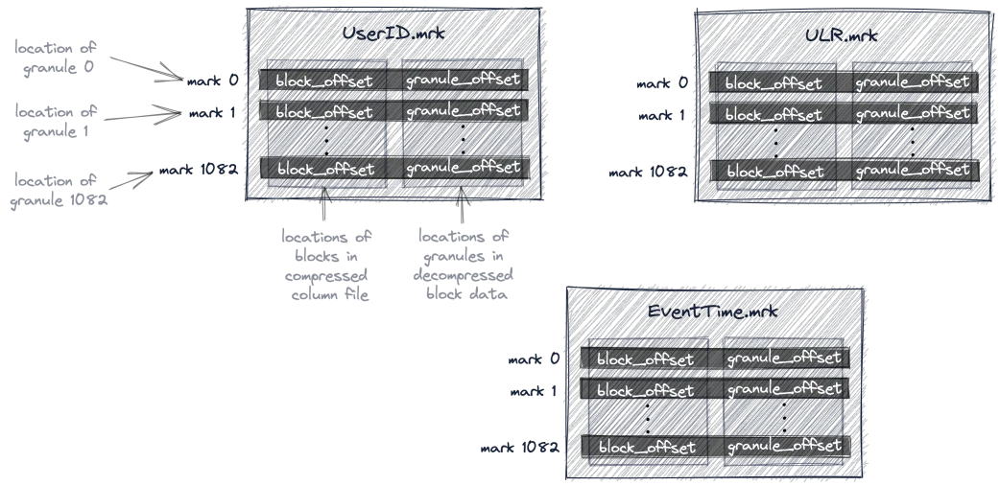<br />主索引是一个扁平的未压缩数组文件(primary.idx)，其中包含从0开始编号的索引标记。<br />类似地，标记文件也是一个扁平的未压缩数组文件(*.mrk)，其中包含从0开始编号的标记。<br />一旦ClickHouse确定并选择了可能包含查询所需的匹配行的颗粒的索引标记，就可以在标记文件数组中查找，以获得颗粒的物理位置。<br />每个特定列的标记文件条目以偏移量的形式存储两个位置:

- 第一个偏移量(上图中的'block_offset')是在包含所选颗粒的压缩版本的压缩列数据文件中定位块。这个压缩块可能包含几个压缩的颗粒(与写入批次的大小有关)。所定位的压缩文件块在读取时被解压到内存中。
- 标记文件的第二个偏移量(上图中的“granule_offset”)提供了颗粒在解压数据块中的位置。

主键索引可以是组合索引, 类似于mysql的组合索引, CK在查询时也必须满足最左匹配原则, 即查询时必须从最左的字段匹配起, **一旦有跳过字段方式, 索引将无法命中**。
<a name="ecVtE"></a>
### 列压缩块
一列均有一个单独的列存文件```{column_name}```.bin来存储实际的数据。为了尽可能减小数据文件大小，文件需要进行压缩，默认算法由part目录下的default_compression_codec文件确定。如果直接将整个文件压缩，则查询时必须读取整个文件进行解压，显然如果需要查询的数据集比较小，这样做的开销就会显得特别大，因此一个列存文件是一个个小的压缩数据块组成的。一个压缩数据块中可以包含若干个granule的数据，而granule就是Clickhouse中最小的查询数据集，后面的索引以及标记也都是围绕granule来实现的。granule的大小由配置项index_granularity确定，默认8192；压缩数据块大小范围由配置max_compress_block_size和min_compress_block_size共同决定。每个压缩块中的header部分会存下这个压缩块的压缩前大小和压缩后大小。整个结构如下图所示：<br />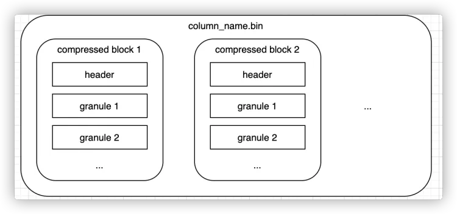<br />每个压缩数据块的体积，按照其压缩前的数据字节大小，都被严格控制在64KB～1MB，其上下限分别由min_compress_block_size（默认65536）与max_compress_block_size（默认1048576）参数指定。而一个压缩数据块最终的大小，则和一个间隔（index_granularity）内数据的实际大小相关（是的，没错，又见到索引粒度这个老朋友了）。<br />MergeTree在数据具体的写入过程中，会依照索引粒度（默认情况下，每次取8192行），按批次获取数据并进行处理。如果把一批数据的未压缩大小设为size，则整个写入过程遵循以下规则：<br />（1）单个批次数据size < 64KB：如果单个批次数据小于64KB，则继续获取下一批数据，直至累积到size>=64KB时，生成下一个压缩数据块。<br />（2）单个批次数据```64KB <= size<=1MB```：如果单个批次数据大小恰好在64KB与1MB之间，则直接生成下一个压缩数据块。<br />（3)单个批次数据size>1MB：如果单个批次数据直接超过1MB，则首先按照1MB大小截断并生成下一个压缩数据块。剩余数据继续依照上述规则执行。此时，会出现一个批次数据生成多个压缩数据块的情况。bitMap字段单个字段占用空间比较大的话，默认的8092行会包含很多个压缩快，导致读放大，这种情况可以将索引粒度调整为128。<br />

> 总结

上面的描述也有点难以理解，其实并不是在写入批次的时候压缩，写入的时候一批次是按照一次写入的条数来算了。假设一次写了2条，这2条在磁盘上也是一个Part,这里说的压缩应该是后台的行为，把已经落盘的Part的列进行压缩。
1. 拉取8192行作为一个批次来压缩。如果一批次小于64KM,那么再拉取8192行,一起压缩。
2. 如果8192行刚好在64K~1MB,那么就直接压缩。
3. 如果8192行大于1MB,那么切分为1兆压缩,剩下的行再分成1M压缩。

**什么是读放大**<br />clickhouse 是列存数据库，对于每一列的数据又是分块存储的，默认是每 8192 行为一块。分块存储的好处是能够更好的做压缩，减小[**数据存储**](https://cloud.tencent.com/product/cdcs?from=20067&from_column=20067)。对于一些基本类型来说效果很好。但是对于 bitmap 类型来说本身值的类型就非常大，8192 行组成的块大小非常大，如果我只是读取其中的一个 bitmap，会有很大的读放大，会非常影响性能。参考:[https://cloud.tencent.com/developer/news/680214](https://cloud.tencent.com/developer/news/680214)<br />**为什么需要Mark文件**<br />为什么主索引不直接包含与索引标记相对应的颗粒的物理位置？<br />因为ClickHouse设计的场景就是超大规模数据，非常高效地使用磁盘和内存非常重要。<br />主索引文件需要放入内存中。对于我们的示例查询，ClickHouse使用了主索引，并选择了可能包含与查询匹配的行的单个颗粒。只有对于这一个颗粒，ClickHouse才需定位物理位置，以便将相应的行组读取以进一步的处理。而且，只有UserID和URL列需要这个偏移量信息。对于查询中不使用的列，例如EventTime，不需要偏移量信息。对于我们的示例查询，Clickhouse只需要UserID数据文件(UserID.bin)中176颗粒的两个物理位置偏移，以及URL数据文件(URL.data)中176颗粒的两个物理位置偏移。<br />由mark文件提供的间接方法避免了直接在主索引中存储所有三个列的所有1083个颗粒的物理位置的条目：因此避免了在主内存中有不必要的(可能未使用的)数据。
<a name="S4L82"></a>

### 联合索引
联合索引类似MySQL数据库中的联合索引。
<a name="j5ZxY"></a>
### 二级索引
除了一级索引之外，MergeTree同样支持二级索引。二级索引又称跳数索引，由数据的聚合信息构建而成。根据索引类型的不同，其聚合信息的内容也不同。跳数索引的目的与一级索引一样，也是帮助查询时减少数据扫描的范围。<br />跳数索引在默认情况下是关闭的，需要设置allow_experimental_data_skipping_indices（该参数在新版本中已被取消）才能使用：
```plsql
SET allow_experimental_data_skipping_indices = 1
```
与一级索引一样，如果在建表语句中声明了跳数索引，则会额外生成相应的索引与标记文件（skp_idx_[Column].idx与skp_idx_[Column].mrk）。<br />用户只能在MergeTree表引擎上使用数据跳数索引。每个跳数索引都有四个主要参数：

- 索引名称。索引名用于在每个分区中创建索引文件。此外，在删除或具体化索引时需要将其作为参数。
- 索引的表达式。索引表达式用于计算存储在索引中的值集。它可以是列、简单操作符、函数的子集的组合。
- 类型。索引的类型控制计算，该计算决定是否可以跳过读取和计算每个索引块。
- GRANULARITY。每个索引块由颗粒（granule）组成。例如，如果主表索引粒度为8192行，GRANULARITY为4，则每个索引“块”将为32768行。

目前，MergeTree共支持4种跳数索引，分别是minmax、set、ngrambf_v1和tokenbf_v1。一张数据表支持同时声明多个跳数索引，例如：
```plsql
CREATE TABLE skip_test (
    ID String,
    URL String,
    Code String,
    EventTime Date,
    INDEX a ID TYPE minmax GRANULARITY 5,
    INDEX b（length(ID) * 8） TYPE set(2) GRANULARITY 5,
    INDEX c（ID，Code） TYPE ngrambf_v1(3, 256, 2, 0) GRANULARITY 5,
    INDEX d ID TYPE tokenbf_v1(256, 2, 0) GRANULARITY 5
) ENGINE = MergeTree()
省略...
```
（1）minmax：minmax索引记录了一段数据内的最小和最大极值，其索引的作用类似分区目录的minmax索引，能够快速跳过无用的数据区间<br />（2） set索引直接记录了声明字段或表达式的取值（唯一值，无重复），其完整形式为set(max_rows)，其中max_rows是一个阈值，表示在一个index_granularity内，索引最多记录的数据行数。如果max_rows=0，则表示无限制。<br />（3）ngrambf_v1：ngrambf_v1索引记录的是数据短语的布隆表过滤器，只支持String和FixedString数据类型。ngrambf_v1**只能够提升in、notIn、like、equals和notEquals查询的性**能，其完整形式为ngrambf_v1(n,size_of_bloom_filter_in_bytes,number_of_hash_functions,random_seed)。这些参数是一个布隆过滤器的标准。<br />输入，如果你接触过布隆过滤器，应该会对此十分熟悉。它们具体的含义如下：

- n：token长度，依据n的长度将数据切割为token短语。
- size_of_bloom_filter_in_bytes：布隆过滤器的大小。
- number_of_hash_functions：布隆过滤器中使用Hash函数的个数。
- random_seed：Hash函数的随机种子。

例如在下面的例子中，ngrambf_v1索引会依照3的粒度将数据切割成短语token，token会经过2个Hash函数映射后再被写入，布隆过滤器大小为256字节。<br />（4）tokenbf_v1：tokenbf_v1索引是ngrambf_v1的变种，同样也是一种布隆过滤器索引。tokenbf_v1除了短语token的处理方法外，其他与ngrambf_v1是完全一样的。tokenbf_v1会自动按照非字符的、数字的字符串分割t。
<a name="xLrU3"></a>
### bin文件的存储
clickhouse的数据存放在bin文件中, 这是真正的存储的地方. Clickhouse并非innodb类似的聚族索引将数据文件和索引放在一起, 而是数据文件和索引文件分开存储. 图中只列举了num.bin文件, 实际上还有id.bin和year.bin.<br />数据存储也并非按照8192行方式存储, 而是通过一个个数据块方式存储. 一个数据块大小为64K ~ 1Mb, 如果一个编号的数据太小, 就会将合并多个编号内的数据; 如果一个编号数据又太大, 就会拆分一个编号的数据. 而num.mrk文件实际上就是管理这层一对多,多对一关系以及维护存储上offset索引的数据结构. (具体的对应关系不展开了, 看图理解)
<a name="CVQ8g"></a>
## 分区
<a name="LrMMX"></a>
### 分区规则
MergeTree数据分区的规则由分区ID决定，而具体到每个数据分区所对应的ID，则是由分区键的取值决定的。分区键支持使用任何一个或一组字段表达式声明，其业务语义可以是年、月、日或者组织单位等任何一种规则。针对取值数据类型的不同，分区ID的生成逻辑目前拥有四种规则：<br />（1）不指定分区键：如果不使用分区键，即不使用PARTITION BY声明任何分区表达式，则分区ID默认取名为all，所有的数据都会被写入这个all分区。<br />（2）使用整型：如果分区键取值属于整型（兼容UInt64，包括有符号整型和无符号整型），且无法转换为日期类型YYYYMMDD格式，则直接按照该整型的字符形式输出，作为分区ID的取值。<br />（3）使用日期类型：如果分区键取值属于日期类型，或者是能够转换为YYYYMMDD格式的整型，则使用按照YYYYMMDD进行格式化后的字符形式输出，并作为分区ID的取值。<br />（4）使用其他类型：如果分区键取值既不属于整型，也不属于日期类型，例如String、Float等，则通过128位Hash算法取其Hash值作为分区ID的取值。<br />数据在写入时，会对照分区ID落入相应的数据分区。<br />如果通过元组的方式使用多个分区字段，则分区ID依旧是根据上述规则生成的，只是多个ID之间通过“-”符号依次拼接。例如按照上述<br />表格中的例子，使用两个字段分区：
```plsql
PARTITION BY (length(Code),EventTime)
```
则最终的分区ID会是下面的模样：
```plsql
2-20190501
2-20190611
```
<a name="dMPkd"></a>
### 分区目录命名
命名规则
```plsql
PartitionID_MinBlockNum_MaxBlockNum_Level
```
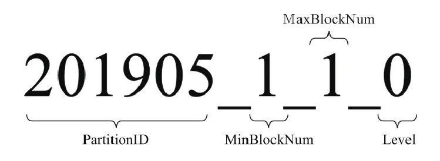<br />（1）PartitionID：分区ID<br />（2）MinBlockNum和MaxBlockNum：顾名思义，最小数据块编号与最大数据块编号。这里的BlockNum是一个整型的自增长编号。如果将其设为n的话，那么计数n在单张MergeTree数据表内全局累加，n从1开始，**每当新创建一个分区目录时，计数n就会累积加1**。对于一个新的分区目录而言，MinBlockNum与MaxBlockNum取值一样，同等于n，例如201905_1_1_0、201906_2_2_0以此类推。但是也有例外，当分区目录发生合并时，对于新产生的合并目录MinBlockNum与MaxBlockNum有着另外的取值规则。<br />（3）Level：合并的层级，可以理解为某个分区被合并过的次数，或者这个分区的年龄。数值越高表示年龄越大。Level计数与BlockNum有所不同，它并不是全局累加的。对于每一个新创建的分区目录而言，其初始值均为0。之后，以分区为单位，如果相同分区发生合并动作，则在相应分区内计数累积加1。<br />伴随着每一批数据的写入**（一次INSERT语句）**，MergeTree都会生成一批新的分区目录。即便不同批次写入的数据属于相同分区，也会生成不同的分区目录。也就是说，对于同一个分区而言，也会存在多个分区目录的情况。在之后的某个时刻（写入后的10～15分钟，也可以手动执行optimize查询语句），ClickHouse会通过后台任务再将属于相同分区的多个目录合并成一个新的目录。已经存在的旧分区目录并不会立即被删除，而是在之后的某个时刻通过后台任务被删除（默认8分钟）。
<a name="GyRXb"></a>
## Optimize语句
Clickhouse作为一款[OLAP数据库](https://cloud.tencent.com/product/cdwpg?from_column=20065&from=20065)，对数据更新的支持比较弱，而且并不支持标准的SQL update/delete语法；它提供的alter table ...... update/delete 语法也是异步的，即收到命令后先返回给客户端成功，至于什么时候数据真正更新成功是不确定的。<br />因此在业务需要数据更新的场景下（如Mysql同步到Clickhouse），通常会使用ReplacingMergeTree或CollapsingMergeTree的数据合并逻辑绕行实现异步更新，这样一方面可以保证数据的最终一致性，另一方面Clickhouse性能开销也会比alter table小。但这种方式有一个缺点是MergeTree引擎的数据合并过程（merge）是Clickhouse基于策略控制的，执行时间比较随机，因此数据一致性缺少时间保证，极端情况下数据过了一天也没有完全合并。<br />而Optimize Table这个命令可以强制触发MergeTree引擎的数据合并，可以用来解决数据合并时间不确定的问题。<br />语法
```plsql
OPTIMIZE TABLE [db.]name [ON CLUSTER cluster] [PARTITION partition | PARTITION ID 'partition_id'] [FINAL] [DEDUPLICATE [BY expression]]
```
使用示例:
```plsql
 OPTIMIZE TABLE person  FINAL;
```
参数介绍：<br />1. “OPTIMIZE TABLE”：指定需要Optimize的表，只支持MergeTree引擎。<br />2. “PARTITION”：若指定了分区，则只会对指定的分区触发合并任务。<br />3. “FINAL”：即使只有一个文件块也执行合并，即使有并行的正在执行的合并，也会强制执行这一次合并。<br />4. “DEDUPLICATE”：去重，若没有后续的“BY”子句，则按照行完全相同去重（所有字段值相同）。<br />5. “BY”：配合“DEDUPLICATE”关键词使用，指定依据哪些列去重
<a name="nD8r1"></a>
## Muation突变
ClickHouse提供了DELETE和UPDATE的能力，这类操作被称为Mutation查询，它可以看作ALTER语句的变种。虽然Mutation能最终实现修改和删除，但不能完全以通常意义上的UPDATE和DELETE来理解，我们必须清醒地认识到它的不同：首先，Mutation语句是一种“很重”的操作，更适用于批量数据的修改和删除；其次，**它不支持事务，一旦语句被提交执行，就会立刻对现有数据产生影响**，无法回滚；最后，Mutation语句的执行是一个异步的后台过程，语句被提交之后就会立即返回。所以这并不代表具体逻辑已经执行完毕，它的具体执行进度需要通过system.mutations系统表查询。<br />主键不能更新。<br />有一张person_update表。原来的表分区结构<br />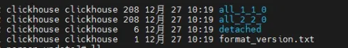<br />当执行update或者delete后，分区目录的变化如下，比原来的目录多了all_1_1_0_3目录和all_2_2_0_3目录，以及一个mutation_3.txt文件。<br />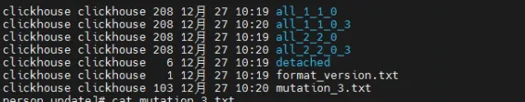<br />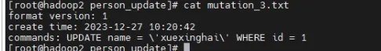<br />新目录的命名规则是在原有名称上加上system.mutations.block_numbers.number。数据在重写的过程中会将需要删除的数据去掉。旧的数据目录并不会立即删除，而是会被标记成非激活状态（active为0）。等到MergeTree引擎的下一次合并动作触发时，这些非激活目录才会被真正从物理意义上删除。<br />那么后缀的数字从何而来呢？查询system.mutations系统表
```plsql
SELECT database, table ,mutation_id, block_numbers.number as num ,is_done FROM system.mutations
```
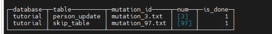<br />我们要ALTER的表是person_update。从表中看到num是3，所以后缀就是3，is_done表示操作已经完成。
<a name="GDYEy"></a>
## 数据写入
数据写入的第一步是生成分区目录，伴随着每一批(批量插入，一个INSERT 算一批，所以不建议一秒超过一次INSERT)数据的写入，都会生成一个新的分区目录。在后续的某一时刻，属于相同分区的目录会依照规则合并到一起；接着，按照index_granularity索引粒度，会分别生成primary.idx一级索引（如果声明了二级索引，还会创建二级索引文件）、每一个列字段的.mrk数据标记和.bin压缩数据文件。<br />对于每个 **INSERT** 语句，会通过几个事务将十来个记录添加到 ZooKeeper。（确切地说，这是针对每个插入的数据块; 每个 INSERT 语句的每 **max_insert_block_size = 1048576** 行和最后剩余的都各算作一个块。）相比非复制表，写 zk 会导致 **INSERT** 的延迟略长一些。但只要你按照建议每秒不超过一个 **INSERT** 地批量插入数据，不会有任何问题。一个 ZooKeeper 集群能给整个 ClickHouse 集群支撑协调每秒几百个 **INSERT**。数据插入的吞吐量（每秒的行数）可以跟不用复制的数据一样高。<br />单个数据块写入是原子的。 INSERT 的数据按每块最多 **max_insert_block_size = 1048576** 行进行分块，换句话说，如果 **INSERT** 插入的行少于 1048576，则该 INSERT 是原子的，即这批数据要么全部成功，要么全部失败。<br />**ReplicatedMergeTree** 引擎采用一个独立的线程池进行复制拉取。线程池的大小通过 [background_fetches_pool_size](https://clickhouse.com/docs/zh/operations/settings/settings#background_fetches_pool_size) 进行限定，它可以在重启服务器时进行调整。<br />默认情况下，INSERT 语句仅等待一个副本写入成功后返回。如果数据只成功写入一个副本后该副本所在的服务器不再存在，则存储的数据会丢失。要启用数据写入多个副本才确认返回，使用 **insert_quorum** 选项。<br />需要注意的是，只有在ClickHouse服务端处理数据的时候才具有这种原子写入的特性，例如使用JDBC或者HTTP接口时。因为max_insert_block_size参数在使用CLI命令行或者INSERT SELECT子句写入时是不生效的。
<a name="sTJMX"></a>
## ACID
默认一个 insert如果是一个块的话，那么这个INSERT是原子性的，要么全部成功，要么全部失败。注意CK的原子性是在同一分区内的一个data part上面讲的。 并且在INSERT时，别的查询是查不到正在写入的data的,ClickHouse 在内部使用带有快照隔离的 MVCC即使在服务器终止/崩溃的情况下，所有 ACID 属性仍然有效。但是现在还不支持事务回滚，就是说执行一半，剩下的数据INSERT失败， 这个时候是回滚不了已经写入的数据的。这块可以用JDBC来测试，发现rollBack其实没有起作用。
<a name="ShESi"></a>
## 副本同步机制
副本协同的核心流程主要有INSERT、MERGE、MUTATION和ALTER四种，分别对应了数据写入、分区合并、数据修改和元数据修改。INSERT和ALTER查询是分布式执行的。借助ZooKeeper的事件通知机制，多个副本之间会自动进行有效协同，但是它们不会使用ZooKeeper存储任何分区数据。而其他查询并不支持分布式执行，包括SELECT、CREATE、DROP、RENAME和ATTACH。例如，为了创建多个副本，我们需要分别登录每个ClickHouse节点，在它们本地执行各自的CREATE语句
<a name="LGKFo"></a>
### INSERT流程
1**.创建第一个副本实例**<br />假设首先从CH5节点开始，对CH5节点执行下面的语句后，会创建第一个副本实例
```sql
CREATE TABLE replicated_sales_1(
    id String,
    price Float64,
    create_time DateTime
) ENGINE =  ReplicatedMergeTree('/clickhouse/tables/01/replicated_sales_1','ch5.nauu.com')
PARTITION BY toYYYYMM(create_time) 
ORDER BY id
```
在创建的过程中，ReplicatedMergeTree会进行一些初始化操作，例如：

- 根据zk_path初始化所有的ZooKeeper节点。
- 在/replicas/节点下注册自己的副本实例ch5.nauu.com。
- 启动监听任务，监听/log日志节点。
- 参与副本选举，选举出主副本，选举的方式是向/leader_election/插入子节点，第一个插入成功的副本就是主副本。

2**.创建第2个副本实例**<br />接着，在CH6节点执行下面的语句，创建第二个副本实例。表结构和zk_path需要与第一个副本相同，而replica_name则需要设置成CH6的域名：
```sql
CREATE TABLE replicated_sales_1(
//相同结构
) ENGINE =  ReplicatedMergeTree('/clickhouse/tables/01/replicated_sales_1','ch6.nauu.com')
//相同结构
```
在创建过程中，第二个ReplicatedMergeTree同样会进行一些初始化操作，例如：

- 在/replicas/节点下注册自己的副本实例ch6.nauu.com。
- 启动监听任务，监听/log日志节点。
- 参与副本选举，选举出主副本。在这个例子中，CH5副本成为主副本。

3.**向第一个副本实例写入数据**<br />现在尝试向第一个副本CH5写入数据。执行如下命令：
```sql
INSERT INTO TABLE replicated_sales_1 VALUES('A001',100,'2019-05-10 00:00:00')
```
上述命令执行之后，首先会在本地完成分区目录的写入<br />接着向/blocks节点写入该数据分区的block_id：
```sql
Wrote block with ID '201905_2955817577822961065_12656761735954722499'
```
该block_id将作为后续去重操作的判断依据。如果此时再次执行刚才的INSERT语句，试图写入重复数据，则会出现如下提示
```sql
Block with ID 201905_2955817577822961065_12656761735954722499 already exists; ignoring it.
```
即副本会自动忽略block_id重复的待写入数据。<br />此外，如果设置了insert_quorum参数（默认为0），并且insert_quorum>=2，则CH5会进一步监控已完成写入操作的副本个数，只有当写入副本个数大于或等于insert_quorum时，整个写入操作才算成功。<br />**4.由第一个副本实例推送Log日志**<br />在3步骤完成之后，会继续由执行了INSERT的副本向/log节点推送操作日志。在这个例子中，会由第一个副本CH5担此重任。日志的编号是/log/log-0000000000，而LogEntry的核心属性如下
```shell
/log/log-0000000000
 source replica: ch5.nauu.com
 block_id:  201905_...
 type :   get
 partition_name :201905_0_0_0
```
从日志内容中可以看出，操作类型为get下载，而需要下载的分区是201905_0_0_0。其余所有副本都会基于Log日志以相同的顺序执行命令。<br />**5.第二个副本实例拉取Log日志**<br />CH6副本会一直监听/log节点变化，当CH5推送了/log/log-0000000000之后，CH6便会触发日志的拉取任务并更新log_pointer，将其指向最新日志下标：
```shell
/replicas/ch6.nauu.com/log_pointer : 0
```
在拉取了LogEntry之后，它并不会直接执行，而是将其转为任务对象放至队列：
```shell
/replicas/ch6.nauu.com/queue/
Pulling 1 entries to queue: log-0000000000 - log-0000000000
```
这是因为在复杂的情况下，考虑到在同一时段内，会连续收到许多个LogEntry，所以使用队列的形式消化任务是一种更为合理的设计。注意，拉取的LogEntry是一个区间，这同样也是因为可能会连续收到多个LogEntry。<br />**6.第二个副本实例向其他副本发起下载请求**<br />CH6基于/queue队列开始执行任务。当看到type类型为get的时候，ReplicatedMerge-Tree会明白此时在远端的其他副本中已经成功写入了数据分区，而自己需要同步这些数据。<br />CH6上的第二个副本实例会开始选择一个远端的其他副本作为数据的下载来源。远端副本的选择算法大致是这样的：<br />（1）从/replicas节点拿到所有的副本节点。<br />（2）遍历这些副本，选取其中一个。选取的副本需要拥有最大的log_pointer下标，并且/queue子节点数量最少。log_pointer下标最大，意味着该副本执行的日志最多，数据应该更加完整；而/queue最小，则意味着该副本目前的任务执行负担较小。<br />在这个例子中，算法选择的远端副本是CH5。于是，CH6副本向CH5发起了HTTP请求，希望下载分区201905_0_0_0
```shell
Fetching part 201905_0_0_0 from replicas/ch5.nauu.com
Sending request to http://ch5.nauu.com:9009/?endpoint=DataPartsExchange
```
如果第一次下载请求失败，在默认情况下，CH6再尝试请求4次，一共会尝试5次（由max_fetch_partition_retries_count参数控制，默认为5）。<br />**7.第一个副本实例响应数据下载**<br />CH5的DataPartsExchange端口服务接收到调用请求，在得知对方来意之后，根据参数做出响应，将本地分区201905_0_0_0基于DataPartsExchang的服务响应发送回CH6<br />**8.第二个副本实例下载数据并完成本地写入**<br />CH6副本在收到CH5的分区数据后，首先将其写至临时目录：<br />待全部数据接收完成之后，重命名该目录：
```shell
Renaming temporary part tmp_fetch_201905_0_0_0 to 201905_0_0_0
```
可以看到，在INSERT的写入过程中，ZooKeeper不会进行任何实质性的数据传输。本着谁执行谁负责的原则，在这个案例中由CH5首先在本地写入了分区数据。之后，也由这个副本负责发送Log日志，通知其他副本下载数据。如果设置了insert_quorum并且insert_quorum>=2，则还会由该副本监控完成写入的副本数量。其他副本在接收到Log日志之后，会选择一个最合适的远端副本，点对点地下载分区数据。
<a name="IkNNx"></a>
### Merge流程
当ReplicatedMergeTree触发分区合并动作时，即会进入这个部分的流程，它的核心流程如图10-7所示。<br />无论MERGE操作从哪个副本发起，**其合并计划都会交由主副本来制定**。在INSERT的例子中，CH5节点已经成功竞选为主副本，所以为了方便论证，这个案例就从CH6节点开始。整个流程从上至下按照时间顺序进行，其大致分成5个步骤。现在，根据图10-7中所示编号讲解整个过程<br />**1.创建远程连接，尝试与主副本通信**<br />首先在CH6节点执行OPTIMIZE，强制触发MERGE合并。这个时候，CH6通过/replicas找到主副本CH5，并尝试建立与它的远程连接。
```shell
optimize table replicated_sales_1
Connection (ch5.nauu.com:9000): Connecting. Database: default. User: default
```
2**.主副本接收通信**<br />主副本CH5接收并建立来自远端副本CH6的连接
```shell
Connected ClickHouse Follower replica version 19.17.0, revision: 54428, database: default, user: default.
```
3.**由主副本制定MERGE计划并推送Log日志**<br />由主副本CH5制定MERGE计划，并判断哪些分区需要被合并。在选定之后，CH5将合并计划转换为Log日志对象并推送Log日志，以通知所有副本开始合并。日志的核心信息如下
```shell
/log/log-0000000002
 source replica: ch5.nauu.com
 block_id:  
 type :   merge
 201905_0_0_0
 201905_1_1_0
 into
 201905_0_1_1
```
从日志内容中可以看出，操作类型为Merge合并，而这次需要合并的分区目录是201905_0_0_0和201905_1_1_0。<br />与此同时，主副本还会锁住执行线程，对日志的接收情况进行监听
```shell
Waiting for queue-0000000002 to disappear from ch5.nauu.com queue
```
其监听行为由replication_alter_partitions_sync参数控制，默认值为1。当此参数为0时，不做任何等待；为1时，只等待主副本自身完成；为2时，会等待所有副本拉取完成。<br />4**.各个副本分别拉取Log日志**<br />CH5和CH6两个副本实例将分别监听/log/log-0000000002日志的推送，它们也会分别拉取日志到本地，并推送到各自的/queue任务队列：
```shell
Pulling 1 entries to queue: log-0000000002 - log-0000000002
```
**5.各个副本分别在本地执行MERGE**<br />CH5和CH6基于各自的/queue队列开始执行任务：
```shell
Executing log entry to merge parts 201905_0_0_0, 201905_1_1_0 to 201905_0_1_1
Merged 2 parts: from 201905_0_0_0 to 201905_1_1_0
```
至此，整个合并流程结束。<br />可以看到，在MERGE的合并过程中，ZooKeeper也不会进行任何实质性的数据传输，所有的合并操作，最终都是由各个副本在本地完成的。而无论合并动作在哪个副本被触发，都会首先被转交至主副本，再由主副本负责合并计划的制定、消息日志的推送以及对日志接收情况的监控。
<a name="ost5u"></a>
## Clickhouse的缺点
<a name="duy3F"></a>
### 不支持事务
Clickhouse并不支持严格意义上的事务。
<a name="Fi2f4"></a>
### 不支持标准SQL
Clickhouse 也不支持标准 SQL，我们用户接入的成本也很高
<a name="yVczT"></a>
### 扩容成本高
Clickhouse 是一款单机性能十分彪悍的 OLAP 系统，但是当集群加减节点后，系统不能自动感知集群拓扑变化，也不能自动 balance 数据，导致运维成本很高。<br />一般来说，新增集群节点我们通常有三种方案：

- 如果业务允许，可以给集群中的表设置 TTL，长时间保留的数据会逐渐被清理到，新增的数据会自动选择新节点，最后会达到负载均衡。
- 在集群中建立临时表，将原表中的数据复制到临时表，再删除原表。当数据量较大时，或者表的数量过多时，维护成本较高。同时无法应对实时数据变更。
- 通过配置权重的方式，将新写入的数据引导到新的节点。权重维护成本较高。

无论上述的哪一种方案，从时间成本，硬件资源，实时性等方面考虑，ClickHouse 都不是非常适合在线做节点扩缩容及数据充分布。同时，由于 ClickHouse 中无法做到自动探测节点拓扑变化，我们可能需要再 CMDB 中写入一套数据重分布的逻辑。所以我们需要尽可能的提前预估好数据量及节点的数量。
<a name="kj1nL"></a>
### 没有真正的Update/Delete
在分析场景中，删除、更新操作并不是核心需求。ClickHouse没有直接支持delete、update操作，而是变相支持了mutation（突变）操作，语法：
```sql
-- delete
ALTER TABLE [db.]table DELETE WHERE filter_expr

-- update
ALTER TABLE [db.]table UPDATE column1 = expr1 [, ...] WHERE filter_expr
```
update/delete 的使用场景是一次更新大量数据，也就是where条件筛选的结果应该是一大片数据。
```sql
-- 一次更新一天的数据。
alter table test update status=1 where status=0 and day='2020-04-01'
```
更新的单位是分区，如果只更新一条数据，那么需要重建一个分区；如果更新100条数据，而这100条可能落在3个分区上，则需重建3个分区；相对来说一次更新一批数据的整体效率远高于一次更新一行,频繁的这种操作，可能会对服务造成压力。
<a name="g0vu1"></a>
### 并发查询性能低
ClickHouse 吃 CPU，可能团队十个人通过执行同一个查询就可以把一台 CPU 40C 的物理机打爆，但是为什么我前面说我们有 700 亿的数据只需要十台物理机就可以扛得住呢？其实我们对 ClickHouse 做了很多保护。官方建议最大并发为100个。很难以支持多并发的场景。<br />再就是它很大程度利用了 CPU，我们都知道 MySQL 是单线程获取数据的，但是 ClickHouse 服务器上面有多少个 CPU，它就会用服务器的一半 CPU 去拉，像我们平时用的 40 核或者 32 核的物理机，基本上拿一半的核去拉数据。当然，这个可以修改配置文件每个 query 用多少 CPU。因为它一个查询需要消耗太多的 CPU，所以在高并发上面是一个短板。当然，我们也不需要考虑什么左侧原则之类的，就算你的查询条件不在索引里面，ClickHouse 的查询一样非常快。<br />**优化方法：**<br />应用端在查询的时候中间也有缓存的概念，其实所有的数据我都会通过缓存去过一遍，如果说所有的数据都从 ClickHouse 上拿的话，ClickHouse 的高并发是扛不住的。刚开始我用 ClickHouse 的时候，我们几台物理机每天早上 9 点钟的时候 CPU 会拉到很高，**如果 CPU 打到百分之六七十的时候，响应时间就会变慢**，这个时候会造成排队查询积压，然后就形成恶性循环，服务器可能就被打挂了，查询也进不来了。
<a name="ZDR45"></a>
### 数据模型单一多表Join很差
尽管速度快，但极大的损失了数据分析灵活性。大家可能都知道ClickHouse单表快、多表挫，所以尽量把数据都打成宽表来进行分析。有很多业务线的用户对此感知并不强，就像那句话：哪有什么岁月静好，不过是有人替你负重前行。而负重前行的正是那些大数据开发工程师，为了让业务用户享受到便捷的服务，他们可真是操碎了心、磨破了嘴、身板差点没累毁。这不是一个可持续的发展状态，这么下去负重只会越来越重。所以说，数据模型要多样化、具备灵活性，比如支持星型模型、雪花模型同时不损失性能，才能让数据分析既轻松又畅快。换句话说，就是宽表、多表都得快，才是真的快。如果join性能可以的话，可以替代Hive。
<a name="hRgPR"></a>
### 实时更新不友好
尤其是在现在大量电商、物流、金融等需要有数据平台变更的场景下，ClickHouse的不支持真正的删除/更新的缺点就被放大了，让人挺头疼的。所以很多用户只能把ClickHouse用于离线数据分析场景。
<a name="CLuP6"></a>
### 容易受Zookeeper性能影响
写数据的瓶颈，绝大部分都是zookeeper引起的。特别是insert分布式表的时候，它的数据会先全部insert到某一个节点上的一个临时目录，然后通过zookeeper按照sharding policy进行分发到各个分片节点，同时副本节点需要从主节点上去拉取数据，走的都是zookeeper。<br />因此，我们不推荐写分布式表，一来是给单节点带来非常大的负担，二来给zookeeper带来很大的压力。第三就是无法保证数据在物理上和业务逻辑上的均衡。<br />zookeeper的瓶颈主要在于znode的数量，如果znode的数量过多，会非常影响性能。经测试，当znode数量达到M级别（百万）时，插入性能<br />znode数量与什么东西有关呢？<br />首先是part(Block)的数量。每个part在zookeeper上都有副本数 * part数个znode。通俗点计算，N个节点，M个part，那么znode的数量就会无限接近于M* N。因此，如果插入的batch太小，数据来不及merge，那么就会产生非常多的part。<br />还有一种可能就是replica_queue过多。这种情况一般是merge任务已经分发到了各副本节点，但是副本节点来不及合并，那么这个任务都阻塞在队列里，队列越来越长，就会导致znode越来越多。<br />之前笔者就曾碰见过，zookeeper上log_pointer数据意外丢失，造成数据一直没有同步，但是数据又一直在写，导致replica_queue越积越多，znode达到了150w之巨，最终导致了zookeeper的不可用。就已经非常缓慢了，严重的甚至可能造成zookeeper失联，从而使表进入read_only状态。
<a name="Mpz9W"></a>

### JOIN性能查
没有完善的Broadcast Join和Shuffer Join。导致分布式JOIN的时候只能使用Global JOIN。普通分布式JOIN会导致读放大。Global JOIN右表不能太大。
<a name="omb0Z"></a>
## 性能优化
<a name="FqRVW"></a>
### 参数优化
**1.max_memory_usage**
```sql
Progress: 1.83 billion rows, 85.31 GB (68.80 million rows/s., 3.21 GB/s.)        6%Received exception from server:
Code: 241. DB::Exception: Received from localhost:9000, 127.0.0.1. 
DB::Exception: Memory limit (for query) exceeded: would use 9.31 GiB (attempt to allocate chunk of 1048576 bytes), maximum: 9.31 GiB: 
(while reading column hits): 
```
用于在单个服务器上运行查询的最大RAM量。在默认配置文件中，最大值为10GB。<br />该设置不考虑计算机上的可用内存量或内存总量。 该限制适用于单个服务器中的单个查询。 您可以使用 **SHOW PROCESSLIST** 查看每个查询的当前内存消耗。 此外，还会跟踪每个查询的内存消耗峰值并将其写入日志。<br />**2.配置max_bytes_before_external_group_by**<br />表示 GROUP BY 使用的内存的最大值，一旦超过这个最大值，那么会刷新到磁盘进行 GROUP BY，一般按照 max_memory_usage 的一半设置即可。因为 ClickHouse 聚合分两个阶段，查询并建立中间数据、合并中间数据。<br />3.配置**max_bytes_before_external_sort**<br />表示 ORDER BY 使用的内存的最大值，一旦超过这个最大值，那么会刷新到磁盘进行 ORDER BY。如果不设置该值，那么当内存不够的时候直接报错，设置了该值，ORDER BY 在内存不够的时候可以基于磁盘完成，但是速度相对就慢了（实际测试发现慢得多，甚至无法接受）。该参数和上一个参数都在 users.xml 中设置。<br />总结：

- **max_concurrent_queries**：限制每秒的并发请求数，默认值100,调整参数值为150。需根据集群性能以及节点的数量来调整此参数值。
- **max_memory_usage**：设置单个查询单台机器的最大内存使用量，建议设置值为总内存的80%，因为需要预留一些内存给系统os使用。
- **max_memory_usage_for_all_queries**：设置单服务器上查询的最大内存量，建议设置为总内存的80%~90%。
- **max_memory_usage_for_user & max_bytes_before_external_sort**：group by和order by使用超出内存的阈值后，预写磁盘进行group by或order by操作。
- **background_pool_size**：后台线程池的大小，默认值为16，我们调整为32。这个线程池大小包含了后台merge的线程数，增大这个参数值是有利于提升merge速度的。
  <a name="jWEBV"></a>
### SQL优化
分布式Join优化
<a name="XpEI2"></a>
## 未来展望

- **服务平台化，故障规范化**。提高业务易用性，提升业务治理，比如：资源的多租户隔离，异常用户的限流熔断，以及对ClickHouse精细化监控报警，包括一些慢查询监控。
- **ClickHouse容器化的部署**。支持数据的存算分离，更好的弹性集群扩缩容，扩缩容后自动数据均衡。
- **服务架构智能化**。针对部分业务场景的高并发查询，ClickHouse本身的支持高并发能力比较弱，引入Doris引擎。基于特定的业务场景去自适应的选择ClickHouse或者是Doris引擎。
- **ClickHouse内核级的优化**。包括实时写入一致性保证、分布式事务支持、移除Zookeeper的服务依赖。目前Zookeeper在ClickHouse数据达到一定量级是存在瓶颈的，所以移除Zookeeper服务依赖是迫切和必然的。

<a name="NLjOJ"></a>
## JOIN算法
<a name="xiHjv"></a>
### 单机JOIN
<a name="jHPnz"></a>
#### HASH JOIN
一般情况下最高效的 Join 实现，所以 Clickhouse 默认选择这种方式。哈希连接的执行过程包括建立阶段（Build Phase）和探测阶段（Probe Phase）。<br />建立阶段：选择一张表，对 Join Key 做哈希建立 Hash Map，全部放在内存里。Clickhouse 会一直以右表来建立Hash Map。<br />探测阶段：另一个表作为探测表，扫描它的每一行并计算 Join Key 的哈希值，在 Hash Map 中试探是否可以 Get（key）。考虑到哈希碰撞，若哈希值相等，需要再判断一次原始 Key 值是否相等，返回最终满足条件的记录.
<a name="o3hV3"></a>
#### Sort Merge JOIN
排序归并算法就是 Sort-Merge Join，也被称为 Merge Join。可以分为排序和归并两个阶段。<br />排序：就是对两表根据 Join Key 进行排序<br />归并：因为两张表已经按照同样的顺序排列，两表各一次循环遍历即可。<br />A、B 两个表各设置一个指针，分别为 I 和 J，若A表第 I 行 Key 小于 B 表第 J 行 Key，则 I ++，否则 J ++，直到匹配到数据则添加到结果集。若表的记录本身就是有序的，或者 Join key 刚好是索引列，选择排序归并成本更低.
<a name="GOX78"></a>
### 分布式JOIN
<a name="DQleB"></a>
#### 普通JOIN
Clickhouse 普通分布式 Join 查询是一个简单版的 Shuffle Join 的实现，或者说是一个不完整的实现。不完整的地方在于，并未按 Join Key 去 Shuffle 数据，而是每个节点全量拉取右表数据。这样会带来读放大的问题。
<a name="Qqqqk"></a>
#### Global Join
Global Join 将右表所有本地的数据查询出来在 Node-1 节点上进行汇总，再通过网络发送到其他节点，避免其他节点重复计算，从而避免查询放大。<br />Global Join 可以看做一个不完整的 Broadcast Join 实现。如果 Join 的右表数据量较大，则会占用大量网络带宽，导致查询性能降低，所以这种情况只适合其中至少有一个表为小表的 Join。<br />**总结**<br />现在我们了解了一下Join实现的细节，回过头来，就可以很自然地了解之前我们Clickhouse Join优化的原理了。Clickhouse 的 Join 一直是被诟病的地方，ClickHouse 单机 Join 操作默认采用 Hash Join算法，可选 Merge Join 算法，但又并未实现完整意义上的 Shuffle Join 和 Broadcast Join ，效率较低。<br />**用Global Join的原因**<br />假设分片数为 N，Global Join 右表本地表查询次数为 N，而普通 Join 右表查询次数为 N 的平方。通过右表广播到所有节点的方式减小 Clickhouse 普通 Join 带来的读放大情况。<br />**小表要放右边的原因**<br />ClickHouse 根据 Join 的右表数据，构建 Hash Map，并将 SQL 中所需的列全部读入内存中。如果右表数据量过大，节点内存无法容纳后，无法完成计算。<br />**需要提前过滤数据的原因**<br />另外特别值得注意的一点是，与其他有自动优化功能的查询引擎如 Hive、Spark 不同，Clickhouse 的查询优化器比较弱，Join操作的谓词不会主动下推，因此一定要先在子查询里做完过滤、聚合等操作，再在结果集上做Join。<br />ClickHouse 在join 查询时不会主动发起谓词下推的操作，需要每个子查询提前完成过滤操作，**需要注意的是，是否执行谓词下推，对性能影响差别很大**(新版本中已经不存在此问 题，但是需要注意谓词的位置的不同依然有性能的差异)
<a name="JBzRU"></a>
## 运维
<a name="rJt0t"></a>
### 查看表的占空空间小
下面的sql可以根据列查询每一列的压缩前和压缩后的大小
```plsql
SELECT
    name,
    formatReadableSize(sum(data_uncompressed_bytes)) AS total_uncompressed_size,
    formatReadableSize(sum(data_compressed_bytes)) AS total_compressed_size
FROM system.columns
WHERE table = 'hdp_ubu_zhuanzhuan_dw_zz_ab_event_detail_inc_1d_local'
and name not in('ab_label','label_data','ab_label3')
group by name
```
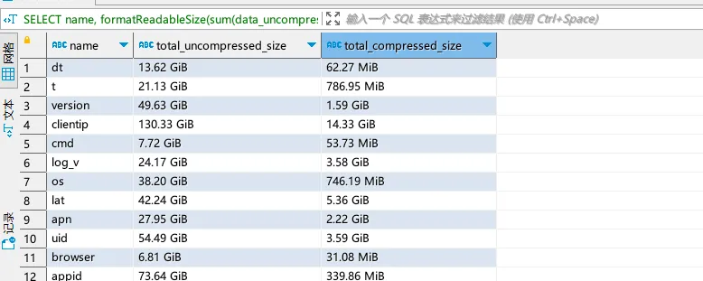

<a name="bpepo"></a>
### 当前连接数
CH 对外暴露的原生接口分为 TCP 和 HTTP 两类，通过 system.metrics 即可查询当前的 TCP、HTTP 与内部副本的连接数
```sql
SELECT * FROM system.metrics WHERE metric LIKE '%Connection';
```
<a name="HnRnB"></a>
### 当前执行的查询
```sql
SELECT query_id, user, address, query  FROM system.processes ORDER BY query_id;
```
<a name="z96aP"></a>
### Mutation 操作查询
```sql
SELECT database, table, mutation_id, command, create_time, is_done FROM system.mutations;
```
<a name="fHr30"></a>
### 查看各个存储路径的空间
```sql
SELECT 
    name, 
    path, 
    formatReadableSize(free_space) AS free, 
    formatReadableSize(total_space) AS total, 
    formatReadableSize(keep_free_space) AS reserved
FROM system.disks
```
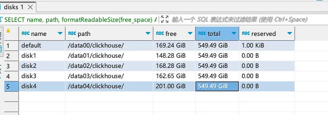
<a name="WR1MJ"></a>
### 查看系统配置
可以从system.settings表中查询系统有关的配置
```sql
select * from system.settings where name like '%memory%'
```
