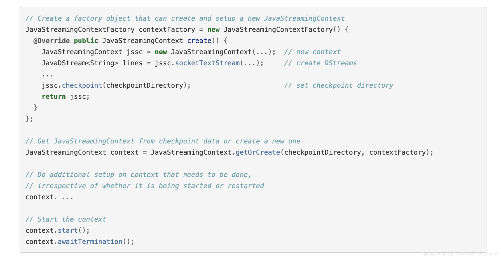

### Checkpoint机制

每一个Spark Streaming应用，正常来说，都是要7 * 24小时运转的，这就是实时计算程序的特点。因为要持续 不断的对数据进行计算。因此，对实时计算应用的要求，应该是必须要能够对与应用程序逻辑无关的失败，进行 容错。

如果要实现这个目标，Spark Streaming程序就必须将足够的信息checkpoint到容错的存储系统上，从而让它能 够从失败中进行恢复。有两种数据需要被进行checkpoint：

#### 元数据checkpoint

将定义了流式计算逻辑的信息，保存到容错的存储系统上，比如HDFS。当运行Spark Streaming应用程序的Driver进程所在节点失败时，该信息可以用于进行恢复。元数据信息包括了：

* 配置信息——创建Spark Streaming应用程序的配置信息，比如SparkConf中的信息。
* DStream的操作信息——定义了Spark Stream应用程序的计算逻辑的DStream操作信息。
* 未处理的batch信息——那些job正在排队，还没处理的batch信息。

#### 数据checkpoin

将实时计算过程中产生的RDD的数据保存到可靠的存储系统中。

对于一些将多个batch的数据进行聚合的，有状态的transformation操作，这是非常有用的。在这种 transformation操作中，生成的RDD是依赖于之前的batch的RDD的，这会导致随着时间的推移，RDD的依赖链条变 得越来越长。

要避免由于依赖链条越来越长，导致的一起变得越来越长的失败恢复时间，有状态的transformation操作执行过 程中间产生的RDD，会定期地被checkpoint到可靠的存储系统上，比如HDFS。从而削减RDD的依赖链条，进而缩短 失败恢复时，RDD的恢复时间。

一句话概括，元数据checkpoint主要是为了从driver失败中进行恢复；而RDD checkpoint主要是为了，使用到有 状态的transformation操作时，能够在其生产出的数据丢失时，进行快速的失败恢复。

### Checkpoint启用方式

1. 使用了有状态的transformation操作——比如updateStateByKey，或者reduceByKeyAndWindow操作，被使用 了，那么checkpoint目录要求是必须提供的，也就是必须开启checkpoint机制，从而进行周期性的RDD checkpoint。

2. 要保证可以从Driver失败中进行恢复——元数据checkpoint需要启用，来进行这种情况的恢复。

   要注意的是，并不是说，所有的Spark Streaming应用程序，都要启用checkpoint机制，如果即不强制要求从 Driver失败中自动进行恢复，又没使用有状态的transformation操作，那么就不需要启用checkpoint。事实上， 这么做反而是有助于提升性能

3. 对于有状态的transformation操作，启用checkpoint机制，定期将其生产的RDD数据checkpoint，是比较简单的。

​	可以通过配置一个容错的、可靠的文件系统（比如HDFS）的目录，来启用checkpoint机制，checkpoint数据就会 写入该目录。使用	StreamingContext的checkpoint()方法即可。然后，你就可以放心使用有状态的 transformation操作了。

4. 如果为了要从Driver失败中进行恢复，那么启用checkpoint机制，是比较复杂的。需要改写Spark Streaming 应用程序。

​	当应用程序第一次启动的时候，需要创建一个新的StreamingContext，并且调用其start()方法，进行启动。当 Driver从失败中恢复	过来时，需要从checkpoint目录中记录的元数据中，恢复出来一个StreamingContext.

### Driver失败重写超过程序

### 配置Spark-submit提交参数

按照上述方法，进行Spark Streaming应用程序的重写后，当第一次运行程序时，如果发现checkpoint目录不 存在，那么就使用定义的函数来第一次创建一个StreamingContext，并将其元数据写入checkpoint目录；当从 Driver失败中恢复过来时，发现checkpoint目录已经存在了，那么会使用该目录中的元数据创建一个 StreamingContext。

但是上面的重写应用程序的过程，只是实现Driver失败自动恢复的第一步。第二步是，必须确保Driver可以在 失败时，自动被重启。

要能够自动从Driver失败中恢复过来，运行Spark Streaming应用程序的集群，就必须监控Driver运行的过程， 并且在它失败时将它重启。对于Spark自身的standalone模式，需要进行一些配置去supervise driver，在它失败 时将其重启。

首先，要在spark-submit中，添加–deploy-mode参数，默认其值为client，即在提交应用的机器上启动 Driver；但是，要能够自动重启Driver，就必须将其值设置为cluster；此外，需要添加–supervise参数。

使用上述第二步骤提交应用之后，就可以让driver在失败时自动被重启，并且通过checkpoint目录的元数据恢 复StreamingContext。

### CheckPoint的说明

将RDD checkpoint到可靠的存储系统上，会耗费很多性能。当RDD被checkpoint时，会导致这些batch 的处理时间增加。因此，checkpoint的间隔，需要谨慎的设置。对于那些间隔很多的batch，比如1秒，如 果还要执行checkpoint操作，则会大幅度削减吞吐量。而另外一方面，如果checkpoint操作执行的太不频 繁，那就会导致RDD的lineage变长，又会有失败恢复时间过长的风险。

对于那些要求checkpoint的有状态的transformation操作，默认的checkpoint间隔通常是batch间隔 的数倍，至少是10秒。使用DStream的checkpoint()方法，可以设置这个DStream的checkpoint的间隔时长。 通常来说，将checkpoint间隔设置为窗口操作的滑动间隔的5~10倍，是个不错的选择。

### Checkpoint局限

**代码更新后checkpoint数据不可用**

checkpoint实现中将Scala/Java/Python objects序列化存储起来，恢复时会尝试反序列化这些objects。如果用修改过的class可能会导致错误。此时需要更换checkpoint目录或者删除checkpoint目录中的数据，程序才能起来.

