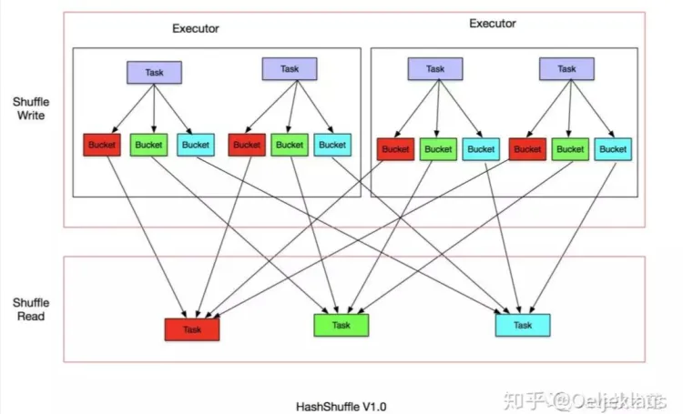
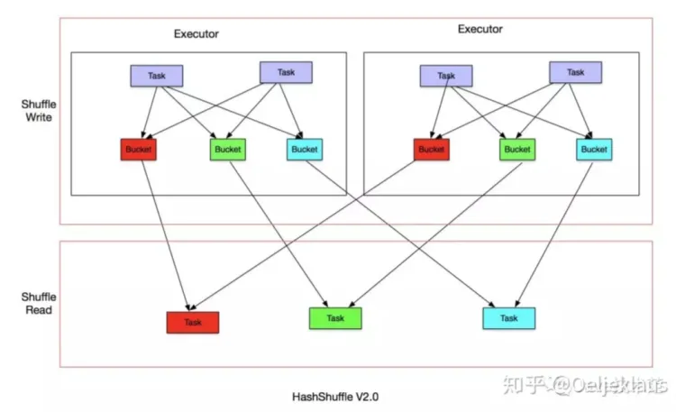
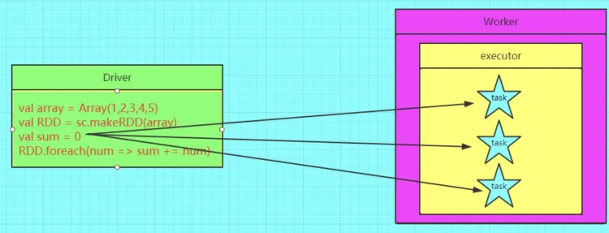
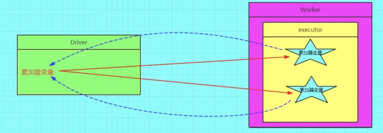
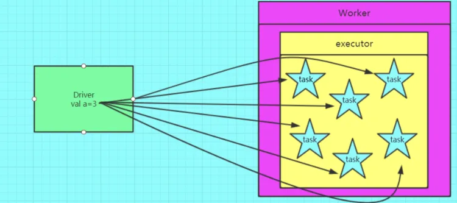
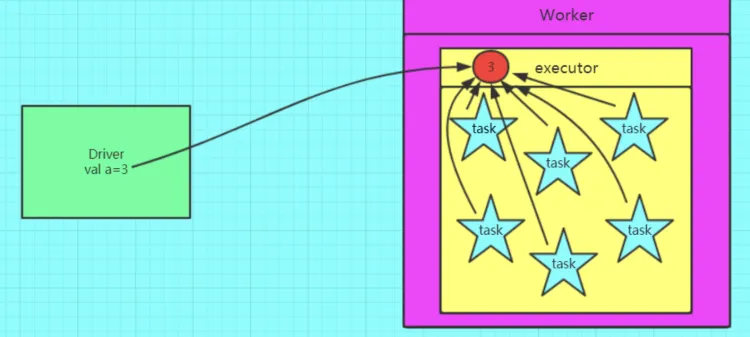

## 什么是RDD2
参考：[https://cloud.tencent.com/developer/article/1780260](https://cloud.tencent.com/developer/article/1780260)
### 概念
RDD（Resilient Distributed Dataset）叫做分布式数据集，是Spark中最基本的数据抽象。代码中是一个抽象类，它代表一个不可变、可分区、里面的元素可[并行计算](https://cloud.tencent.com/product/gpu?from=20065&from_column=20065)的集合。
### RDD的五个特性
- 1） A list of partitions<br />一个分区列表，一个rdd有多个分区，后期spark任务计算是以分区为单位，一个分区就对应上一个task线程。 通过val rdd1=sc.textFile(文件) 如果这个文件大小的block个数小于等于2，它产生的rdd的分区数就是2 如果这个文件大小的block个数大于2，它产生的rdd的分区数跟文件的block相同。<br />- 2）A function for computing each split<br />由一个函数计算每一个分片 比如： rdd2=rdd1.map(x=>(x,1)) ，这里指的就是每个单词计为1的函数<br />- 3）A list of dependencies on other RDDs<br />一个rdd会依赖于其他多个rdd，这里就涉及到rdd与rdd之间的依赖关系，后期spark任务的容错机制就是根据这个特性而来。 比如： rdd2=rdd1.map(x=>(x,1)) rdd2的结果是通过rdd1调用了map方法生成，那么rdd2就依赖于rdd1的结果 对其他RDD的依赖列表，依赖还具体分为宽依赖和窄依赖，但并不是所有的RDD都有依赖。<br />- 4)Optionally, a Partitioner for key-value RDDs (e.g. to say that the RDD is hash-partitioned)<br />(可选项) 对于kv类型的rdd才会有分区函数（必须要产生shuffle），对于不是kv类型的rdd分区函数是None。 分区函数的作用：它是决定了原始rdd的数据会流入到下面rdd的哪些分区中。 spark的分区函数有2种：第一种hashPartitioner（默认值）, 通过 key.hashcode % 分区数=分区号 第二种RangePartitioner,是基于一定的范围进行分区。<br />- 5)Optionally, a list of preferred locations to compute each split on (e.g. block locations for an HDFS file)<br />(可选项) 一组最优的数据块的位置，这里涉及到数据的本地性和数据位置最优 spark后期在进行任务调度的时候，会优先考虑存有数据的worker节点来进行任务的计算。大大减少数据的网络传输，提升性能。这里就运用到了[大数据](https://cloud.tencent.com/solution/bigdata?from=20065&from_column=20065)中移动数据不如移动计算理念。
### RDD特点
RDD表示只读的分区的数据集，对RDD进行改动，只能通过RDD的转换操作，由一个RDD得到一个新的RDD，新的RDD包含了从其他RDD衍生所必需的信息。RDDs之间存在依赖，RDD的执行是按照血缘关系延时计算的。如果血缘关系较长，可以通过持久化RDD来切断血缘关系。
## 常见算子
从小方向来说，Spark 算子大致可以分为以下三类:<br />1）Value数据类型的Transformation算子，这种变换并不触发提交作业，针对处理的数据项是Value型的数据。<br />2）Key-Value数据类型的Transfromation算子，这种变换并不触发提交作业，针对处理的数据项是Key-Value型的数据对。<br />3）Action算子，这类算子会触发SparkContext提交Job作业。
### 聚合算子

1. **ReduceByKeyApache Spark 中用于对键值对 RDD 进行聚合操作的转换算子之一。它对具有相同键的值进行本地归约，然后在整个数据集上进行全局归约。**reduceByKey** 的基本作用是将相同键的值按照给定的归约函数进行合并。

具体来说，**reduceByKey** 的签名如下：
```
def reduceByKey(func: (V, V) => V): RDD[(K, V)]
```

2. **groupByKey**

Apache Spark 中用于对键值对 RDD 进行分组操作的转换算子之一。它将具有相同键的所有值组合在一起，形成一个键对应的值的集合。具体来说，**groupByKey** 的签名如下：
```
def groupByKey(): RDD[(K, Iterable[V])]
```

3. **aggregateByKey**

Apache Spark 中用于对键值对 RDD 进行聚合操作的高级转换算子。它提供了更大的灵活性，允许用户在每个键上执行不同的初始化、合并和最终聚合逻辑。**aggregateByKey** 的签名如下：
```
def aggregateByKey[U: ClassTag](zeroValue: U)(
  seqOp: (U, V) => U, combOp: (U, U) => U): RDD[(K, U)]
```
其中：

- **zeroValue** 是一个初始值，用于为每个键创建一个累加器。
- **seqOp** 是一个二元操作符，用于将每个值合并到累加器。
- **combOp** 是一个二元操作符，用于将两个累加器合并成一个。

**      groupByKey、reduceByKey、aggregateByKey区别**<br /> 三者都可以做分组操作。reduceByKey、aggregateByKey不但分组还做了聚合操作

- groupByKey直接进行shuffle操作，数据量大的时候速度较慢。
- reduceByKey、aggregateByKey在shuffle之前可能会先进行聚合，聚合后的数据再进行shuffle，这样一来进行shuffle的数据会变少，速度会快。
- reduceByKey、aggregateByKey的区别是前者不同partition以及partition之间的聚合操作是一样的，而后者可以指定两种操作来对应于partition之间和partition内部不同的聚合操作，并且aggregateByKey可以指定初始值。
- 在aggregateByKey中，如果两种操作是一样的，可以使用foldByKey来代替，并且只传一个操作函数。foldBykey和reudceBykey的区别是前者可以指定一个初始值
4. **foldByKey**

是aggregateByKey函数的特殊形式，即简写形式。<br />**功能：**根据设定规则同时进行分区间的计算和分区内的计算，具体为，<br />（1）在分区内按照相同的key进行某种规则计算；<br />（2）分区内部计算完后，接着计算分区间的同样依据相同的key按照规则进行计算，**注意：分区内和分区间的计算规则是一样的。**

5. **combineByKey**
### 重新分区算子

1. **repartition	**

**repartition** 是 Apache Spark 中用于改变 RDD 分区数量的转换算子。它用于重新组织数据并更改 RDD 的分区分布，可以增加或减少分区的数量。**repartition** 的签名如下：
```
 /**
   * Return a new RDD that has exactly numPartitions partitions.
   *
   * Can increase or decrease the level of parallelism in this RDD. Internally, this uses
   * a shuffle to redistribute data.
   *
   * If you are decreasing the number of partitions in this RDD, consider using `coalesce`,
   * which can avoid performing a shuffle.
   */
  def repartition(numPartitions: Int)(implicit ord: Ordering[T] = null): RDD[T] = withScope {
    coalesce(numPartitions, shuffle = true)
  }

```
其中 **numPartitions** 是希望得到的新分区数量。

- repartition可以将分区的并行度增加，也可以将分区的并行度减少
- 可以看到repartition调用了coalesce方法，并且传入的shuffle参数是true。换句说话，就是无论分区数是增加还是减少**都会执行shuffle**操作。

使用 **repartition** 时，Spark 将重新分配数据以适应新的分区数，可能需要进行数据的移动和网络传输。因此，谨慎使用 **repartition**，特别是在大规模数据集上，以避免不必要的开销。

2. **coalesce**

**coalesce** 是 Spark 中的一个转换算子，用于减少 RDD 的分区数量。与 **repartition** 不同，**coalesce** 主要用于减少分区数量，而不进行数据的 shuffle（不进行数据的网络传输和重分配）。因此，相对于**repartition**，**coalesce** 更加轻量级。<br />**coalesce** 的签名如下：
```
def coalesce(numPartitions: Int, shuffle: Boolean = false, partitionCoalescer: Option[PartitionCoalescer] = Option.empty)
  (implicit ord: Ordering[T] = null): RDD[T]
```
其中：

- **numPartitions** 是希望得到的新分区数量。
- **shuffle** 是一个布尔值，表示是否进行 shuffle。默认为 **false**，即不进行 shuffle。
- **partitionCoalescer** 是一个可选参数，用于指定自定义的分区合并器

我们常认为coalesce不产生shuffle会比repartition 产生shuffle效率高，而实际情况往往要根据具体问题具体分析，coalesce效率不一定高，有时还有大坑，大家要慎用。 coalesce 与 repartition 他们两个都是RDD的分区进行重新划分，repartition只是coalesce接口中shuffle为true的实现（假设源RDD有N个分区，需要重新划分成M个分区） <br />1）如果 。一般情况下N个分区有数据分布不均匀的状况，利用HashPartitioner函数将数据重新分区为M个，这时需要将shuffle设置为true(repartition实现,coalesce也实现不了)。 <br />2）如果N>M并且N和M相差不多，(假如N是1000，M是100)那么就可以将N个分区中的若干个分区合并成一个新的分区，最终合并为M个分区，这时可以将shuff设置为false（coalesce实现），如果M>N时，coalesce是无效的，不进行shuffle过程，父RDD和子RDD之间是窄依赖关系，无法使文件数(partiton)变多。 总之如果shuffle为false时，如果传入的参数大于现有的分区数目，RDD的分区数不变，也就是说不经过shuffle，是无法将RDD的分区数变多的 <br />3）如果N>M并且两者相差悬殊，这时你要看executor数与要生成的partition关系，如果executor数 小于等于 要生成partition数，coalesce效率高，反之如果用coalesce会导致(executor数-要生成partiton数)个excutor空跑从而降低效率。如果在M为1的时候，为了使coalesce之前的操作有更好的并行度，可以将shuffle设置为true
### 排序算子

1. **sortBy**

**sortBy** 是 Apache Spark 中的一个转换算子，用于对 RDD 中的元素进行排序。与 **sortByKey** 不同，**sortBy** 允许对元素的任意属性进行排序，而不仅仅是键。**sortBy** 的签名如下：
```
def sortBy[K](f: (T) => K, ascending: Boolean = true, numPartitions: Int = this.partitions.length)
  (implicit ord: Ordering[K], ctag: ClassTag[K]): RDD[T]
```
其中：

- **f** 是一个函数，将元素映射到需要排序的键。
- **ascending** 是一个布尔值，表示升序还是降序排序，默认为升序。
- **numPartitions** 是结果 RDD 的分区数量，默认为原始 RDD 的分区数量。
- **ord** 是一个隐式参数，表示排序的顺序，Spark 会根据被排序的类型推断出适当的隐式 **Ordering**。
- **ctag** 是一个隐式参数，表示排序键的 **ClassTag**。
2. **sortByKey**

在一个(K,V)的RDD上调用，K必须实现Ordered接口，返回一个按照key进行排序的(K,V)的RDD

- **ascending**：一个布尔值，表示排序顺序，默认为 **true**，即升序排序。
- **numPartitions**：结果 RDD 的分区数量，默认为原始 RDD 的分区数量。
- **ord**：隐式参数，表示排序的顺序，Spark 会根据键的类型推断出适当的隐式 **Ordering**。
- **ctag**：隐式参数，表示排序键的 **ClassTag**
### 映射算子

1. **map**

**map** 是 Apache Spark 中的一个转换算子，用于对 RDD 中的每个元素执行指定的映射操作。它将一个 RDD 中的每个元素通过一个用户定义的函数进行映射，生成一个新的 RDD。**map** 的基本签名如下：
```
def map[U: ClassTag](f: T => U): RDD[U]
```

2. **flatMap**

flatMap 其实和 map 与 mapPartitions 算子类似，在功能上，与 map 和 mapPartitions 一样，flatMap 也是用来做数据映射的，在实现上，对于给定映射函数 f，flatMap(f) 以元素为粒度，对 RDD 进行数据转换。不过，与前两者相比，flatMap 的映射函数 f 有着显著的不同。对于 map 和 mapPartitions 来说，其映射函数 f 的类型，都是（元素） => （元素），即元素到元素。而 flatMap 映射函数 f 的类型，是（元素） => （集合），即元素到集合（如数组、列表等）。因此，flatMap 的映射过程在逻辑上分为两步：

- 以元素为单位，创建集合；
- 去掉集合“外包装”，提取集合元素。
```scala
// 读取文件内容
val lineRDD: RDD[String] = sc.parallelize(List("Apache Spark is a fast and general-purpose cluster computing system."))
// 以行为单位提取相邻单词
val wordPairRDD: RDD[String] = lineRDD.flatMap( line => {
  // 将行转换为单词数组
  val words: Array[String] = line.split(" ")
  // 将单个单词数组，转换为相邻单词数组
  val list = for (i <- 0 until words.length - 1) yield words(i) + "-" + words(i+1)
  println("list: " + list)
  list.iterator  //返回list的迭代器,最终所有的集合元素都会被抽到一个集合中
})
wordPairRDD.collect().foreach(x=>println(x))
```

3. **mapPartition**mapPartitions** 是 Apache Spark 中的一个转换算子，它允许对 RDD 中的每个分区应用一个函数。与 **map** 和 **flatMap** 不同，**mapPartitions** 操作的是整个分区的数据而不是单个元素，这使得它更适合处理分区级别的操作，而不是每个元素的操作。
4. **mapPartitionWithIndex**

**mapPartitionsWithIndex** 是 Apache Spark 中的一个转换算子，类似于 **mapPartitions**，但它额外提供了分区的索引信息。这个算子允许对 RDD 中的每个分区应用一个函数，并传递分区索引作为参数。这样，你可以在处理每个分区时根据分区索引执行不同的操作。
### 去重算子

1. **distinct**

**distinct** 是 Apache Spark 中的一个转换算子，用于去除 RDD 中的重复元素，返回一个包含唯一元素的新的 RDD<br />**distinit原理**<br />我们看下源码
```scala
/**   * Return a new RDD containing the distinct elements in this RDD.   */  
def distinct(numPartitions: Int(implicit ord: Ordering[T] = null): RDD[T] = withScope {    
    map(x => (x, null)).reduceByKey((x, y) => x, numPartitions).map(_._1)  
}  

/**   * Return a new RDD containing the distinct elements in this RDD.   */
def distinct(): RDD[T] = withScope {    
    distinct(partitions.length)  
}
```
上面是distinct的源码，有带参和无参两种。当我们调用无参的distinct时，底层调用的是如下源码
```python
def distinct(): RDD[T] = withScope {    
  distinct(partitions.length)  
}
```
带参数的distinct其内部就很容易理解了，这就是一个wordcount统计单词的方法，区别是：后者通过元组获取了第一个单词元素。<br /><br />总结：使用map算子把元素转为一个带有null的元组；使用reducebykey对具有相同key的元素进行统计；之后再使用map算子，取得元组中的单词元素，实现去重的效果。
## Shuffer算法
> Spark有2种Shuffer方法，第一种是HashShuffer，第二种是SortShuffer。

HashShuffer在旧的版本中先使用的，类似于MapReduce,但是区别在于Spark中的HashShuffer没有排序，而MapReduce HashShuffer中是有排序的，但是后面的版本中，Spark将HashShuffer换成了SortShuffer。
### HashShuffer的迭代
**普通hashShuffer**<br />第一版是直接Map端的Task直接根据下游的Reduce的Task的数量然后将对应属于reducetask分区的数据写入到本地磁盘文件。 <br />假设Map端有2个Executor，每个Executor中有2个Map task，而下游有一个Reduce，Reduce中有3个task。如下图：<br /><br />Map端的task将内存中的数据分别写入到本地的多个文件中，每个文件对应的是下游中的一个reduce task。由于总共有3个reduce task，所有一个map task 需要生成三个reduce task的文件。<br />这样的话，2个executor中有4个task，每个map task 需要生成3个reduce task。就需要生成4*3 = 12 个task文件。<br />task文件数量= MapTask数量 * ReduceTask的数量。 <br />这样会有一个问题，当MapTask和ReduceTask的数量比较多时，会导致task文件的数量爆炸性的增长。IO性能会降低。所以后面Spark抛弃了这种方式。<br />参考：

- [https://alstonwilliams.github.io/spark/2019/02/17/Spark%E6%9E%B6%E6%9E%84-Shuffle(%E8%AF%91)/](https://alstonwilliams.github.io/spark/2019/02/17/Spark%E6%9E%B6%E6%9E%84-Shuffle(%E8%AF%91)/)

**V2ConsolidatedShuffle（文件合并的HashShuffer）**<br />基于第一版HashShuffer的缺点(生成的task文件太多，会导致内存需要存储大量的文件描述符，而且会引起海量的IO读写)，Spark又使用了第二版的Shuffer算法。<br />为了优化 HashShuffleManager 我们可以设置一个参数：spark.shuffle.consolidateFiles，该参数默认值为 false，将其设置为 true 即可开启优化机制，通常来说，如果我们使用 HashShuffleManager，那么都建议开启这个选项。

开启 consolidate 机制之后，在 shuffle write 过程中，task 就不是为下游 stage 的每个 task 创建一个磁盘文件了，此时会出现shuffleFileGroup的概念，每个 shuffleFileGroup 会对应一批磁盘文件，磁盘文件的数量与下游 stage 的 task 数量是相同的。一个 Executor 上有多少个 cpu core，就可以并行执行多少个 task。而第一批并行执行的每个 task 都会创建一个 shuffleFileGroup，并将数据写入对应的磁盘文件内。

当 Executor 的 cpu core 执行完一批 task，接着执行下一批 task 时，下一批 task 就会复用之前已有的 shuffleFileGroup，包括其中的磁盘文件，也就是说，此时 task 会将数据写入已有的磁盘文件中，而不会写入新的磁盘文件中。因此，consolidate 机制允许不同的 task 复用同一批磁盘文件，这样就可以有效将多个 task 的磁盘文件进行一定程度上的合并，从而大幅度减少磁盘文件的数量，进而提升 shuffle write 的性能。

假设第二个 stage 有 100 个 task，第一个 stage 有 50 个 task，总共还是有 10 个 Executor（Executor CPU 个数为 1），每个 Executor 执行 5 个 task。那么原本使用未经优化的 HashShuffleManager 时，每个 Executor 会产生 500 个磁盘文件，所有 Executor 会产生 5000 个磁盘文件的。但是此时经过优化之后，每个 Executor 创建的磁盘文件的数量的计算公式为：cpu core的数量 * 下一个stage的task数量，也就是说，每个 Executor 此时只会创建 100 个磁盘文件，所有 Executor 只会创建 1000 个磁盘文件。<br />这个功能优点明显，但为什么 Spark 一直没有在基于 Hash Shuffle 的实现中将功能设置为默认选项呢，官方给出的说法是这个功能还欠稳定。<br />Consolidation算法就是多了一个文件的合并， 从之前的每个MapTask生成文件优化为每个Execotor为单位生成文件(其实应该是以Core核心数为单位，这里默认了一个Executor只有一个Core核心)，这个合并其实是指单分区的合并，最终以一个文件为一个分区。<br />ConsolidatedShuffle 以Executor为单位，进行文件处理，如下图：<br /><br />和第一版不同的是，以Executor为单位生成对应的Task文件，这样的话Task文件的数量就会大幅的减少，为Executor的数量*ReeuceTask的数量。但是如果ReduceTask的数量依然还是比较多的话， 产生的task文件数还是很多。 最终Spark转向了SortShuffer.<br />总结：

1. HashShuffer的优点是不用排序，因为每个下游Task的数据都被单独写到一个文件中， 所以可以不用排序。
2. 缺点是生产的文件过多，会对文件系统造成压力。大量小文件随机读写带来一定的磁盘开销。
### Sort Based Shuffer
参考：[https://blog.csdn.net/weixin_39216383/article/details/81194498](https://blog.csdn.net/weixin_39216383/article/details/81194498)<br />由于HashShuffer会导致产生大量的中间磁盘文件，导致IO性能降低。尽管后面有合并文件的HashShuffer，但是当ReduceTask数量大的时候依然会I产生大量的文件导致IO性能降低。<br />因此Spark在1.2版本正式使用了Sort Shuffer替代了Hash Shuffer。因此目前我们在Spark中使用到的Shuffer算法都是Sort Base Shuffer。<br />在Sort Shuffer中，分两类的场景，一类是普通的SortShuffer，一类是开启byPass的Sort Shuffer。什么情况下使用普通SortShuffer，什么情况下使用ByPass的Sort取决于是有没有聚合运算。<br />**普通SortShuffer**<br />会对partition中数据在内存中进行排序。然后分批次写入到磁盘的临时文件中，最后把多个临时文件合并为一个文件(多分区数据合并)。这种模式和Mapreduce差不多，数据会先写入一个内存数据结构中，如果是ReduceByKey这种带有聚合的算子，那么内存结构会使用Map结构。如果是Join这种shuffer算子， 则会使用ArrayList的数据结构， 数据直接写入内存，当内存数据量达到临界值时，会将内存数据写入到磁盘中。在写入磁盘前，会按key对每个partition中的数据进行排序，排序后按批次写入磁盘文件， 最后再进行合并到一个文件。因此产生的文件数量和Shuffer Write Task。的数量相同。如下图：<br /><br />**byPass机制的SortShuffer(忽略sort)**<br /><br />byPass的启动机制：

- shuffle reduce task数量小于spark.shuffle.sort.bypassMergeThreshold参数的值，这个值默认200个。
- 不是聚合类的shuffle算子（比如reduceByKey）。

byPass的特殊之处在于不会对partition内的数据进行排序。、Reducer 端任务数比较少的情况下，基于 Hash Shuffle 实现机制明显比基于 Sort Shuffle 实现机制要快，因此基于 Sort huffle 实现机制提供了一个回退方案，就是 bypass 运行机制。对于 Reducer 端任务数少于配置属性spark.shuffle.sort.bypassMergeThreshold设置的个数时，使用带 Hash 风格的回退计划。<br />此时，每个 task 会为每个下游 task 都创建一个临时磁盘文件，并将数据按 key 进行 hash 然后根据 key 的 hash 值，将 key 写入对应的磁盘文件之中。当然，写入磁盘文件时也是先写入内存缓冲，缓冲写满之后再溢写到磁盘文件的。最后，同样会将所有临时磁盘文件都合并成一个磁盘文件，并创建一个单独的索引文件。<br />该过程的磁盘写机制其实跟未经优化的 HashShuffleManager 是一模一样的，因为都要创建数量惊人的磁盘文件，只是在最后会做一个磁盘文件的合并而已。因此少量的最终磁盘文件，也让该机制相对未经优化的 HashShuffleManager 来说，shuffle read 的性能会更好。<br />而该机制与普通 SortShuffleManager 运行机制的不同在于：第一，磁盘写机制不同；第二，不会进行排序。也就是说，启用该机制的最大好处在于，shuffle write 过程中，不需要进行数据的排序操作，也就节省掉了这部分的性能开销。<br />**总结:**

1. 如果有聚合条件的Shuffer算子(比如ReduceByKey)，使用普通机制的SortShuffer，会进行排序
2. 如果不是聚合条件的Shuffer算子，且Shuffer Read Task的数量小于等于spark.shuffle.sort.bypassMergeThreshold的值(默认为200)，就会启用byPass机制，byPass不会进行排序。可以减少排序带来的性能损耗。
3. 两种SortShuffer产生的task文件数量和Map Task 的数量相同。 与ReduceTask数量没有关系。比如2个Executor，每个Executor中有2个MapTask。那么就会产生4个task文件 ，这个文件是将下游分区的数据Merge一起了。并带有一个索引文件，Reduce端拉取的时候会先通过索引文件确定要读取的文件的数据范围。
4. 为什么HashShuffer中没有进行sort,是为了去掉sort这个阶段，如果没有了sort，那么就意味着最终生成的多个文件不能合并，MapReduce中shuffer是用归并排序，前提是每个文件中已经做了排序。但是spark没有sort，所以最终的文件合并成本很高，基本就不可能合并。所以Map Task 对下游的每个Reduce单独生成了一个partition了。能够合并的前提是按一个文件中要按partition排序，这样reduce正确拉取到。
5. 在第二版的HashShuffer中，对Map Task 生成的文件进行了合并，合并规则是按照partition进行合并，最终在一个Executor中的文件个数与Reduce的数量是一致的。一个分区一个文件。
## 任务提交流程<br /><br />
## 数据倾斜
### 什么是数据倾斜
数据清洗是某个partitin的数据量非常大， 而别的分区的数据量小。导致几个task计算耗时很久任务计算时间很长。就是某个key在shuffer的时候被分发到一个分区，而这个key的数量远大于其他的key.
### 数据倾斜会导致什么问题

1. 导致OOM
2. 导致任务计算时间很长
### 如何解决数据倾斜

- 参考： [https://zhuanlan.zhihu.com/p/511193855](https://zhuanlan.zhihu.com/p/511193855)
#### 基本思路
既然数据倾斜是因为相同 key 的值被分配到少数几个节点上造成的单点问题，那么尽可能的的让 key 平均分配，问题就解决了。所以可以有几个思路：

- 数据预处理：在数据清洗过程中把计数特别多的 key 过滤掉（有损），或单独计算（无损）。
- 业务逻辑优化：从业务逻辑的层面上来优化数据倾斜，比如从数据的源头就尽可能避免单个计量很大的 key
- 参数优化：Hadoop 和 Spark 都自带了很多的参数和机制来调节数据倾斜，合理利用它们就能解决大部分问题。
- 程序优化：比如用 group 代替 count(distinct) 等。
#### 过滤异常数据
直接过滤异常数据，对于有的情况下是有损的，但是对于部分情况，该方法也是可用的，比如本该在数据清洗阶段清洗的大量的NULL值、空值未被清洗。对于这类情况，直接使用 where 条件过滤即可。<br />另外，如果部分看起来有用的数据，但是预估到实际计算结果中影响不大，也可酌情过滤。
#### 优化元数据
#### 优化Map端数据
如果Map端从HDFS读取的数据为不压缩文件，且不支持split切割，则会导致有的Map端读取的文件比较大，有的文件读取的文件较小。产生Map端的数据倾斜。
#### 优化Shuffle逻辑
#### 使用MapJoin
#### 调整reduce并行度
调整reduce的并行度，从而使得每个partition分区分发到的数据量会减少。从而解决数据倾斜。
#### key 加盐
## Checkpoint
## 缓存
RDD 可以使用 persist() 方法或 cache() 方法进行持久化。数据将会在第一次 action 操作时进行计算，并缓存在节点的内存中。Spark 的缓存具有容错机制，如果一个缓存的 RDD 的某个分区丢失了，Spark 将按照原来的计算过程，自动重新计算并进行缓存。<br />持久化是将RDD的数据缓存到内存或者其他存储介质中(比如磁盘)。<br />RDD本身是不存储数据的，如果要想一个RDD实现复用，则会重新从源头开始计算数据。导致数据被重新计算。<br />如果一个RDD缓存的数据丢失了，则会重新计算数据。
### Cache
Cache和Persist方法其实表达的是同一个意思，只不过Cache方法也调用的是persist方法。<br />Cache对某个RDD的数据进行缓冲到内存中，实现了数据的复用。下次重复使用该RDD的时候不会从数据源进行重新的计算，提高了计算效率和减少了重复的计算量。<br />源代码如下，其实cache还是调用了persist()的无参方法，默认存储到内存中。
```scala
def persist(): this.type = persist(StorageLevel.MEMORY_ONLY)

/**
* Persist this RDD with the default storage level (`MEMORY_ONLY`).
*/
def cache(): this.type = persist()
```

```scala
package com.dytg.sparkcore

import org.apache.spark.{SparkConf, SparkContext}

object Cache01 {

  def main(args: Array[String]): Unit = {

    val sparkConf = new SparkConf().setAppName("Example021").setMaster("local[*]")

    val sc = new SparkContext(sparkConf)

    val rdd = sc.makeRDD(List("zhangsan", "lisi", "wangwu"));

    val mapRdd = rdd.map(e =>{
      println("执行map 算子")
      e+" : 20 "
    } )

    mapRdd.cache()

    mapRdd.foreach(e => println(e))

    //如果对maprdd不进行cache缓存，那么执行saveAsTextFile时会顺着RDD血缘重新再计算一次。
    //虽然这里mapRDD这个对象被复用了，但是RDD中本身是不存储数据的，只是对数据的抽象的描述和定义。
    //所以需要追溯到数据源头再进行一次计算。
    //当mapRdd执行了cache，则会将数据缓存到内存中，再一次使用mapRDD的时候，就直接使用cache的数据，不用重新开始计算了，这是一种减少
    //重复计算量的一种方法
    mapRdd.saveAsTextFile("rdd.txt")

  }
}
```
### Persist
persist方法的作用和cache方法一样，只不过persist方法支持配置数据存储的方式，可以存储到内存中，也可以存储到文件中，但是这里的存储到文件中是一个临时文件，当Job停止的时候会自动删除这个临时的文件。因此只在一个Job运行的过程中可以使用到。
### 存储级别

- MEMORY_ONLY : 将 RDD 以反序列化 Java 对象的形式存储在 JVM 中。如果内存空间不够，部分数据分区将不再缓存，在每次需要用到这些数据时重新进行计算。这是默认的级别。
- MEMORY_AND_DISK : 将 RDD 以反序列化 Java 对象的形式存储在 JVM 中。如果内存空间不够，将未缓存的数据分区存储到磁盘，在需要使用这些分区时从磁盘读取。
- MEMORY_ONLY_SER : 将 RDD 以序列化的 Java 对象的形式进行存储（每个分区为一个 byte 数组）。这种方式会比反序列化对象的方式节省很多空间，尤其是在使用 fast serializer时会节省更多的空间，但是在读取时会增加 CPU 的计算负担。
- MEMORY_AND_DISK_SER : 类似于 MEMORY_ONLY_SER ，但是溢出的分区会存储到磁盘，而不是在用到它们时重新计算。
- DISK_ONLY : 只在磁盘上缓存 RDD。
- MEMORY_ONLY_2，MEMORY_AND_DISK_2，等等 : 与上面的级别功能相同，只不过每个分区在集群中两个节点上建立副本。
- OFF_HEAP（实验中）: 类似于 MEMORY_ONLY_SER ，但是将数据存储在 off-heap memory，这需要启动 off-heap 内存。
### 缓存删除策略
Spark 自动监控各个节点上的缓存使用率，并以最近最少使用的方式（LRU）将旧数据块移除内存。如果想手动移除一个 RDD，而不是等待该 RDD 被 Spark 自动移除，可以使用 RDD.unpersist() 方法。
## 累加器和广播变量
### 累加器
在spark应用程序中，我们经常会有这样的需求，如异常监控，调试，记录符合某特性的数据的数目，这种需求都需要用到计数器，如果一个变量不被声明为一个累加器，那么它将在被改变时不会再driver端进行全局汇总，即在分布式运行时每个task运行的只是原始变量的一个副本，并不能改变原始变量的值，但是当这个变量被声明为累加器后，该变量就会有分布式计数的功能。<br />错误的图解：<br /><br />正确的图解<br /><br />注意事项：<br />累加器在Driver端定义赋初始值，累加器只能在Driver端读取最后的值，在Excutor端更新<br />累加器的定义
```java
val a = sc.accumulator(0) //定义一个累加器
val b = a.value //获取一个累加器的值
```
### 广播变量
如果我们要在分布式计算里面分发大对象，例如：字典，集合，黑白名单等，这个都会由Driver端进行分发，一般来讲，如果这个变量不是广播变量，那么每个task就会分发一份，这在task数目十分多的情况下Driver的带宽会成为系统的瓶颈，而且会大量消耗task服务器上的资源，如果将这个变量声明为广播变量，那么知识每个executor拥有一份，这个executor启动的task会共享这个变量，节省了通信的成本和服务器的资源。<br />**广播变量的特点**

1. 由Driver端分发到每个Executor上
2. 每个Executor上的task共享读取该广播变量
3. 广播变量不能被修改
4. 一般用于字典表，或者join小表的广播

广播变量图解<br />错误用法，会导致每个task都有一份变量的数据，导致浪费Executor的内存<br /><br />正确用法。使用广播变量分发到每个Executor上，Executor上的task共享该变量，变量内存只有一份<br /><br />下面是一个代码示例：<br />要通过broast.value来获取广播变量的值
```java
val sparkConf = new SparkConf().setAppName("Example0212").setMaster("local[*]")

    val sc = new SparkContext(sparkConf)

    val rdd = sc.makeRDD(List(("a", 4), ("b", 1), ("c", 2)))

    val map = mutable.Map(("a",1),("b",2),("c",4))

    val broastMap: Broadcast[mutable.Map[String, Int]] = sc.broadcast(map)

    rdd.map{
    case (word,count) =>
        val l =  broastMap.value.getOrElse(word,0)
        (word,(count,l))
        }.foreach(println)
    }
```
## DataFrame和DataSet
### 区别
DataFrame和DataSet都是分布式数据处理的抽象概念，用于表示分布式数据集。它们之间的主要区别在于其对类型安全性和编程接口的支持。

1. **DataFrame:**
    - **概念：** DataFrame 是一种分布式的数据集，可以看作是由命名列组成的分布式表格。它类似于关系型数据库中的表格或者Pandas库中的DataFrame。
    - **类型安全性：** DataFrame 是不类型安全的，即它的列没有特定的类型信息，而是被认为是通用的**Column**类型。这意味着在编译时无法捕捉到类型错误。
    - **编程接口：** DataFrame API 是基于SQL的查询语言，提供了一种类似于SQL的查询接口，支持使用SQL语句进行数据操作。DataFrame可以通过Spark SQL模块创建，也可以通过读取外部数据源创建。
2. **DataSet:**
    - **概念：** DataSet 是强类型的分布式数据集，它是对DataFrame的扩展，引入了类型信息。它可以看作是具有类型信息的分布式集合，类似于Scala或Java中的集合。
    - **类型安全性：** DataSet 是类型安全的，即它在编译时就能捕捉到类型错误。这使得在进行操作时更容易发现潜在的问题。
    - **编程接口：** DataSet API 提供了一组强类型的操作函数，可以直接使用类和Lambda表达式。它更适用于编写复杂的业务逻辑，而不仅仅是简单的数据操作。DataSet也可以通过Spark SQL模块创建。

其实DataFrame可以看做是特殊的DataSet，数据类型为Row，看源码
```scala
  type DataFrame = Dataset[Row]
```
