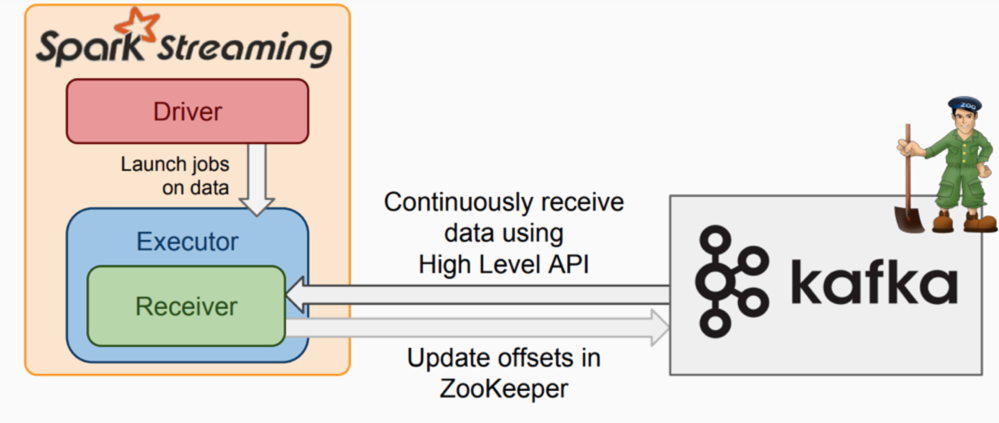
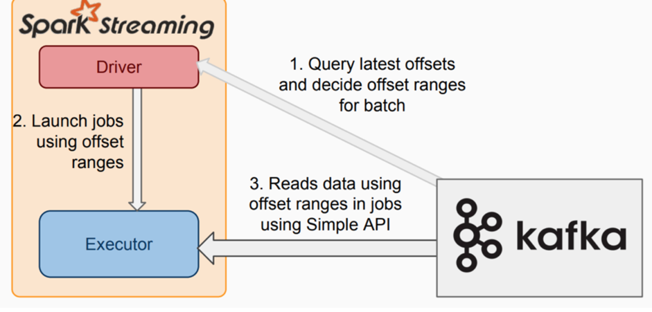

## Spark Core
### 1. Spark为什么比mapreduce快？为什么快呢？ 快在哪里呢？

Spark计算比MapReduce快的根本原因在于DAG计算模型。一般而言，DAG相比Hadoop的MapReduce在大多数情况下可以减少shuffle次数**
Spark的DAGScheduler相当于一个改进版的MapReduce，如果计算不涉及与其他节点进行数据交换，Spark可以在内存中一次性完成这些操作，也就是中间结果无须落盘，减少了磁盘IO的操作。但是，如果计算过程中涉及数据交换，Spark也是会把shuffle的数据写磁盘的！！！
有同学提到，Spark是基于内存的计算，所以快，这也不是主要原因，要对数据做计算，必然得加载到内存，Hadoop也是如此，只不过Spark支持将需要反复用到的数据给Cache到内存中，减少数据加载耗时，所以Spark跑机器学习算法比较在行（需要对数据进行反复迭代）。Spark基于磁盘的计算依然也是比Hadoop快。
刚刚提到了Spark的DAGScheduler是个改进版的MapReduce，所以Spark天生适合做批处理的任务。而不是某些同学说的：Hadoop更适合做批处理，Spark更适合做需要反复迭代的计算。
Hadoop的MapReduce相比Spark真是没啥优势了。但是Hadoop的HDFS还是业界的大数据存储标准。

### 2.Spark和MR的区别？ 

Spark vs MapReduce ≠ 内存 vs 磁盘

其实Spark和MapReduce的计算都发生在内存中，区别在于：
MapReduce通常需要将计算的中间结果写入磁盘，然后还要读取磁盘，从而导致了频繁的磁盘IO。
Spark则不需要将计算的中间结果写入磁盘，这得益于Spark的RDD（弹性分布式数据集，很强大）和DAG（有向无环图），其中DAG记录了job的stage以及在job执行过程中父RDD和子RDD之间的依赖关系。中间结果能够以RDD的形式存放在内存中，且能够从DAG中恢复，大大减少了磁盘IO。

### 3.Mapreduce和Spark的都是并行计算，那么他们有什么相同和区别

MapReduce和Spark都是用于并行计算的框架。

相同点：
* 并行计算：两者都支持将大规模的数据集划分为多个小任务，并在分布式环境中并行执行这些任务。
* 可扩展性：它们都可以在大规模集群上运行，通过添加更多的计算节点来扩展计算能力。
* 容错性：它们都具备故障恢复机制，能够处理计算节点的故障，并保证计算的正确性。

区别：
* 内存使用：MapReduce将中间数据写入磁盘，而Spark将中间数据存储在内存中，这使得Spark在某些情况下比MapReduce更快，尤其是对于迭代计算和交互式查询等需要多次读写数据的场景。
* 数据处理模型：MapReduce采用了经典的"map"和"reduce"操作模型，而Spark引入了更多的数据处理操作，如过滤、排序、连接等，使得编写数据处理逻辑更加灵活。
* 实时计算支持：Spark提供了实时流处理功能，可以对数据进行实时处理和分析，而MapReduce主要用于离线批处理。
* 编程接口：MapReduce使用Java编程接口，而Spark支持多种编程语言接口，包括Java、Scala、Python和R，使得开发者可以使用自己熟悉的语言进行开发。

总体而言，Spark相对于MapReduce来说更加灵活和高效，尤其适用于需要实时计算和复杂数据处理的场景。但对于一些传统的离线批处理任务，MapReduce仍然是一个可靠的选择。

### 4.简述Spark中的缓存机制与checkpoint机制，说明两者的区别与联系

两者都是做RDD持久化的

> 一、RDD的缓存机制

RDD通过cache方法或者persist方法可以将前面的计算结果缓存，但并不是立即缓存，而是在接下来调用Action类的算子的时候，该RDD将会被缓存在计算节点的内存中，并供后面使用。它既不是transformation也不是action类的算子。

注意：缓存结束后，不会产生新的RDD

缓存有可能丢失，或者存储存储于内存的数据由于内存不足而被删除，RDD的缓存容错机制保证了即使缓存丢失也能保证计算的正确执行。通过基于RDD的一系列转换，丢失的数据会被重算，由于RDD的各个Partition是相对独立的，因此只需要计算丢失的部分即可，并不需要重算全部Partition。

使用缓存的条件：（或者说什么时候进行缓存）

要求的计算速度快，对效率要求高的时候
集群的资源要足够大，能容得下要被缓存的数据
被缓存的数据会多次的触发Action（多次调用Action类的算子）
先进行过滤，然后将缩小范围后的数据缓存到内存中
在使用完数据之后，要释放缓存，否则会一直在内存中占用资源

> 二、CheckPoint机制（容错机制）

RDD的缓存容错机制能保证数据丢失也能正常的运行，是因为在每一个RDD中，都存有上一个RDD的信息，当RDD丢失以后，可以追溯到元数据，再进行计算

检查点（本质是通过将RDD写入高可用的地方（例如 hdfs）做检查点）是为了通过lineage（血统）做容错的辅助，lineage过长会造成容错成本过高，这样就不如在中间阶段做检查点容错，如果之后有节点出现问题而丢失分区，从做检查点的RDD开始重做Lineage，就会减少开销

设置checkpoint的目录，可以是本地的文件夹、也可以是HDFS。一般是在具有容错能力，高可靠的文件系统上(比如HDFS, S3等)设置一个检查点路径，用于保存检查点数据

在设置检查点之后，该RDD之前的有依赖关系的父RDD都会被销毁，下次调用的时候直接从检查点开始计算。
checkPoint和cache一样，都是通过调用一个Action类的算子才能运行

**区别与联系：**

区别：

缓存机制是将数据存储在内存中，以提高数据访问速度；而Checkpoint机制是将数据持久化到磁盘，以提高容错性和长期存储需求。
缓存机制适用于频繁访问的数据，而Checkpoint机制适用于需要可靠持久化的数据。

联系：

Checkpoint操作可以将RDD缓存在磁盘上，从而实现数据的持久化和容错性，类似于缓存机制的一种延伸。
在某些情况下，可以将Checkpoint和缓存机制结合使用，以实现更高效的数据处理和作业执行。

缓存机制和Checkpoint机制在Spark中都扮演着重要的角色，分别用于优化性能和提高容错性。它们在作业执行过程中有着不同的功能和应用场景，开发人员可以根据具体需求选择合适的机制来提升Spark作业的效率和可靠性

### 5.Spark算子可分为那两类，这两类算子的区别是什么?

Spark的算子可以分为两类：Transformation、Action

Transformation：从现有的数据集创建一个新的数据集，返回一个新的 RDD 操作。Transformation都是惰性的，它们并不会立刻执行，只是记住了这些应用到 RDD 上的转换动作
Action：触发在 RDD 上的计算，这些计算可以是向应用程序返回结果，也可以是向存储系统保存数据
Transformation 最重要的特点：延迟执行、返回 RDD

Action最重要的特点：触发 Job ，返回的结果一定不是 RDD

常见的 Transformation 包括：map、mapVaules、filter、flatMap、mapPartitions、uoin、join、distinct、xxxByKey
常见的 Action 包括：count、collect、collectAsMap、first、reduce、fold、aggregate、saveAsTextFile
有Shuffle的 Transformation 包括：

一堆的 xxxByKey（sortBykey、groupByKey、reduceByKey、foldByKey、aggrea geByKey、combineByKey）。备注：不包括countByKey
join相关（join、leftOuterJoin、rightOuterJoin、fullOuterJoin、cogroup）
distinct、intersection、subtract、partionBy、repartition

### 6.Spark cache和persist的区别

1. **cache()**：
   - `cache()` 是一个便捷的方法，它是 `persist()` 方法的一种特殊情况，使用默认参数将数据缓存在内存中。
   - `cache()` 方法默认将数据以内存存储级别（MEMORY_ONLY）进行缓存。
   - 当使用 `cache()` 方法时，Spark 将尝试将 RDD 缓存在内存中，但如果内存不足，数据可能会被重新计算而不是从磁盘加载。
2. **persist()**：
   - `persist()` 方法允许你指定不同的存储级别和序列化格式。
   - 通过 `persist()` 方法，你可以选择将数据缓存在内存、磁盘、或者内存和磁盘的组合中，还可以指定数据的序列化方式。
   - 例如，你可以使用 `persist(StorageLevel.MEMORY_AND_DISK)` 将数据同时缓存在内存和磁盘上，以减少内存不足时重新计算的可能性。

总的来说，`cache()` 是 `persist()` 方法的一种简化形式，在大多数情况下，使用 `cache()` 就足够了。如果你需要更多的控制，比如指定存储级别或序列化方式，那么可以使用 `persist()` 方法。

### 7.简单说一下hadoop和spark的shuffle相同和差异

* 从 high-level 的角度来看，两者并没有大的差别。 都是将 mapper（Spark 里是 ShuffleMapTask）的输出进行 partition，不同的 partition 送到不同的 reducer（Spark 里 reducer 可能是下一个 stage 里的 ShuffleMapTask，也可能是 ResultTask）。Reducer 以内存作缓冲区，边 shuffle 边 aggregate 数据，等到数据 aggregate 好以后进行 reduce() （Spark 里可能是后续的一系列操作）。
* 从 low-level 的角度来看，两者差别不小。 Hadoop MapReduce 是 sort-based，进入 combine() 和 reduce() 的 records 必须先 sort。这样的好处在于 combine/reduce() 可以处理大规模的数据，因为其输入数据可以通过外排得到（mapper 对每段数据先做排序，reducer 的 shuffle 对排好序的每段数据做归并）。目前的 Spark 默认选择的是 hash-based，通常使用 HashMap 来对 shuffle 来的数据进行 aggregate，不会对数据进行提前排序。如果用户需要经过排序的数据，那么需要自己调用类似 sortByKey() 的操作；如果你是Spark 1.1的用户，可以将spark.shuffle.manager设置为sort，则会对数据进行排序。在Spark 1.2中，sort将作为默认的Shuffle实现。
* 从实现角度来看，两者也有不少差别。 Hadoop MapReduce 将处理流程划分出明显的几个阶段：map(), spill, merge, shuffle, sort, reduce() 等。每个阶段各司其职，可以按照过程式的编程思想来逐一实现每个阶段的功能。在 Spark 中，没有这样功能明确的阶段，只有不同的 stage 和一系列的 transformation()，所以 spill, merge, aggregate 等操作需要蕴含在 transformation() 中。
   如果我们将 map 端划分数据、持久化数据的过程称为 shuffle write，而将 reducer 读入数据、aggregate 数据的过程称为 shuffle read。那么在 Spark 中，问题就变为怎么在 job 的逻辑或者物理执行图中加入 shuffle write 和 shuffle read的处理逻辑？以及两个处理逻辑应该怎么高效实现？

 Shuffle write由于不要求数据有序，shuffle write 的任务很简单：将数据 partition 好，并持久化。之所以要持久化，一方面是要减少内存存储空间压力，另一方面也是为了 fault-tolerance

### 8.RDD的弹性表现在哪几点

* 自动的进行内存和磁盘的存储切换

* 基于Lineage的高效容错；
* task如果失败会自动进行特定次数的重试；
* stage如果失败会自动进行特定次数的重试，而且只会计算失败的分片；
* checkpoint和persist，数据计算之后持久化缓存；
* 数据调度弹性，DAG TASK调度和资源无关；
* 数据分片的高度弹性

### 9.Spark Shuffer过程

[参考这篇文章](https://www.cnblogs.com/jxhd1/p/6528540.html)

### 10.Spark的数据本地性有哪几种

  Spark中的数据本地性有三种：

* PROCESS_LOCAL是指读取缓存在本地节点的数据
* NODE_LOCAL是指读取本地节点硬盘数据
* ANY是指读取非本地节点数据
   

通常读取数据PROCESS_LOCAL>NODE_LOCAL>ANY，尽量使数据以PROCESS_LOCAL或NODE_LOCAL方式读取。其中PROCESS_LOCAL还和cache有关，如果RDD经常用的话将该RDD cache到内存中，注意，由于cache是lazy的，所以必须通过一个action的触发，才能真正的将该RDD cache到内存中。

### 11.Spark为什么要持久化，一般什么场景下要进行persist操作

 spark所有复杂一点的算法都会有persist身影，spark默认数据放在内存，spark很多内容都是放在内存的，非常适合高速迭代，1000个步骤只有第一个输入数据，中间不产生临时数据，但分布式系统风险很高，所以容易出错，就要容错，rdd出错或者分片可以根据血统算出来，如果没有对父rdd进行persist 或者cache的化，就需要重头做。   以下场景会使用persist

* 某个步骤计算非常耗时，需要进行persist持久化
* 计算链条非常长，重新恢复要算很多步骤，很好使，persist
* checkpoint所在的rdd要持久化persist。checkpoint前，要持久化，写个rdd.cache或者rdd.persist，将结果保存起来，再写checkpoint操作，这样执行起来会非常快，不需要重新计算rdd链条了。checkpoint之前一定会进行persist。
* shuffle之后要persist，shuffle要进性网络传输，风险很大，数据丢失重来，恢复代价很大
* shuffle之前进行persist，框架默认将数据持久化到磁盘，这个是框架自动做的

### 12.描述Yarn执行一个任务的过程

1. 客户端client向ResouceManager提交Application，ResouceManager接受Application并根据集群资源状况选取一个node来启动Application的任务调度器driver（ApplicationMaster）
2. ResouceManager找到那个node，命令其该node上的nodeManager来启动一个新的 JVM进程运行程序的driver（ApplicationMaster）部分，driver（ApplicationMaster）启动时会首先向ResourceManager注册，说明由自己来负责当前程序的运行。
3. driver（ApplicationMaster）开始下载相关jar包等各种资源，基于下载的jar等信息决定向ResourceManager申请具体的资源内容
4. ResouceManager接受到driver（ApplicationMaster）提出的申请后，会最大化的满足 资源分配请求，并发送资源的元数据信息给driver（ApplicationMaster）
5. driver（ApplicationMaster）收到发过来的资源元数据信息后会根据元数据信息发指令给具体机器上的NodeManager，让其启动具体的container
6. NodeManager收到driver发来的指令，启动container，container启动后必须向driver（ApplicationMaster）注册。
7. driver（ApplicationMaster）收到container的注册，开始进行任务的调度和计算，直到 任务完成。注意：如果ResourceManager第一次没有能够满足driver（ApplicationMaster）的资源请求 ，后续发现有空闲的资源，会主动向driver（ApplicationMaster)发送可用资源的元数据信息以提供更多的资源用于当前程序的运行

### 13.Spark应用程序的执行过程是什么

1. 构建Spark Application的运行环境（启动SparkContext），SparkContext向资源管理器（可以是Standalone、Mesos或YARN）注册并申请运行Executor资源；
2. 资源管理器分配Executor资源并启动StandaloneExecutorBackend，Executor运行情况将随着心跳发送到资源管理器
3. SparkContext构建成DAG图，将DAG图分解成Stage，并把Taskset发送给Task Scheduler。Executor向SparkContext申请Task，Task Scheduler将Task发放给Executor运行同时SparkContext将应用程序代码发放给Executor；
4. Task在Executor上运行，运行完毕释放所有资源。

### 14.Sort-based shuffle的缺陷

1. 如果mapper中task的数量过大，依旧会产生很多小文件，此时在shuffle传递数据的过程中reducer段，reduce会需要同时大量的记录进行反序列化，导致大量的内存消耗和GC的巨大负担，造成系统缓慢甚至崩溃。
2. 如果需要在分片内也进行排序，此时需要进行mapper段和reducer段的两次排序。

### 15.spark.storage.memoryFraction参数的含义,实际生产中如何调优

1. 用于设置RDD持久化数据在Executor内存中能占的比例，默认是0.6,，默认Executor 60%的内存，可以用来保存持久化的RDD数据。根据你选择的不同的持久化策略，如果内存不够时，可能数据就不会持久化，或者数据会写入磁盘；
2. 如果持久化操作比较多，可以提高spark.storage.memoryFraction参数，使得更多的持久化数据保存在内存中，提高数据的读取性能，如果shuffle的操作比较多，有很多的数据读写操作到JVM中，那么应该调小一点，节约出更多的内存给JVM，避免过多的JVM gc发生。在web ui中观察如果发现gc时间很长，可以设置spark.storage.memoryFraction更小一点

### 16.介绍一下你对Unified Memory Management内存管理模型的理解

 Spark中的内存使用分为两部分：执行（execution）与存储（storage）。执行内存主要用于shuffles、joins、sorts和aggregations，存储内存则用于缓存或者跨节点的内部数据传输。1.6之前，对于一个Executor，内存都由以下部分构成：

1. ExecutionMemory。这片内存区域是为了解决 shuffles,joins, sorts and aggregations 过程中为了避免频繁IO需要的buffer。 通过spark.shuffle.memoryFraction(默认 0.2) 配置。
2. StorageMemory。这片内存区域是为了解决 block cache(就是你显示调用rdd.cache, rdd.persist等方法), 还有就是broadcasts,以及task results的存储。可以通过参数 spark.storage.memoryFraction(默认0.6)设置。
3. OtherMemory。给系统预留的，因为程序本身运行也是需要内存的(默认为0.2)。   传统内存管理的不足：
   1. Shuffle占用内存0.2*0.8，内存分配这么少，可能会将数据spill到磁盘，频繁的磁盘IO是很大的负担，Storage内存占用0.6，主要是为了迭代处理。传统的Spark内存分配对操作人的要求非常高。（Shuffle分配内存：ShuffleMemoryManager, TaskMemoryManager, ExecutorMemoryManager）一个Task获得全部的Execution的Memory，其他Task过来就没有内存了，只能等待；
   2. 默认情况下，Task在线程中可能会占满整个内存，分片数据

## Spark Sql
#### 1. 说说RDD、DataFrame、DataSet三者的区别与联系
一、RDD
RDD叫做弹性分布式数据集，是Spark中最基本的数据处理模型。代码中是一个抽象类，它代表了一个弹性的、不可变的、可分区、里面的元素可进行计算的集合

RDD封装了计算逻辑，并不保存数据；RDD是一个抽象类，需要子类具体实现；RDD封装了计算逻辑，是不可以改变的，想要改变，只能产生新的RDD，在新的RDD里面封装计算逻辑；可分区、并行计算

二、DataFrame
DataFrame是一种以RDD为基础的分布式数据集，类似于传统数据库中的二维表格

三、RDD与DataFrame的区别
两者均为懒执行

DataFrame
带有schema元信息，即 DataFrame 所表示的二维表数据集的每一列都带有名称和类型，便于Spark SQL的操作
支持嵌套数据类型（struct、array和Map），从易用性来说，DataFrame提供的是一套高层的关系操作，比函数式的RDD API更加友好
因为优化的查询执行计划，导致DataFrame执行效率优于RDD
RDD
无法得到所存数据元素的具体结构，SparkCore只能在Stage层面进行简单、通用的流水线优化
操作门槛高

四、DataSet
DataSet是分布式数据集，是DataFrame的一个扩展。提供了RDD的优势（强类型）以及Spark SQL优化执行引擎的优点

DataFrame是DataSet的特例：DataFrame=DataSet[Row]，

## SparkStreaming
### SparkStreaming消费Kafka的方式以及区别？
> 基于Receiver的方式

这种方式使用Receiver来获取数据。Receiver是使用Kafka的高层次Consumer API来实现的。receiver从Kafka中获取的数据都是存储在Spark Executor的内存中的（如果突然数据暴增，大量batch堆积，很容易出现内存溢出的问题），然后Spark Streaming启动的job会去处理那些数据。

然而，在默认的配置下，这种方式可能会因为底层的失败而丢失数据。如果要启用高可靠机制，让数据零丢失，就必须启用Spark Streaming的预写日志机制（Write Ahead Log，WAL）。该机制会同步地将接收到的Kafka数据写入分布式文件系统（比如HDFS）上的预写日志中。所以，即使底层节点出现了失败，也可以使用预写日志中的数据进行恢复。
该模式下：

* 在executor上会有receiver从kafka接收数据并存储在Spark executor中，在到了batch时间后触发job去处理接收到的数据，1个receiver占用1个core；
* 为了不丢数据需要开启WAL机制，这会将receiver接收到的数据写一份备份到第三方系统上（如：HDFS）；
* receiver内部使用kafka High Level API去消费数据及自动更新offset

> 基于Direct的方式

这种新的不基于Receiver的直接方式，是在Spark 1.3中引入的，从而能够确保更加健壮的机制。替代掉使用Receiver来接收数据后，这种方式会周期性地查询Kafka，来获得每个topic+partition的最新的offset，从而定义每个batch的offset的范围。当处理数据的job启动时，就会使用Kafka的简单consumer api来获取Kafka指定offset范围的数据。
该模式下：
* 没有receiver，无需额外的core用于不停地接收数据，而是定期查询kafka中的每个partition的最新的offset，每个批次拉取上次处理的offset和当前查询的offset的范围的数据进行处理；
* 为了不丢数据，无需将数据备份落地，而只需要手动保存offset即可；
* 内部使用kafka simple Level API去消费数据, 需要手动维护offset，kafka zk上不会自动更新offset

**优点如下：**

- 简化并行读取：如果要读取多个partition，不需要创建多个输入DStream然后对它们进行union操作。Spark会创建跟Kafka partition一样多的RDD partition，并且会并行从Kafka中读取数据。所以在Kafka partition和RDD partition之间，有一个一对一的映射关系。 
- 高性能：如果要保证零数据丢失，在基于receiver的方式中，需要开启WAL机制。这种方式其实效率低下，因为数据实际上被复制了两份，Kafka自己本身就有高可靠的机制，会对数据复制一份，而这里又会复制一份到WAL中。而基于direct的方式，不依赖Receiver，不需要开启WAL机制，只要Kafka中作了数据的复制，那么就可以通过Kafka的副本进行恢复。 
- 一次且仅一次的事务机制。

**对比：** 

- 基于receiver的方式，是使用Kafka的高阶API来在ZooKeeper中保存消费过的offset的。这是消费Kafka数据的传统方式。这种方式配合着WAL机制可以保证数据零丢失的高可靠性，但是却无法保证数据被处理一次且仅一次，可能会处理两次。因为Spark和ZooKeeper之间可能是不同步的。
- 基于direct的方式，使用kafka的简单api，Spark Streaming自己就负责追踪消费的offset，并保存在checkpoint中。Spark自己一定是同步的，因此可以保证数据是消费一次且仅消费一次。 在实际生产环境中大都用Direct方式

> 两者的区别
* 前者在executor中有Receiver接受数据，并且1个Receiver占用一个core；而后者无Receiver，所以不会暂用core
* 前者InputDStream的分区是 num_receiver *batchInterval/blockInteral，后者的分区数是kafka topic partition的数量。Receiver模式下num_receiver的设置不合理会影响性能或造成资源浪费；如果设置太小，并行度不够，整个链路上接收数据将是瓶颈；如果设置太多，则会浪费资源；  
* 前者使用zookeeper来维护consumer的偏移量，而后者需要自己维护偏移量；  
* 为了保证不丢失数据，前者需要开启WAL机制，而后者不需要，只需要在程序中成功消费完数据后再更新偏移量即可
