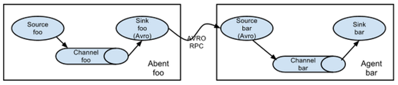
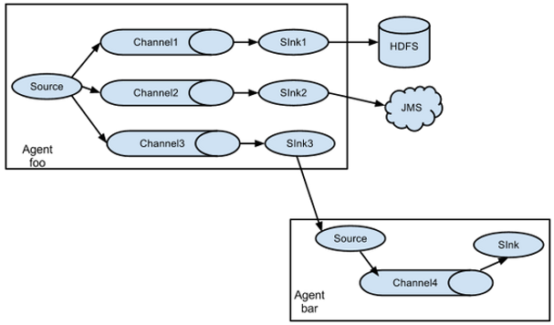
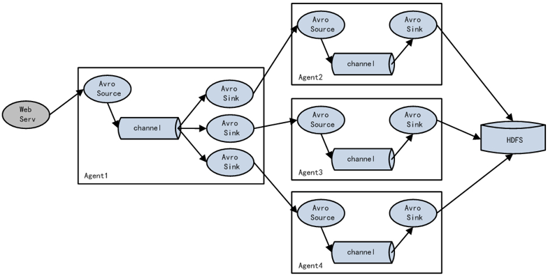
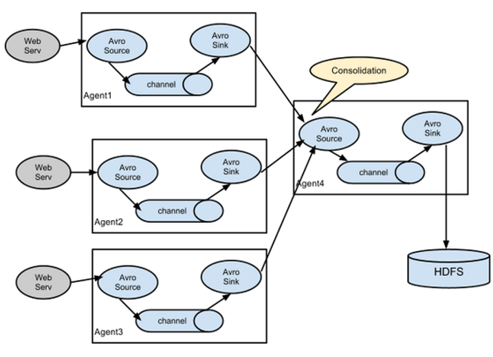
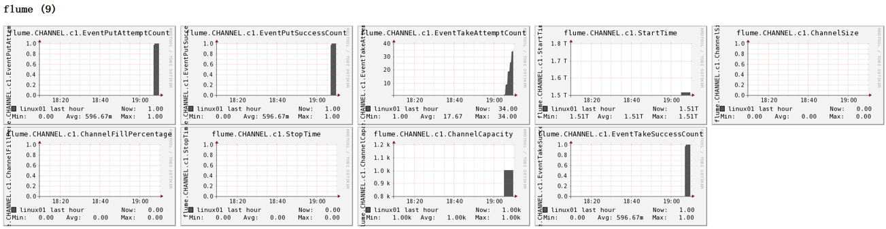

## Flume架构


1. Agent：Agent是一个JVM进程，它以事件（event）的形式将数据从源头送至目的。Agent主要有3个部分组成，Source、Channel、Sink。
2. Source：Source是专门用来收集数据的，将数据封装成Event发送给Channel。Source组件可以处理各种类型、各种格式的日志数据，包括netcat、avro、exec、spooling directory、taildir、thrift、jms、sequence generator、syslog、http、legacy。
3. Sink：Sink不断地轮询Channel中的事件且批量地移除它们，并将这些事件批量写入到存储系统、或者被发送到另一个Flume Agent。Sink组件目的地包括hdfs、logger、avro、thrift、ipc、file、HBase、solr、自定义。
4. Channel：Channel是位于Source和Sink之间的缓冲区。因此，Channel允许Source和Sink运作在不同的速率上。Channel是线程安全的，可以同时处理几个Source的写入操作和几个Sink的读取操作。Flume自带两种Channel：Memory Channel和File Channel。
   - Memory Channel是内存中的队列。Memory Channel在不需要关心数据丢失的情景下适用。如果需要关心数据丢失，那么Memory Channel就不应该使用，因为程序死亡、机器宕机或者重启都会导致数据丢失
   - File Channel将所有事件写到磁盘。因此在程序关闭或机器宕机的情况下不会丢失数据

5. Event：传输单元，Flume数据传输的基本单元，Source接收数据，以Event的形式发送给Channel。Event由Header和Body两部分组成，Header用来存放该event的一些属性（默认为空），为K-V结构，Body用来存放该条数据，形式为字节数组

## Flume Agent的内部原理

主要组件

### **ChannelSelector**

ChannelSelector的作用就是选出Event将要被发往哪个Channel。其共有两种类型，分别是Replicating（复制）和Multiplexing（多路复用）

ReplicatingSelector会将同一个Event发往所有的Channel，Multiplexing会根据相应的原则，将不同的Event发往不同的Channel。

### **SinkProcessor**

SinkProcessor共有三种类型，分别是DefaultSinkProcessor、LoadBalancingSinkProcessor和FailoverSinkProcessor

DefaultSinkProcessor对应的是单个的Sink（一对一），LoadBalancingSinkProcessor和FailoverSinkProcessor对应的是Sink Group（多个Sink），LoadBalancingSinkProcessor可以实现负载均衡的功能，FailoverSinkProcessor可以错误恢复（故障转移）的功能。

FailoverSinkProcessor（故障转移）可以设置优先级，优先选择级别高的sink发送数据，但是LoadBalancingSinkProcessor（负载均衡）不能设置优先级。

LoadBalancingSinkProcessor算法有两种，①random-随机分配 ②round_robin-轮循。

另外，如果一个Channel对接多个Sink,那么Channel中某一时刻的数据只能被一个Sink所获取，即同样的数据不能被发送到多个Sink。

## ExecSource、Spooldir Source、Taildir Source的区别

exec即execute执行的意思。表示执行Linux命令来读取文件。和tail -F命令搭配可以检测文件

Exec source适用于监控一个实时追加的文件，不能实现断点续传，就是说如果agent挂了，重新启动后（使用tail -f）会把文件的所有内容重新读一遍

Spooldir Source适合用于同步新文件，但不适合对实时追加日志的文件进行监听并同步。Spooldir Source读取的新文件以后会将其标记为.completed，但是，如果对已经读取的文件（即标记为.completed的文件）中追加新的内容，那么使用Spooldir Source是不行的，因为标记为.completed后，无论这个文件是否有变化，都不会再读取了。

而Taildir Source适合用于监听多个实时追加的文件，并且能够实现断点续传。即能够记录读取到的位置，agent重启后可以断点续读.

```
## 一、Exec source配置
a2.sources.r2.type = exec
a2.sources.r2.command = tail -F /opt/module/flume/demo/123.log


# 二、Spooling Directory Source : 用来监听一个目录进行自动收集目录中的内容
#1.当目录中某一个log文件的内容被读取完毕后，该文件有两种处理方案：
#  ①删除 ②在原来文件的名字后加.COMPLETED  --- 取决于 deletePolicy的设置
#2.在原来文件的名字后加.COMPLETED就是为标识该文件已经被读取完毕
#注意 ：该目录中的文件名不能相同，如果相同则会抛异常
a2.sources.r2.type = spooldir
a2.sources.r2.spoolDir = /opt/module/flume/upload
a2.sources.r2.fileSuffix = .COMPLETED


## 三、Taildir Source配置
a3.sources.r3.type = TAILDIR
# 文件中记录了source读取到的内容的位置,一旦taildir_position.json文件丢失那么source后从该文件的开始位置重新读
a3.sources.r3.positionFile = /opt/module/flume/tail_dir.json
a3.sources.r3.filegroups = f1 f2
a3.sources.r3.filegroups.f1 = /opt/module/flume/files/.*file.*
a3.sources.r3.filegroups.f2 = /opt/module/flume/files2/.*log.*
```

Taildir Source维护了一个json格式的position File，其会定期的往position File中更新每个文件读取到的最新的位置，因此能够实现断点续传。Position File的格式如下：

```
{"inode":2496272,"pos":12,"file":"/opt/module/flume/files/file1.txt"}
{"inode":2496275,"pos":12,"file":"/opt/module/flume/files/file2.txt"}
```

Linux中储存文件元数据的区域就叫做inode，每个inode都有一个号码，操作系统用inode号码来识别不同的文件，Unix/Linux系统内部不使用文件名，而使用inode号码来识别文件.

## Flume的事务机制

Flume的事务机制（类似数据库的事务机制）：Flume使用两个独立的事务分别负责从Soucrce到Channel，以及从Channel到Sink的事件传递。


思考：Take事务中的doRollback回滚的时候，如果Channel满了该怎么办？

不会出现这种情况，因为只有事务成功提交后才会将Channel中数据的空间释放【注意:doTake是从Channel中把数据拿走了，此时Channel中没有被拿走的数据，但是该数据所占用的存储空间没有被释放】，如果事务回滚，由于数据的空间没有被释放，所以可以直接拿来用。

## Flume常用的拓扑结构

### 简单串联




这种模式是将多个flume顺序连接起来了，从最初的source开始到最终sink传送的目的存储系统。此模式不建议桥接过多的flume数量， flume数量过多不仅会影响传输速率，而且一旦传输过程中某个节点flume宕机，会影响整个传输系统。

简单串联的第一个Flume的Sink类型为Avro。

Avro指的是序列化（不同的进程数据之间的传递需要进行序列化，即把对象序列化到磁盘，再从磁盘中读取转化为内存中的对象）

### 复制和多路复用

> 这是对ChannelSelector来说的


Flume支持将事件流向一个或者多个目的地。这种模式可以将相同数据复制到多个channel中，或者将不同数据分发到不同的channel中（多路复用），sink可以选择传送到不同的目的地。

使用这种方式需要将sources的type设置为replicating或者multiplexing
```shel
a1.sources = r1

#一、复制(默认不配也可以)
a1.sources.r1.selector.type = replicating


#二、复用 (如果是复制，下面四个选项就不用配置了)
a1.sources.r1.selector.type = multiplexing
#event(headers | body)根据headers中的key和value进行数据的发送
#state指的是headers，key的值
a1.sources.r1.selector.header = state
#CZ指的是key对应的value值那么就发送到channel1
a1.sources.r1.selector.mapping.CZ = c1
#US指的是key对应的value值那么就发送到channel2
a1.sources.r1.selector.mapping.US = c2
```

### 负载均衡和故障转移

> 这是SinkProcessor


Flume支持使用将多个sink逻辑上分到一个sink组，sink组配合不同的SinkProcessor（即LoadBalancingSinkProcessor或FailoverSinkProcessor）可以实现负载均衡和错误恢复的功能

SinkProcessor共有三种类型，分别是DefaultSinkProcessor、LoadBalancingSinkProcessor和FailoverSinkProcessor。

DefaultSinkProcessor对应的是单个的Sink（一对一），LoadBalancingSinkProcessor和FailoverSinkProcessor对应的是Sink Group（多个Sink）

```she
a1.sinks = k1 k2

#一、配置failover故障转移
#该sink组有哪些sink的实例
a1.sinkgroups.g1.sinks = k1 k2
#配置sinkProcessor的类型①failover故障转移 ②load_balance负载均衡
a1.sinkgroups.g1.processor.type = failover
#配置sink的优先级数值越大优先级越高
a1.sinkgroups.g1.processor.priority.k1 = 5
a1.sinkgroups.g1.processor.priority.k2 = 10

#二、load_balance负载均衡
#定义一个sink组
a1.sinkgroups = g1
#指明sink组中的sink实例
a1.sinkgroups.g1.sinks = k1 k2
#设置sinkProcessor的类型（负载均衡）
a1.sinkgroups.g1.processor.type = load_balance
#①random-随机分配  ②round_robin-轮循
a1.sinkgroups.g1.processor.selector = random
```

###  聚合功能


这种模式是我们最常见的，也非常实用，日常web应用通常分布在上百个服务器，大者甚至上千个、上万个服务器。产生的日志，处理起来也非常麻烦。用flume的这种组合方式能很好的解决这一问题，每台服务器部署一个flume采集日志，传送到一个集中收集日志的flume，再由此flume上传到hdfs、hive、hbase等，进行日志分析。

## 你是如何实现Flume数据传输监控的

通过Ganglia进行监控。

Ganglia由gmond、gmetad和gweb三部分组成。

gmond（Ganglia Monitoring Daemon）是一种轻量级服务，安装在每台需要收集指标数据的节点主机上。使用gmond，你可以很容易收集很多系统指标数据，如CPU、内存、磁盘、网络和活跃进程的数据等。（每台机器上都要安装）
gmetad（Ganglia Meta Daemon）整合所有信息，并将其以RRD格式存储至磁盘的服务。（只需在主服务器上安装即可）
gweb（Ganglia Web）Ganglia可视化工具，gweb是一种利用浏览器显示gmetad所存储数据的PHP前端。在Web界面中以图表方式展现集群的运行状态下收集的多种不同指标数据。（只需在主服务器上安装即可）

监控界面如图所示


图例说明：

字段（图表名称）	字段含义
EventPutAttemptCount	source尝试写入channel的事件总数量
EventPutSuccessCount	成功写入channel且提交的事件总数量
EventTakeAttemptCount	sink尝试从channel拉取事件的总数量。
EventTakeSuccessCount	sink成功读取的事件的总数量
StartTime	channel启动的时间（毫秒）
StopTime	channel停止的时间（毫秒）
ChannelSize	目前channel中事件的总数量
ChannelFillPercentage	channel占用百分比
ChannelCapacity	channel的容量

## 你公司采用的Source类型是什么

监控后台日志：exec、spooldir、TAILDIR

监控后台产生日志的端口：netcat

## 简单介绍下Flume的参数调优

（1）Source

增加Source个数（使用TairDir Source时可增加FileGroups个数）可以增大Source的读取数据的能力。例如：当某一个目录产生的文件过多时需要将这个文件目录拆分成多个文件目录，同时配置好多个Source 以保证Source有足够的能力获取到新产生的数据。

batchSize参数决定Source一次性往putList放event的个数，适当调大这个参数可以提高Source搬运Event到Channel时的性能。（execSource的batchSize默认为20）。

（2）Channel

type 选择memory时Channel的性能最好，但是如果Flume进程意外挂掉可能会丢失数据。type选择file时Channel的容错性更好，但是性能上会比memory channel差。不过实际生产时选memory多一些。

我们也可以使用file Channel时dataDirs配置多个不同盘下的目录可以提高性能。

Capacity参数决定Channel可容纳最大的event条数。transactionCapacity 参数决定每次Source往channel里面写的最大event条数和每次Sink从channel里面读的最大event条数。transactionCapacity需要大于Source和Sink的batchSize参数。

（3）Sink

增加Sink的个数可以增加Sink消费event的能力。Sink也不是越多越好够用就行，过多的Sink会占用系统资源，造成系统资源不必要的浪费。
batchSize参数决定Sink一次批量从takeList读取的event条数，适当调大这个参数可以提高Sink从Channel搬出event的性能。（注意：不仅source有batchSize，Sink里也有batchSize）。

## 数据怎么采集到Kafka，实现方式

> flume写数据到kafka分为2种：

* 第一种方式：netcatSource->memeory channel->kafkaSink
* 第二种方式：netcatSource->kafka channel

## flume和kafka采集日志区别，采集的中间件停了该怎么办

Flume采集日志是通过流的方式直接将日志收集到存储层，Sink写入数据到目的地后，就把Channel中相应的event移出了。

kafka是将数据缓存到kafka集群（默认在磁盘上报错7天，如果有必要可以设置为永久），消费者可以指定offset访问分区内任意数据。kafka中数据的删除跟有没有消费者消费完全无关。

如果在采集日志中，采集的中间件停了该怎么办？

对于Flume来说，如果Sink没有从Channel中获取数据，那么Channel中的数据会一直存在。具体来说，是通过Channel到Sink的事务进行的，该事物有三个操作dotake、docommit、dorollback，如果Sink没有获取数据，即dotake无法把takeList中的数据发送给sink，那么docommit就会执行失败，此时会执行dorollback方法，将数据归还给channel，同时清空缓冲区，所以如果sink没有将数据写出去，数据会一直在channel。

这时候你会想，channel中的数据无法被sink取出，那channel满了怎么办？如果channel满了，那么source往channel发送数据的事务就会失败，即doput将source的数据放入putlist后，commit检查channel中没有足够的空间了，那么就会执行doroollback方法，给source抛出异常，同时将putlist中的数据清空，之后source会重复发送数据。

memeory channel的默认容量是100个event，file channel默认容量是100万个event

所以对于Flume来说，如果其采集数据的中间件停了，两个事物都会执行失败，source会一直尝试向channel发送数据，sink会一直尝试从channel读取数据发往采集的中间件，然后失败、抛异常、回滚。
另外，补充一个参数：maxBackoff
这个参数代表当source向channel放数据时检测到channel满了后等待多久再进行重试，默认是4秒。

对于kafka来说，由于消费者可以通过offset从上次的位置读取数据，所以就算其消费者挂了，也没有关系。并且，kafka的数据是持久化到磁盘上，其数据的删除跟有没有消费者消费完全无关，新版kafka的数据的生命周期为7天

## 简单介绍一下Flume的使用场景

1. 日志采集和传输，采集多种日志到目的地
2. 日志聚合
   日常web应用通常分布在上百个服务器，大者甚至上千个、上万个服务器。产生的日志，处理起来也非常麻烦。用flume的这种组合方式能很好的解决这一问题，每台服务器部署一个flume采集日志，传送到一个集中收集日志的flume，再由此flume上传到hdfs、hive、hbase等，进行日志分析
3. 结合Kafka使用，Flume和Kafka可以很好地结合起来使用。如果你的设计需要从Kafka到Hadoop的流数据，使用Flume配置Kafka source读取数据kafka中的数据，然后写入到HDFS中，当然你也可以自己实现kafka的消费者，但这完全没有必要。
4. 也可以将日志采集到kafka供多个消费者消费，Kafka中的数据通过Flume采集到存储系统上

## flume不采集Nginx日志，通过Logger4j采集日志，优缺点是什么

优点：Nginx的日志格式是固定的，但是缺少sessionid，通过logger4j采集的日志是带有sessionid的，而session可以通过redis共享，保证了集群日志中的同一session落到不同的tomcat时，sessionId还是一样的，而且logger4j的方式比较稳定，不会宕机。

缺点：不够灵活，logger4j的方式和项目结合过于紧密，而flume的方式比较灵活，拔插式比较好，不会影响项目性能。

